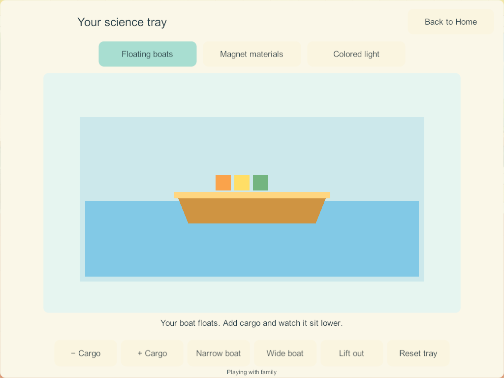

# Home science: playful projects and visual references

**Implementation follow-through — candidate 178:** the user requested completion of SCI-09. [Four mixing variants are now implemented](home-mixing-2026-09-27.html), using the chemistry and direct-touch requirements below. This remains a dated research record; its proposal labels describe the research stage, not the latest implementation status. The other redesign recommendations remain open.

September 27, 2026 · LAB-01 / H-29–30 / SCI-01–09 · Research and proposed design, not a new game build.

**Latest addition:** the user explicitly requests mixing materials and seeing reactions, such as vinegar and baking soda. SCI-09 adds a mixing/reaction station to the previous eight. Its first required example is vinegar and baking soda; the additional variations below are researched proposals. No mixing implementation exists in candidate 174.

**The earlier research covered scientific rules, child controls, four-player ownership and saving more deeply than visual play.** Candidate 174 establishes three functioning experiments, but its flat shapes and text controls are still a prototype. This follow-up examines actual publisher visuals, samples an official gameplay trailer, and now covers nine play loops including the later mixing request. It does not establish child acceptance or change installed apps.

[First research and scientific sources](home-science-coloring-research-2026-09-27.html) · [Current Unity implementation](home-discovery-2026-09-27.html) · [Complete Home tracker](../home-world-feature-tracker.html).

## 1. What was actually examined

These are design references, not a ranking of the best games. Publisher claims about learning are not independent evidence that children will enjoy our version. Reference artwork remains on its publisher's website; it is not imported into game assets. Remote pictures below require an internet connection.

| Reference | Evidence inspected in this pass | Useful finding and Little Weeps application |
| --- | --- | --- |
| [Tinybop Simple Machines](https://tinybop.com/apps/simple-machines) | Official page, two full publisher images viewed, and [handbook text](https://tinybop.com/assets/handbooks/simple-machines/Tinybop-EL4-Simple-Machines-Handbook-EN.pdf). | The apparatus dominates the scene: large pulleys, an obvious rope connection, objects underneath. Its lever illustration shows the launch path. Apply large equipment and readable motion to our magnet and ramp stations. |
| [Tinybop Light & Color](https://tinybop.com/apps/light-and-color) | Official page, rainbow promotional vignette viewed, and [handbook text](https://tinybop.com/assets/handbooks/light-and-color/Tinybop-EL12_LightandColor_Handbook.pdf). PDF screenshots could not be retrieved; the vignette is not a gameplay capture. | The handbook describes manipulating lamps, mirrors and prisms within scenes. Our RGB experiment should expose overlapping light spots and their sources. The current whole-panel color switch omits that important visible relationship. |
| [Toca Lab: Elements — official gameplay trailer](https://www.youtube.com/watch?v=ATjRZIfgMBE) | Verified publisher trailer; sampled frames at 0:19, 0:34 and 0:49, with description read. Historical 2013 reference; not a complete playthrough or audio review. | Friendly shapes have faces; equipment fills the view; the cooling frame puts a small character in a dish beside an oversized cooling tool. Apply readable props and brief reactions. Do not adopt fictional element transformations as our science model. |
| [Toca Boca Jr catalog](https://www.tocaboca.com/toca-boca-jr) | Publisher descriptions of Lab: Elements, Lab: Plants and other play apps. The deeper page's age gate was not submitted. | Plants and materials are presented as things to experiment with, with personality. Our proposals use toy passengers, sprouting seeds and responsive props while preserving accepted Bluey/Bingo characters. No claim of testing these apps. |
| [Thinkrolls 2 — Avokiddo](https://www.avokiddo.com/thinkrolls2/) | Official feature description and page viewed; game trailer not watched. | Physics is connected to a visible purpose and progressively introduced obstacles. Apply an optional picture invitation such as reaching a basket; retain free play. Its saved profiles are not evidence of simultaneous multiplayer. |
| [PBS Play & Learn Science](https://www.pbs.org/video/play-learn-science-pbs-kids-parents-app-ygxn5t/) | Official description and transcript; video unavailable. | Ramps, moving objects, light and shadows connect experiments to familiar actions and caregiver conversation. Add optional comparison prompts without blocking play. |
| [Sago Mini School](https://sagomini.com/school/) | Official descriptions of child-led exploration and familiar themes, including gardens and rainbows. | Start with recognizable things children can manipulate. Use one ready setup, then reveal optional depth through play. No claim of hands-on gameplay testing. |

### Visual reference: large equipment and an obvious cause

Publisher image: [Tinybop Simple Machines](https://tinybop.com/apps/simple-machines). The rope, pulleys and hanging tool form an understandable chain. Our inference: the child should see the tool, the affected object and the result together, with a calm background behind them.

### Visual reference: motion that explains the result

Publisher image: [Tinybop Simple Machines](https://tinybop.com/apps/simple-machines). This is an explanatory illustration, not evidence that every arrow is an in-game control. Our proposal uses an optional short trail for a rolling ball so a child can compare two runs without reading a number.

### The current Little Weeps baseline

This is real candidate-174 evidence. It makes the load result visible, but adding cargo still relies on bottom text buttons; the boat and water are schematic. It needs direct prop handling, illustrated materials, motion and a small purpose for experimenting. Passing save/network checks does not establish that this presentation is engaging.

## 2. Presentation contract for Little Weeps

The following are our proposed design decisions inferred from the references, not measurements mandated by research.

- **A toy corner in the house:** keep the connected downstairs bay and four usable places. Show a tub, magnet tray, ramp, lamps, shadow screen, bubble kit, string board, seed pots and mixing tray as recognizable illustrated equipment. Keep walking and book access clear. Busy stations show a small live result, not a wall of identical menu tiles.
- **A large experiment when opened:** reserve roughly three quarters of the usable landscape view for the apparatus and result as an initial layout target. Put a few large picture tools around it, within comfortable reach. Keep Home/back, optional hint and sound controls visible without covering the result. Validate the actual phone and iPad layouts; the percentage is not an acceptance shortcut.
- **Touch the thing:** pick a cargo toy, move a magnet, reposition a light or pluck a string. Supply tap-to-select then tap-to-place assistance alongside dragging. Avoid making the main loop a row of text commands or repeated Next taps.
- **Respond where the finger acted:** a placed block clunks, water ripples, a magnet lifts metal, a string visibly wiggles. Each reaction must explain the change. Decorative sparkles never substitute for the experiment and should not run continuously.
- **A reason to try again:** optional picture cards invite a comparison, a silly arrangement or a tiny pretend story. No required reading, countdown, score, failure screen or locked sequence. The experiment stays playable after an invitation is satisfied.
- **Calm, useful sound:** short splashes, clinks, rolling and plucks tied to actions; optional brief spoken hints after an explicit tap. Each player's audio preferences remain local. Sound-off retains the visible result; reduced-motion keeps a clear settled state. Review the sound on actual devices before calling it good.
- **Consistent illustration:** use the existing Home palette and integrated rear/object/front layers, with readable contact shadows and uncluttered work surfaces. Preserve accepted character art and animation. Produce new final prop art after reviewing the layout and the assets it needs.

## 3. Nine projects: what the child actually does

These are proposed extensions of the existing SCI IDs, not additional finished features. Scientific constraints come from chapter 30 and the [first research's source-to-decision table](home-science-coloring-research-2026-09-27.html). Fun interpretations below are design proposals that still require playtesting.

### SCI-01 — A little cargo harbor

**Loop:** choose a ready narrow or wide toy boat → tap or drag cargo from a nearby basket onto it → watch the boat settle lower → remove cargo or try the other hull → lift it back onto the dock.

Make the tub a shallow illustrated harbor with a dock, soft ripples, floating markers and chunky cargo toys. The load remains visible on the deck. When overloaded, the boat settles gently into the shallow tub; every piece remains retrievable. No lost toys or fail screen. A waterline shows the result without a numerical chart.

Optional invitations: carry three toy passengers; compare the same cargo in both boats; try a reviewed wood block and stone. The hulls must visibly explain their different capacity. Boat tilt needs an actual placement/balance model; do not add misleading tilting as random decoration. Proposed new sample types require explicit, finite material rules.

### SCI-02 — Magnet treasure workshop

**Loop:** pick up the big magnet wand → move it around the tray → collect compatible pieces → release them onto a picture path or sorting mat → try another material.

Give objects recognizable forms and different silhouettes: steel washer, iron toy piece, wooden block, plastic button and aluminum token. Metal pieces briefly lift and clink; other materials remain where placed. A ghost outline can show where to drop a piece. No hidden success counter.

Optional invitations: guide a magnetic toy through a winding trail; arrange a robot picture; compare two bar magnets using stable pole markings. A second magnet and repulsion are separate new behavior, not already supported by the existing wand. Clearly distinguish aluminum from iron; never teach that all metal sticks.

### SCI-03 — Ramp playground

**Loop:** release a ready ball → watch it roll into a wide catcher → lift the ramp onto another support → run it again → swap the surface.

Use chunky wooden track pieces, broad snapping positions, a visible start cup and a soft landing basket. A faint optional last-run marker lets children compare distances; no competitive leaderboard. Add a toy car only with its own reviewed motion, rather than using an unexplained speed bonus.

Optional invitations: reach the big basket; compare smooth and felt strips with the same ball; build a gentle two-section route. Release and reset act on one workspace. No rule that heavier objects always roll faster.

### SCI-04 — Rainbow light garden

**Loop:** turn on a red, green or blue torch → move its light spot across a pale garden screen → overlap spots → switch a torch off and notice the difference.

Keep lamp bodies, faint beam cones and overlapping circles visible together. Outline flowers and stars on the screen provide places to aim. The full screen should not merely become one flat color when a switch is pressed.

Optional invitations: light the yellow flower; make a white star with three overlapping lights; create a changing stage for a toy. This models additive light, separately from paint. Let children move the result continuously; avoid a binary completion stamp.

### SCI-05 — Dinosaur shadow stories

**Loop:** put a dinosaur toy between a lamp and screen → move it nearer/farther → see the shadow change → add another toy or backdrop → tell a tiny story.

Use recognizable, complete dinosaur silhouettes with the lamp, toy and screen all visible. A jungle or bedtime backdrop makes the scene inviting. Shadow size follows consistent geometry; repositioning the screen or source is not random zoom. Keep a simple one-toy arrangement ready for the youngest player.

Optional invitations: make a tiny and giant T-Rex shadow; match a pictured silhouette; hide a baby dinosaur behind a larger shadow. Dinosaur sound buttons are deliberate and local, never frightening automatic roars. The toy selection should share the existing dinosaur catalog when those assets are available.

### SCI-06 — Bubble garden

**Loop:** dip a large wand → blow with the fan → steer the airflow → tap bubbles to pop them → dip again.

Show the soap film stretching before release, soft iridescent rims and a gentle wobble. A few different wand outlines and two or three fan settings make clear choices. Bound the number of bubbles; the scene remains responsive with four players experimenting.

Optional invitations: send bubbles through a large hoop; compare gentle and stronger air; try a square wand and notice the released bubble becomes round. Do not make square floating bubbles as the science result. Popping is optional; there is no missed-bubble penalty.

### SCI-07 — String music workshop

**Loop:** pluck a large string → see and hear the vibration → shorten its active length with a chunky slider → pluck again → compare high and low notes.

Use a wooden sound box, three or four generously spaced strings and a clear visible bridge. The touched string reacts immediately; an optional enlarged wiggle helps show the motion. Start with one variable: length, while holding tension and string type fixed.

Optional invitations: make a high and a low call; answer a short two-note pattern; improvise. Harder plucking changes loudness, not arbitrarily pitch. Any slowed visual vibration is an explanatory display, not a claim that the real string moves at that slow rate. Keep all meaning visible when muted.

### SCI-08 — Seed window garden

**Loop:** choose a seed → place it in a ready pot → water → choose light → deliberately advance time → see roots, shoot and leaves develop → decorate the pot.

Use an optional cutaway soil window and distinct growth stages rather than an invisible timer. The sun/time control visibly communicates that days are passing quickly. Plant care should allow recovery and continued exploration; avoid sudden plant death when a child leaves.

Optional invitations: compare matched pots with one condition changed; grow a small windowsill collection; carry a finished pot to an owned bedroom once durable creation/carry records exist. Different seed species and overwatering behavior need reviewed rules before inclusion. Do not imply that adding water instantly produces a real plant or that soil is the only growing medium.

### SCI-09 — Mix and discover

**User-requested loop:** choose a bowl or toy volcano → scoop baking soda → pour vinegar → immediately see and hear fizzing where the ingredients meet → try different amounts → let it settle and rinse this tray to repeat. Contact starts the reaction; stirring is not an artificial unlock step. A spoon, jug and dropper should perform different visible actions.

**Presentation:** one large clear bowl or open volcano in the middle, with labeled picture ingredients and chunky tools arranged around it. Show powder accumulating, a controllable stream, rising bubbles and liquid remaining afterward. Offer tap-to-add measured portions as well as forgiving drag/pour controls. Add optional coloring for appearance and a separate soap choice for longer-lived foam. Foam can gently spill into a catch tray and be wiped up. Fizzing and small pops follow the visible reaction; no forced loud explosion or result screen.

| Experiment | What is grounded in the source | Proposed game interaction and visible payoff |
| --- | --- | --- |
| **Baking soda + vinegar; optional foam volcano — required first example** | The reaction produces carbon dioxide bubbles. Detergent helps bubbles persist; continuing to add one ingredient does not guarantee unlimited gas. [ACS: Gas Sudsation](https://www.acs.org/education/whatischemistry/adventures-in-chemistry/experiments/gas-sudsation.html) | Scoop and pour into a clear bowl, then optionally use the same model inside a toy volcano. Compare a small and larger compatible portion. Food color changes appearance; soap changes foam retention, not gas production. |
| **Color-changing cabbage liquid — proposed variation** | Red-cabbage indicator changes color with acidity/basicity. The source activity targets older children; our simplified touch interaction is a design adaptation. [ACS: Red Cabbage Indicator](https://www.acs.org/education/activities/red-cabbage-indicator.html) | Ready-prepared indicator in a transparent cup; add drops of vinegar or baking-soda solution and watch color spread. Use reviewed ingredient/amount-dependent colors, not a random rainbow or identical color for every base. |
| **Oil, water and color swirls — proposed variation** | Oil and water separate; water-based coloring enters the water phase. Mixing can disperse droplets without making a permanently uniform solution. [Science Buddies: Underwater Color Bursts](https://www.sciencebuddies.org/stem-activities/underwater-color-bursts) | Pour layers, add colored drops, stir and watch droplets separate again. This is a physical mixture, not another fizz-producing chemical reaction. |
| **Cornstarch + water oobleck — proposed variation** | The mixture changes consistency with its water content and responds differently to slow movement and a quick force. [Science Buddies: Oobleck](https://www.sciencebuddies.org/stem-activities/oobleck-colloid) | Add water gradually to powder, stir, slowly draw through it or tap rapidly. Show slow flow versus brief resistance; ordinary touch cannot supply real tactile resistance, so use clear deformation and optional sound. Do not present it as actual freezing/melting. |

**Free experimentation with understandable results:** picture invitations are optional. Keep a small, reviewed ingredient set and implement its combinations deliberately. Water plus baking soda must not produce the vinegar fizz. Incompatible or unreactive additions can dilute, settle or remain visibly separate. No generic rule that every mixture erupts. Different experiment trays expose the relevant starting materials; an Explore tray can combine the reviewed set without inventing unsupported chemical outcomes.

**Persistent reaction rules:** retain vessel identity, ingredient amounts, remaining reactive ingredients, mixture state, reaction progress and owner. A consumed portion cannot be recreated by stirring, reopening or reconnecting. More gas requires remaining compatible reactants. The PC authority advances the shared reaction while clients render bounded bubbles locally; leaving does not freeze everyone else's play. Record a settled result on reopen rather than replaying the same eruption. New state requires additive migration and recovery checks; it is not covered by 174's existing tests.

**Four simultaneous players:** four complete supply/tool sets and independently saved trays; no shared ingredient shortage or global station lock. Reset/rinse affects only the current player's tray. Watching another player's experiment is allowed; changing their mixture follows the existing ownership/Together rules. Experimental mixtures remain science objects, separate from edible kitchen dishes.

**Acceptance additions:** immediate contact reaction; partial pours; visibly different quantities; no fizz from the water control; finite reactant consumption; soap changes foam rather than gas quantity; durable mid-reaction/reopen state; four simultaneous reactions with independent reset; correct server progress and bounded effects. Physical touch, audio and older-iPad performance remain separate acceptance checks.

## 4. Four-player play, persistence and performance

Four players can choose the same experiment simultaneously, each opening a full-size workspace on their own device. This does not mean four tiny panels on one screen. The room shows each person's current project with a profile marker that has both color and shape. Choosing the same avatar does not combine ownership.

Keep candidate 174's independent saved workspaces. Leaving, resetting, traveling or changing experiment cannot erase anyone else's project. Cross-owner co-editing requires an explicit Together permission and object/tool claims; it is not implied by being nearby and remains future work. Independent use must not wait for that feature.

Save meaningful state: object identity, location, cargo membership, lamp position, chosen materials, plant stage and owner. Do not save ripple particles, sound instances or animated texture frames. New durable fields need migration from 174 and invalid-state validation; no reset of the existing four trays. Keep private solo progress separate from shared authority.

Use bounded local effects, reusable sprite/mesh elements and an event-driven room preview. Only an open experiment needs its full visual treatment. Test payload and frame time with four science workspaces, kitchen timers and coloring together. These are proposed constraints, not a claim of completed A10 performance testing.

## 5. Recommended next bounded build and acceptance

**Recommend one complete cargo-harbor pass first (SCI-01).** It should establish the art, direct manipulation, visible response and optional invitation standard before that approach spreads to magnets and RGB. The user has now added mixing/reactions as SCI-09; its first bounded slice is the complete baking-soda/vinegar loop above, followed by reviewed variations. This scope addition does not by itself reorder the active implementation queue. Blank drawing, all six unbuilt science stations and the wider Home backlog remain required. These recommendations are research results, not evidence of implementation or visual approval.

1. Review a landscape layout and prop list against the existing Home artwork. Show the actual boat, cargo basket, dock, waterline and accessible controls together.
2. Implement cargo tap/drag, clear placement and retrieval, responsive illustrated water/boat states, and one optional compare-the-boats invitation. Reuse existing valid boat state; add only the contracts the play needs.
3. Check a first-use child can start without someone reading the screen. Observe where taps miss and what the child tries next; revise rather than claiming enjoyment from screenshots.
4. Capture the whole loop on phone and tablet layouts, including overload/retrieval, closing/reopening and reduced-motion/sound-off. Confirm all important props remain fully visible and controls do not obscure them.
5. Test four independent users, travel/leave/reset, save migration, restart/rejoin and retained current experiments. Then qualify real mixed devices, A10 performance and action sounds. Source tests and desktop captures remain separate from physical acceptance.

No science status becomes Complete in this pass. Candidate 174 is still the latest recorded Windows science build; deployed Samsung/iPads/server remain last recorded at 171. The existing development-lineage hold on main and the outstanding shared-play/book/audio qualification remain in force.
