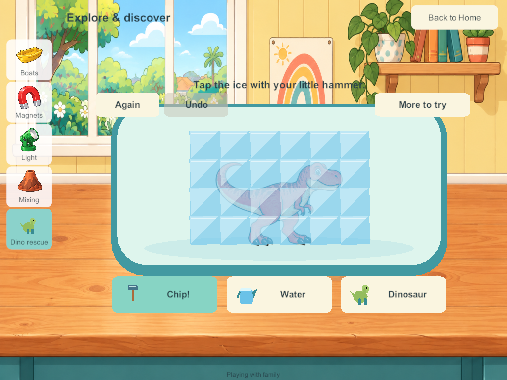
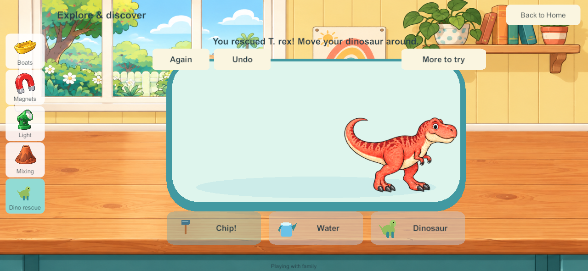

# Dinosaur rescue in the Home science area

September 28, 2026. LAB-01 / SP-02. This bounded slice brings the accepted frozen-dinosaur prototype into the Unity game. It leaves the other fourteen science prototypes, bubble/color labs and native reader control work tracked separately.

## Research applied

The [hammer and lab research](science-hammer-labs-2026-09-28.html) and [child-flow research](science-kids-flow-2026-09-28.html) were read before implementation. The [accepted picture-control review](home-picture-controls-2026-09-28.html) supplies the cream/teal cards, recognizable tools, brief labels and optional extras. This pass applies that existing research; it does not claim a new external research round or physical child acceptance.

The small hammer follows the user's requested play: taps remove nearby pieces, cracks reveal progress, and a large **Chip!** alternative finds the next remaining piece. Hammering does not add heat. Warm/cool water retains separate, gradual melting. A warmer portion supplies more melting energy in this toy model; this is not a measured physical simulation.

## Native play

Walk to the downstairs Science bench and choose **Dino rescue**. Tap the ice, brush across it, or use Chip! Water works from its picture button and direct tray taps. Choose T. rex, Triceratops or Brontosaurus before starting; the existing illustrated book artwork is reused with its reviewed full-animal bounds. After rescue, drag the dinosaur around the tray. Again starts another rescue and Undo restores the prior change. One undo state is retained; it cannot grow without limit.

More to try contains warm/cool water, sound and calm effects. These preferences stay local and opening a rescue starts no narration. The brief hammer/pour sounds reuse the native science effects. Final sound-quality acceptance remains open. The browser's spoken hint system is not included in this native slice.

The dinosaur is a persistent toy inside this lab. Carrying it into other rooms, dinosaur discovery collections and all twenty toy types remain future work. Nothing spawns an unlimited stream of world objects.

## Four-player authority and persistence

Production schema 19 / content 20 adds one independent rescue tray per profile. Each tray retains twenty-four ice strengths, twenty-four bounded melting-energy values, one dinosaur choice/position, a revision and at most one undo record. Only its owner can change it. The existing shared command receipts handle duplicate input, and the tray revision rejects stale edits even when the general command queue rebases world revisions.

The PC remains the shared authority. Water continues melting when someone changes activities or travels. One player resetting, leaving or disconnecting cannot reset another tray. Private solo uses the same rules and keeps its existing separate save; no offline edits merge into a server world.

Migration appends the trays while preserving existing objects, rooms, coloring, chemistry, receipts and identities. Optional records use bounded arrays because Unity's inline class serialization cannot represent null the same way as the core test serializer. The first candidate exposed that issue in an actual old-save migration test and was superseded before delivery.

Visual fragments and hammer motion remain local and bounded; only gameplay progress is saved or synchronized. Book texture leases are acquired on opening and released on closing, including cancelled asynchronous loads. There is no new raster asset or independent copy of the dinosaur sheets.

## Validation and delivery

Windows and signed Android candidate **191** have been built. Builds 189/190 are intermediate candidates and are not for installation. No family device, production server, enrollment or private save has been changed by this task.

- [Matching source and artifact checks](evidence/ice-rescue191-2026-09-28/source-artifact-checks.json): all 211 C# source files match between the Windows and Android builds and the final working source; 351 Windows files and the signed APK match their manifests. Unity importer whitespace-only churn was removed without changing art.
- [Android inspection](evidence/ice-rescue191-2026-09-28/android-artifact-inspection.json): correct Little Weeps package/version, release configuration, pinned family signature and ZIP/LOAD alignment passed. The full static check remains failed for the existing 16 KB RELRO alignment gate; 16 KB runtime and physical device qualification are not claimed.
- [218 core test groups](evidence/ice-rescue191-2026-09-28/core-results.json) pass, including additive migration, deep copying, corrupt/stale/duplicate/foreign input, four-player isolation, gradual melting and bounded payloads.
- [Seven native four-client groups](evidence/ice-rescue191-2026-09-28/native-results.json) pass: actual 187-to-191 save migration, direct hammer taps, complete rescue, reset/undo, two-finger toy handling, independent travel, lifecycle preferences and exact server restart/rejoin state.
- [Native private solo](evidence/ice-rescue191-2026-09-28/solo-results.json) passes hammer/water saving, continued melting while viewing boats and exact reopen with local preferences.
- [Concurrent-load recovery run](evidence/ice-rescue191-2026-09-28/recovery-concurrent-load-results.json): backup/restore/rollback, invalid bundles and reconstructed enrollment passed, but packet-queue warnings failed the final network-health check while Android compilation and other native tests were running. This result is retained. The isolated repeat passed all seven groups with no queue warnings. Concurrent machine load is a possible contributor, not an established cause.

- [Seven isolated production-recovery groups](evidence/ice-rescue191-2026-09-28/recovery-results.json) pass with populated rescue trays: byte-exact backups/restores, rollback, rejected invalid bundles, interrupted-operation protection, recovered enrollment and encrypted four-client packet health. The recovery helper now admits candidate 191; this is not authorization or evidence of live-server deployment.

The signed release artifact is `Builds/AndroidSigned/G3-0.0.191/LittleWeeps.apk`. Android remains last verified at **188**; iPads and family server remain last recorded at **171**, iPhone at **101**. No fresh device/server inventory was requested or performed.

These screenshots come from native Windows release clients resized to tablet/phone aspect ratios. They are not physical iPad/Android screenshots.

Physical multitouch, listening, sustained mixed-device play and older A10 iPad performance remain open. Preserve the branch's existing book/audio/shared-play qualification hold; do not promote this lineage to main.

**Next bounded task:** review this native rescue on a device, then bring the accepted Water → Soap → Stir → Dip → Blow bubble lab into Home with the same four-player persistence and picture controls. Liquid-color mixing and native reader controls follow; the wider Home backlog remains required.
