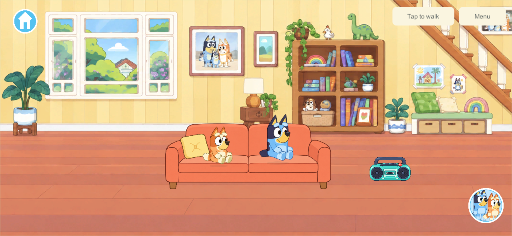
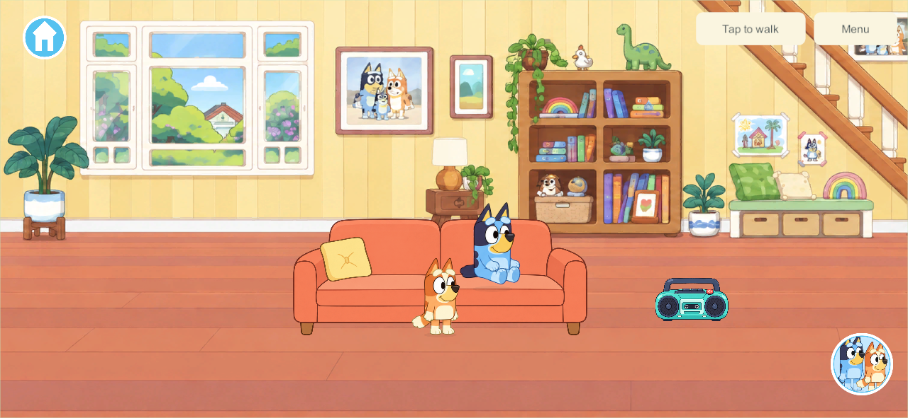
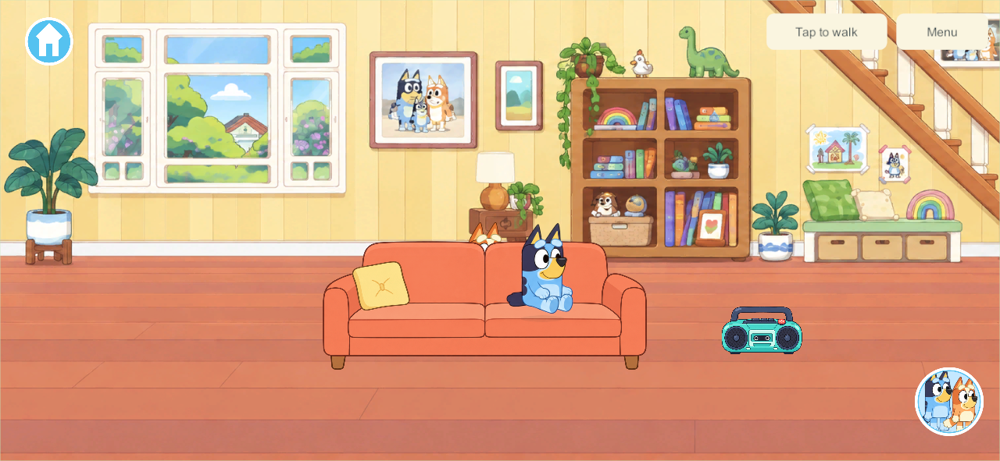
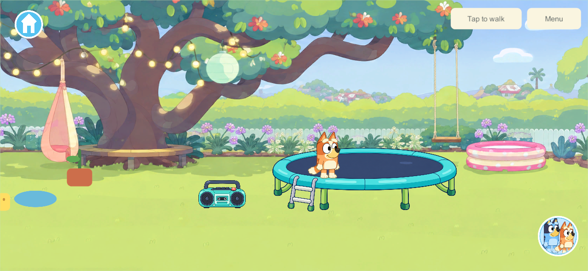
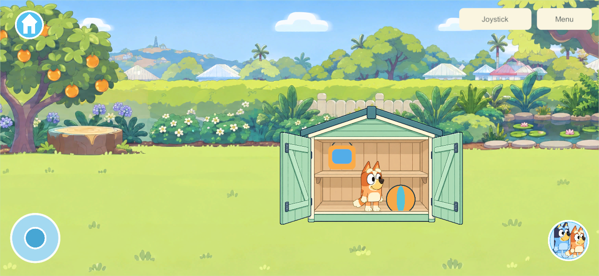
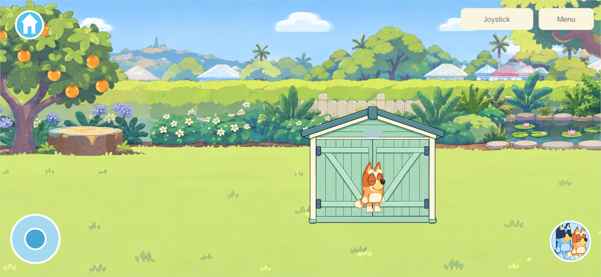

# One sofa, one trampoline, one shed

September 26, 2026 · **ART-HOME-02, first A/B slice · WORLD-01/02, ITEM-02/03, CHAR-01**

The previous composition painted a couch, trampoline and shed into the panorama and then drew separate usable copies in front. This pass replaces those three backgrounds with clean plates and keeps one live placement for each fixture. Kitchen/food, reading furniture, bedrooms and the remaining layered-house inventory stay in the plan.

## What changed

- The living-room base now contains the complete wall/floor behind the sofa. The baked sofa, coffee table, rug and their contents/shadows are removed. The coffee table will return as a separate support when that feature is built; it is not an invisible clickable object.
- The tree panorama no longer contains a painted trampoline; the far-garden panorama no longer contains the shed or the painted tap/tools/pots around it. Existing usable tools keep their identities and positions.
- Sofa arms/base, the near trampoline frame, and shed frame/shelf lips are independently ordered front parts, registered to the same fixture textures as their backs. The editable [layer layout](../../Unity/FamilyPlayset/Assets/FamilyPlayset/Resources/Worlds/Home/Art/layer-layout.json) uses shared texture coordinates, without duplicating texture residency. The normal uGUI clipping and material remain in use.
- Sitters and jumpers draw between the fixture rear and front at its ground depth. Nearby walkers draw in front or behind the whole fixture using their floor position. Stored items draw inside the shed, behind its frame/shelf lips, and disappear from both rendering and touch targets when closed.
- A network-driven Render previously re-enabled stored props until LateUpdate hid them again. Closed-container visibility now applies during both updates, preventing a temporary hidden-item input target.
- The rigid trampoline frame no longer squashes with the character. A deformable mat and full enclosure artwork remain future polish; this pass retains the existing open trampoline artwork.

The reopen check also exposed an existing shutdown ordering issue: Unity may destroy a panorama Graphic before its owning screen. Scenery cleanup now skips already-destroyed Graphics instead of trying to dirty their texture during shutdown.

No fixture positions, storage slots, item IDs, save schema or family authority were changed. The one Home/backyard destination, joystick and character chooser remain. **420 floor units/second (2 times the original)** is the accepted shared speed for every current and future character; the calmer animation is retained.

## Art and implementation sources

The built-in imagegen tool edited the existing panoramas, preserving their 2172×724 composition and surrounding room/garden features. [Exact prompts and output/source paths](../../SourceArt/Home/composition-2026-09-26.json). Runtime clean plates are [living room](../../Unity/FamilyPlayset/Assets/FamilyPlayset/Resources/Worlds/Home/Scenery/home-living.png), [tree garden](../../Unity/FamilyPlayset/Assets/FamilyPlayset/Resources/Worlds/Home/Scenery/garden-tree.png) and [far garden](../../Unity/FamilyPlayset/Assets/FamilyPlayset/Resources/Worlds/Home/Scenery/garden-shed.png). The preceding originals remain in Git history. Fixture artwork is reused with authored render geometry; no commercial game assets were extracted.

The shelf, under-stair bench, swing and pool remain staged scenery. They must be separated before their interactions are enabled; no duplicate usable copy is authorized. The [inventory](../../SourceArt/Home/scene-layer-plan.json) retains kitchen surfaces/interiors, remaining supports and the shared doorway/seam work. This milestone does not mark the full home or ART-HOME-02 complete.

## Verification and delivery

**Native Windows 128 passes all six groups** in the [home integration result](evidence/integrated-home-2026-09-26/native-home.json): two-seat occupancy, seated character switching, nearer/farther walkers, radio/dancing/mute, bounce/exit while a sibling stays seated, same-item shed storage through travel, closed-item visibility, and offline save/reopen. All [92 core rules](evidence/integrated-home-2026-09-26/core-rules.json) pass. Core gameplay is unchanged from that 126 check; later fixes affect view visibility and teardown only. Phone and 4:3 captures keep controls inside their safe area and retain the three-panorama cache bound.

The initial 126 run exposed closed-item reactivation; 127 confirmed that fix but caught the panorama shutdown ordering issue. The complete 128 run passes after both fixes. These native results do not substitute for sustained A10 measurements or the user's visual acceptance.

**Android 128 delivered in place over 125.** [Installation and save evidence](evidence/integrated-home-2026-09-26/android-install.json) verifies the package/signing identity and exact installed APK bytes. [All 751 Unity source/art/settings files matched](evidence/integrated-home-2026-09-26/build-source.json) before installation; subsequent normalization only removes Unity-generated metadata whitespace. The phone visibly runs Bluey in the connected kitchen with the accepted controls. The new fixture compositions were inspected in the native screenshots above; the user's phone visual review remains open.

All eight saved records remain: seven byte-identical, while the active solo save differs only in position and command history as the user plays. Every other persisted field is identical. No reset, uninstall or save replacement occurred. [Actual phone launch](evidence/integrated-home-2026-09-26/phone-running.png).

The live family server/helper remains **110** and Apple devices **101**. Matching content-5 family rollout, physical A10 profiling and Android native 16 KB qualification remain separate open work. Local isolated test worlds do not alter the family world.
