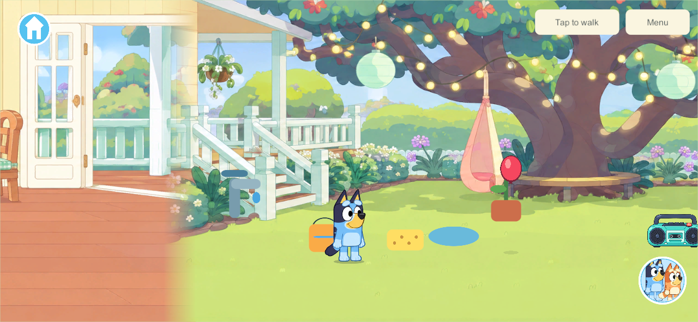
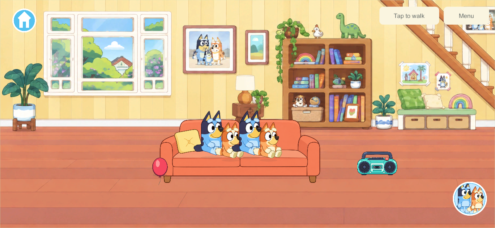
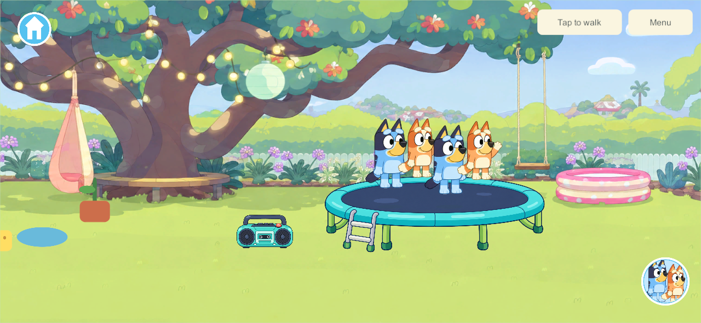
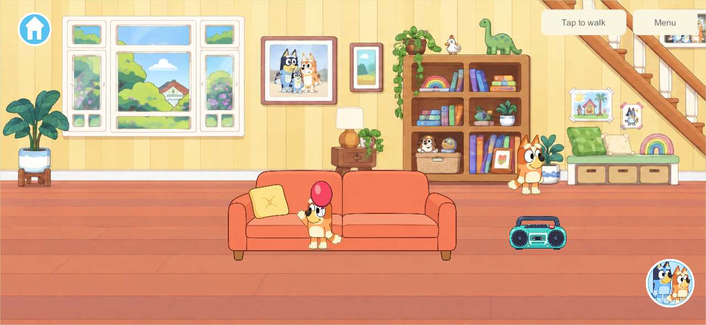

# Keepy Uppy and four-player home objects

## Movement while tapping — build 150

September 26, 2026 · SHOW-25 / HOME-4P · user-reported touch regression

Tapping the balloon used the common fixture helper that canceled every active pointer. That also released the joystick, canceled an object drag and cleared a tap-to-walk destination. The balloon now opts out of that cancellation; its tap starts the activity while other fingers keep their current gestures. Fixture controls retain their existing cancellation behavior. There is no save, shared-authority or content-contract change from build 149.

`Tools/Test-KeepyMovement.py 150` passed **13 native release checks** using Unity's touch-input path in disposable solo and four-player sessions. The checks cover an unmoving joystick finger continuing after a balloon tap, simultaneous object pickup/holding, a third balloon touch preserving both gestures, object release, joystick release, menu cancellation, tap-to-walk continuity and unaffected siblings. [Native evidence](evidence/keepy-movement150-2026-09-26/native-play.json). These are injected native touches, not physical phone multi-touch acceptance.

Windows client/server and signed Android **150** built successfully with no errors or warnings. Both manifests match all current runtime source files. [Build/source evidence](evidence/keepy-movement150-2026-09-26/built-source-check.json). Samsung updated in place from 149 with the pinned signature and exact installed APK verified; **all 16 saves remain byte-identical**. The launch command succeeded and no Unity/Android runtime errors were recorded. The user then opened the game and confirmed the balloon fix on the phone: “just tested the ballon and works great!” This is scoped acceptance of the reported input issue; sustained mixed-device play remains separate. [Installation/save evidence](evidence/keepy-movement150-2026-09-26/android-update.json).

The change remains on `codex/home-reading` with the original six-book preview, whose broader recovery, four-device and A10 qualification is still open. No family server or Apple device was updated. Next: continue the bounded Home/book work from the current tracker after the accepted balloon fix.

## Original Keepy Uppy milestone

September 26, 2026 · SHOW-25 / HOME-4P · candidate **130**, content **6**, save schema **5**

The home now has a red balloon that starts Keepy Uppy when tapped. It tosses upward, drifts, and receives an automatic raised-arm tap from an eligible character underneath. All four connected players share the same balloon. There are no points, winners, losses or game-over screens. A balloon that reaches the floor rests until tapped again. The connected backyard remains part of Home; other worlds do not receive this activity.

The sofa and trampoline each now have four closer spots within the same artwork and dimensions. The original outside spots retain their saved anchors. The two added spots sit between them. Moving, changing areas or disconnecting releases only that player's spot. All future shared activities are explicitly designed for four players in `AGENTS.md` and the current decisions.

## Backyard tuning — user feedback after Android 130

The user requested an outdoor spawn, a higher toss, faster sideways motion and specifically a faster **fall**. Candidate **132** starts on the backyard lawn at (760, 150). Existing indoor balloon saves move to that spot once; player, prop, home and receipt data stays intact. Outdoor saved flights stay at their existing position. Horizontal bounds keep the balloon in the backyard.

The launch peaks near **302** height units versus **203** in build 130. Its descent from the apex takes about **0.85 seconds** and the whole untouched toss takes **2.08 seconds**. Build 131's earlier draft fell for 1.45 seconds and stayed airborne for 2.68 seconds; it was never installed on the phone. Build 132 retains the taller upward arc and increases downward acceleration after the apex. A fall-speed cap preserves existing save validation limits. This is deliberate game tuning, not a claim of physically measured balloon motion.

Sideways motion also accelerates: initial horizontal velocity is 85 simulation units (136 per real second), and character returns use 105–150 (168–240 per real second). Contact cooldown and the saved play clock remain real-time values. The existing schema-5/content-6 fields and validation bounds are unchanged. The four-player automatic returns and floor rest/tap-to-restart behavior remain.

**105 core checks pass**, including indoor-save relocation, four-player contacts and measured peak, whole-flight and separate descent durations. [Build 132 core evidence](evidence/keepy-backyard132-2026-09-26/core-rules.json). **Eight native release play groups pass**, including each of four players returning the shared balloon, both arm animations, offline reopen and a separately timed faster descent. [132 native evidence](evidence/keepy-backyard132-2026-09-26/native-play.json). Windows and signed Android 132 releases build successfully; runtime sources match both artifacts. [Built-source evidence](evidence/keepy-backyard132-2026-09-26/built-source-check.json). Android installation is pending the disconnected phone; installed Samsung remains 130.

The superseded build 131 passed eight native play groups and six isolated recovery groups. Its recovery harness now tolerates only 1e-9 clock differences after Unity JSON conversion; restored file bytes, enrollment and all other gameplay fields still require exact equality. [131 native evidence](evidence/keepy-backyard131-2026-09-26/native-play.json) · [131 recovery evidence](evidence/keepy-backyard131-2026-09-26/recovery.json). Build 131 is qualified for recovery; 132 has not repeated that separate rollout qualification. Neither build has replaced the live family server or Apple apps.

## Research and design decisions

The official Bluey rules describe an air-filled balloon, kept off the ground using body taps. They normally end play on a ground contact. The user's requested version deliberately uses floor rest and another tap, without a loss or score. This is our variant, not a claim that Budge's app follows these exact rules. [Official Bluey Keepy Uppy rules](https://www.bluey.tv/play/how-to-play-keepy-uppy/).

Air resistance opposes motion and grows with speed squared for the drag model described by NASA. Here gravity and quadratic vertical drag produce a slower falling balloon, with a small deterministic sideways breeze. The numbers are tuned game units; they are not measured properties of a real balloon or extracted Bluey game physics. [NASA drag equation](https://www1.grc.nasa.gov/beginners-guide-to-aeronautics/drag-equation/).

Unity describes the accuracy/cost trade-off in fixed simulation steps and the risk of excessive catch-up after a slow frame. Our existing authority advances a small custom 60 Hz balloon simulation, with at most one second admitted per maintenance call. It uses swept descending-height crossings so a falling balloon cannot skip a character's contact band between samples. Rendering smooths received positions, while contact boundaries show the authoritative hit. This is custom uGUI presentation; no Rigidbody component or Unity interpolation setting is being claimed. [Unity fixed simulation frequency](https://docs.unity.com/en-us/engine/6000.3/manual/physics-section/physics-overview/physics-optimization/cpu/frequency), [Unity interpolation explanation](https://docs.unity.com/en-us/engine/6000.3/manual/physics-section/physics-overview/rigidbody/rigidbody-interpolation).

A contact requires the correct home area, nearby horizontal position, matching floor depth, free hands and no occupied seat/trampoline slot. Only connected players count during shared play; only the selected player counts in private solo. A descending crossing and short cooldown prevent repeated frame-by-frame hits. If several children overlap, the closest valid character receives one hit, with stable tie-breaking. All four can take turns returning the same balloon without joining a separate activity menu.

One PC authority owns shared flight. Clients receive its continuing state through the existing motion stream, including which character just hit it. Late full snapshots cannot rewind newer balloon motion. Flight pauses when no active player remains in Home. Returning resumes that saved flight without offline catch-up. Schema 5 adds one balloon while retaining existing players, props, receipts, home switches and enrollment. Older content 5 clients cannot join the new content 6 authority; the family rollout must update the server and participating clients together.

The balloon is a small original vector UI mesh with a highlight, knot, swaying string and ground shadow. Bluey and Bingo reuse their accepted raised-arm drawings. Accepted walking remains **420 units/second, twice the original speed**, with the existing calm walking cadence for current and future characters.

## Native appearance

Four couch places, unchanged couch size:

Four trampoline places, unchanged trampoline size:

Bingo's raised-arm balloon response:

## Acceptance and delivery

- **103 core checks pass:** additive saves, four fixture slots, no double hits, missed/floor/depth cases, busy hands, disconnected-player exclusion, shared pause, frame-rate independence, malformed state and unchanged movement speed. The initial standalone runner was blocked by Windows Application Control; the final compiled test suite ran successfully without changing security settings. [Core evidence](evidence/keepy-uppy130-2026-09-26/core-rules.json).
- **Nine native play groups pass:** four clients use both four-place fixtures through touch, each of the four can return the shared balloon, Bluey/Bingo arm responses, continuous sibling motion, floor rest, home-only travel/pause, and offline close/reopen. Phone and tablet-sized native Windows captures were inspected. [Native evidence](evidence/keepy-uppy130-2026-09-26/native-play.json).
- **Six existing home groups pass:** layered seating, competing seats, radio/music/dancing, trampoline exit, shed storage/retrieval, and offline home state. [Home regression evidence](evidence/keepy-uppy130-2026-09-26/home-regression.json).
- **Two native upgrade groups pass:** a disposable version-128 family upgrades additively, all four original profiles reconnect, and restoring an older backup produces the same upgrade. [Upgrade evidence](evidence/keepy-uppy130-2026-09-26/upgrade.json).
- **Six native recovery groups pass:** live backup, exact restore including paused in-flight balloon, four-player rejoin, rollback, invalid/interrupted-save refusal and rebuilding a missing disposable world from its backup. Only build 130 is added to the production recovery gate; exploratory 129 stays unqualified. [Recovery evidence](evidence/keepy-uppy130-2026-09-26/recovery.json).
- All 72 runtime source files match both built release manifests. The Android signature matches the established family identity; all 401 payload entries are unchanged by signing. [Built-source check](evidence/keepy-uppy130-2026-09-26/built-source-check.json).

Build 130 Windows server/client and the family-signed Android release APK were built and checked. The engineering tests above use disposable families.

**Requested Android rollout:** Samsung updated **128 → 130** in place with the pinned signing identity and exact installed APK hash verified. All **16 prior saved records remain**: 15 byte-identical and one additive schema-4 → 5 solo upgrade, retaining all original players, props and home switches. The app opens; the home balloon is visible and a physical tap was verified to send it upward. The phone was left at Home. [Installation/save evidence](evidence/keepy-uppy130-2026-09-26/android-update.json) · [Physical balloon screenshot](evidence/keepy-uppy130-2026-09-26/android-balloon-started.png).

Both iPads and the PC family server/helper remain **128**; iPhone remains **101**. No live-server cutover or Apple update was performed. Android currently plays private solo because its content 6 needs a matching updated server.

Next: coordinate matching mobile/server builds, preserve and verify each device's existing saves/enrollment, then obtain physical four-device play and older-iPad performance feedback. iPad export/signing and physical installation are still pending. After this minigame's acceptance, return to the planned kitchen architecture, supports and interactive interiors.
