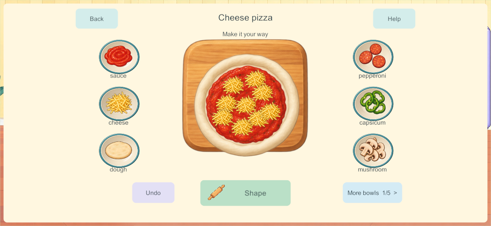
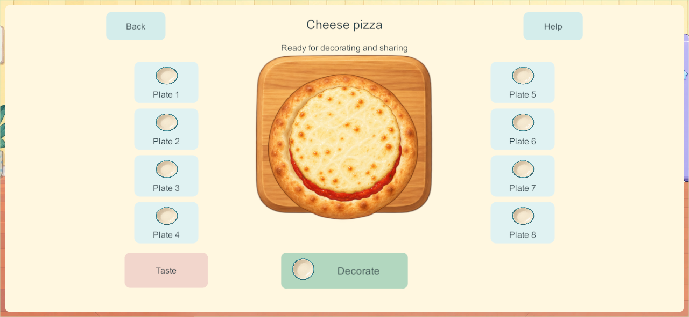
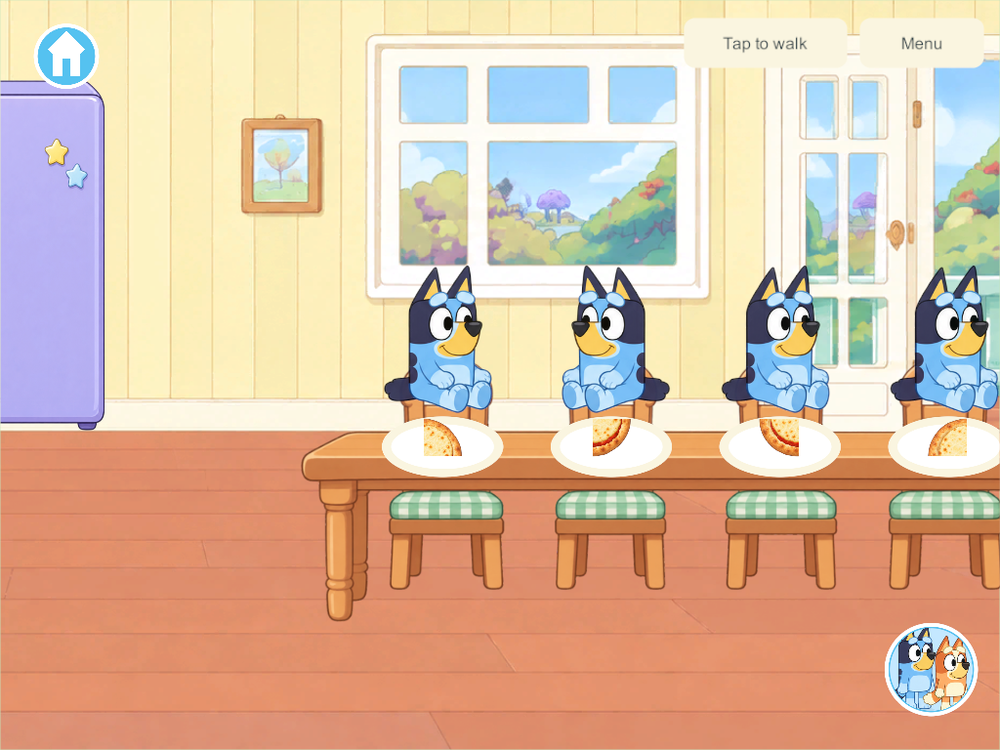
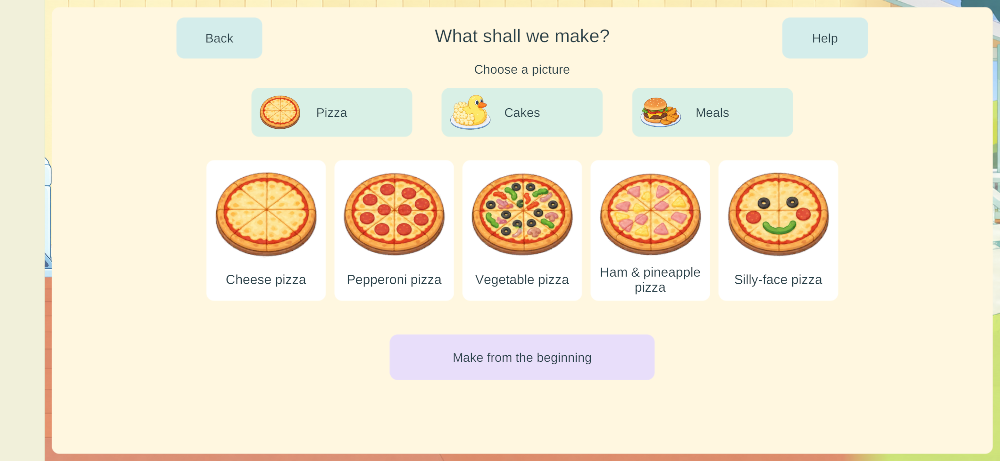

# Easier four-player cooking — September 27, 2026

**Later phone feedback opens a process correction:** the user reports inappropriate ingredients in cakes and repeated-button cooking. [New process audit and staged-cooking research](kitchen-staged-cooking-research-2026-09-27.html) governs the next implementation. The engineering evidence below remains valid for its scope; it does not establish complete cooking activities or accepted child usability.

The Android 162 review identified blocked appliances, a confusing tray selector and too many drawer prerequisites. Candidate **166** applies the [child-interaction research](kitchen-child-friendly-research-2026-09-27.html): a large central dish, surrounding ingredient bowls, working Cook entry and automatic selection of an available real tray. **Samsung was subsequently updated to 166; see phone delivery below.** This candidate is a new preview, not accepted child usability or completion of Home.

## Play and presentation

- The table and four seats sit beside the appliance bank. Fridge, oven, cupboards and counters remain separately interactive; saved contents and occupied seats migrate to their new supports.
- Tap **Cook**, choose a pictured pizza, cake or meal, and start with an available tray. An empty plate also leads to Make food. Four already-open recipe pickers can commit independently without all claiming the first tray. Return to your own creation by persistent profile identity; an occupied kitchen offers existing creations instead of overwriting them.
- Six large ingredient bowls surround the central board. A tap adds one real portion; dragging optionally chooses its position. Five bowl pages retain the full inventory, with visible forward/back controls. Required tool actions and baking have tap alternatives. Manual drawer play remains available, but assisted cooking does not require it.
- Pizza shows raw dough, sauce, scattered cheese, actual toppings and a baked crust with melted cheese. The same topping positions survive baking and transfer to the appropriate slice. Serving offers eight real plates; Taste, washing and return to Home remain independent.
- All fifteen recipes use the new pictured entry and assisted preparation. Cakes/meals still use their earlier finished illustrations with additional toppings; bespoke shaping, stacking and transformation effects remain unfinished.

## Shared objects and saves

**Schema 14 / content 15 / build contract 16.** The forward migration relocates anchored kitchen contents and seated occupants, preserving object/support IDs, existing food, held and loose items, room ownership, receipts and enrollment. It adds optional cook-profile and ingredient-contributor fields. Legacy schema-13 positions remain valid when reading older checkpoints.

Assistance is an authority transaction. It can access eligible communal kitchen stock behind closed doors without exposing closed contents to ordinary pickup. It cannot take another player's held object or private storage. Starting a recipe selects a clean eligible tray atomically, consumes real stock and records the cook profile. If required base stock is exhausted, the explicit recipe choice replenishes that same bounded package; empty extra bowls offer Refill. No extra loose objects spawn. Ingredient additions respect the existing dish limit and reserve capacity for required recipe ingredients.

Undo removes only the acting player's latest eligible unbaked addition. It discards that portion rather than rewinding a package batch or another player's work. Heating uses four real oven positions and stops safely at ready. Serving transfers a single portion bit; tasting consumes it; washing reuses that same dish. Closing a panel or leaving Home does not stop another cook. PC/VPS authority and private offline saves remain unchanged, with no offline merging.

## Applied research and artwork

The [research](kitchen-child-friendly-research-2026-09-27.html) informed the central composition, recognizable bowls, tap alternatives, automatic tray assignment and optional cupboard play. Its proposed audio/hand demonstrations are **not implemented** here: Help currently gives a short written cue. Platform touch guidance is a starting point; physical target measurements and child observation still need actual devices.

Built-in imagegen supplied an unchanged transparent six-part atlas: raw dough, baked crust, sauce, melted cheese, board and bowl. [Source artwork](../../SourceArt/Home/Kitchen/cooking-layers.png) · [Exact prompt and provenance](../../SourceArt/Home/Kitchen/cooking-layers.manifest.json). Existing character artwork and movement are preserved.

## Qualification

Evidence is collected in [the candidate directory](evidence/kitchen166-2026-09-27/). Core and native results are scoped engineering checks, not proof of first-use success by a child.

- **184 core checks passed**, including occupied schema-13 migration, simultaneous starts, last-unit consumption, held-item protection, all fifteen assisted recipes, undo isolation and independent baking/cold restore. [Core results](evidence/kitchen166-2026-09-27/core-tests.json).
- Three native build-165 UI groups passed: four concurrent closed-door recipe pickers, tap/gesture cooking and serving with a departing cook, and independent dining plus empty-plate entry. [Results](evidence/kitchen166-2026-09-27/native-ui165.json).
- All fifteen native build-165 recipes passed preparation, heat, serving, tasting and washing without opening drawers or spawning extra stock: [five pizzas](evidence/kitchen166-2026-09-27/recipes165-0.json), [five cakes](evidence/kitchen166-2026-09-27/recipes165-1.json), [five meals](evidence/kitchen166-2026-09-27/recipes165-2.json).
- All three native UI groups passed again in final **166** after correcting Taste-button overlap and the slice renderer's quadrant orientation. Final screenshots were inspected at phone/tablet aspect ratios. [Final UI results](evidence/kitchen166-2026-09-27/native-ui166.json).
- Windows client/server and signed release Android **166** built successfully. All **90 game C# files and 12 kitchen images** match both final source manifests; all **351 Windows artifact hashes** and the signed APK hash were rechecked. [Source/artifact verification](evidence/kitchen166-2026-09-27/source-verification.json) · [Windows](evidence/kitchen166-2026-09-27/windows-build166.json) · [Android](evidence/kitchen166-2026-09-27/android-build166.json). The APK was subsequently **installed in place on Samsung**, as recorded below.
- Three native continuity groups passed in final **166**: an actual build-155 checkpoint migrates with prior fields/enrollment preserved and four original profiles rejoining; carried food survives upstairs travel, private outage/taste/cold reopen and authoritative rejoin; current backup and restored-155 migration validate. [Continuity results](evidence/kitchen166-2026-09-27/continuity166.json). An earlier run timed out during a client join while other native/build work was active; the isolated serial rerun passed without runtime changes. [Attempt history](evidence/kitchen166-2026-09-27/test-attempts.json).
- Six isolated build-165 recovery groups passed: protected backup, exact restore/four original profiles, rollback, ten invalid-bundle refusals, interrupted restore and missing-world reconstruction. [Results](evidence/kitchen166-2026-09-27/recovery165.json). The production recovery allowlist is unchanged.

Build 166 changes only Taste-button placement and rendered slice orientation from 165; core, network and persistence code remain identical. [Exact qualification scope](evidence/kitchen166-2026-09-27/qualification-scope.json).

The screenshots below are native Windows clients at phone/tablet aspect ratios, not physical phone/tablet captures.

## Remaining acceptance and delivery

KUX-01–06 have scoped native/core evidence; their physical-device portions and the full mistake/help matrix remain open. **KUX-07 first-use child observation is open.** No new speech, hand demonstration, bespoke kitchen soundscape or A10 performance result is claimed. Picture orders/parent reactions, creation album, picnic packing, drinks/blender/café and full cake/meal transformations remain in the [Home tracker](../home-world-feature-tracker.html). H-07–10 / COOK-01 remain Partial.

Next: review this candidate's first pizza on the phone, record actual trouble spots before explaining the steps, and address that feedback before expanding the remaining kitchen behaviors. Continue older-iPad and mixed-device/lifecycle qualification when devices are available.

This work remains on `codex/home-kitchen`, which includes earlier book-preview development lineage with outstanding qualification recorded in [the book report](home-books-2026-09-26.html). It is not promoted wholesale to `main`. The implementation pass updated no devices. The subsequent authorized phone delivery below updates Samsung to 166; PC server/helper and iPads remain 128, iPhone 101. Shared content-15 play requires a coordinated matching server update; private solo remains available.

## Subsequent Samsung delivery

**Phone delivery — September 27: Samsung updated in place from 162 to 166.** Exact installed signed APK and launch verified. All 16 primary saves and 16 backups remain; 15 primary saves are byte-identical. The active world migrated from schema 13 to 14 with all 117 objects, rooms, ownership and player identity retained; a new pizza started on the phone consumed exactly one dough unit. The new recipe chooser was visibly verified. [Delivery and retention evidence](evidence/kitchen166-2026-09-27/android-update.json). Full physical recipe/child/mixed-device acceptance remains open; other devices/server unchanged.

