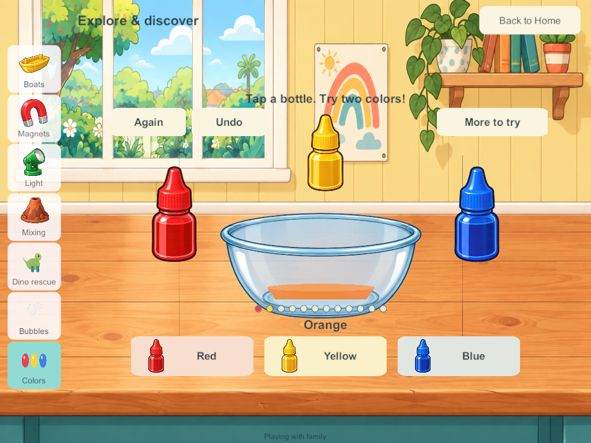
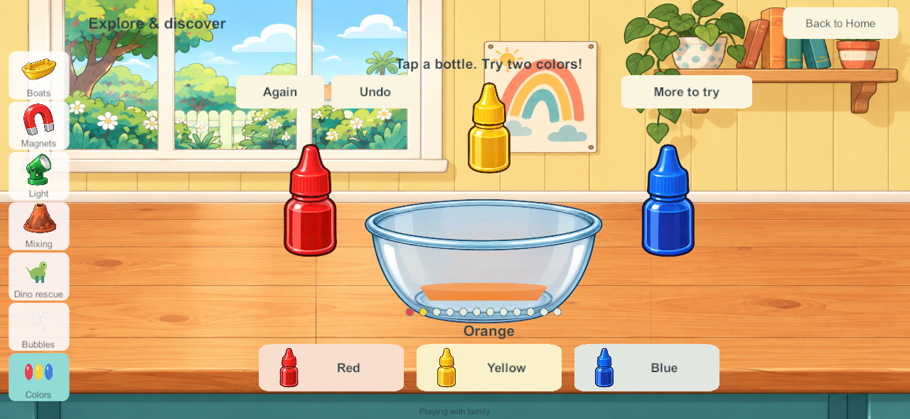
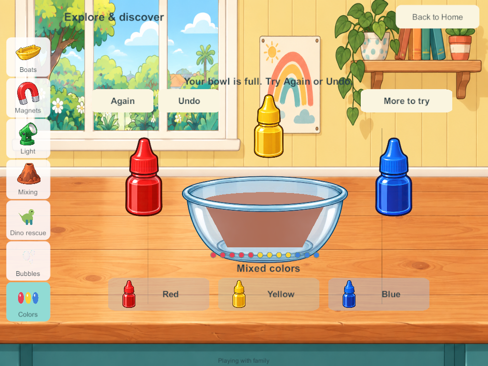

# Liquid colors in the Home science area

September 28, 2026. LAB-01 / SP-15. This bounded slice brings the accepted liquid-color prototype into the Unity Home game. It is separate from SCI-04 additive colored light and SCI-09 chemistry. The nine original stations, fifteen prototype concepts, native reader controls and full Home backlog remain required.

## Research applied

The [hammer, bubble and liquid-color research](science-hammer-labs-2026-09-28.html), [child-flow study](science-kids-flow-2026-09-28.html), [picture-control review](home-picture-controls-2026-09-28.html) and goal-sheet chapter 30 were read before implementation. This applies previously reviewed research rather than claiming a fresh external research round.

The [PBS walking-water activity](https://www.pbs.org/parents/crafts-and-experiments/experiment-with-walking-water) informed three obvious source colors and one receiving vessel. The [PBS family science guide](https://static.pbslearningmedia.org/media/media_files/00eeccf4-8cc2-44cd-aaf3-942771df089f/5f2da456-9574-4772-8094-57efcec32511.pdf) describes Curious George mixing/painting colors and exploring brown; that supports free combinations without compulsory matching. The historical commercial game was not run. Toca's exploration references and the child-flow research inform direct bottle taps, equal picture choices, brief labels and optional extras. Physical child usability remains unverified.

The accepted prototype's authored **RYB approximation** is ported unchanged: equal red/yellow gives orange, yellow/blue green, red/blue purple, and equal thirds earthy brown. Proportions change the shade; strongly uneven three-color mixtures are labeled Mixed colors. Clear water dilutes toward a pale watery color while retaining the original colored portions. This is neither additive RGB nor a measured spectral dye simulation. There is no invented fizz reaction or claim that every mixture of dyes behaves identically.

## Native play and presentation

At the downstairs Science bench choose **Colors**. Tap any red, yellow or blue bottle, or its large matching picture button. Each accepted tap adds one portion. A short stream and swirls blend toward the resulting color; rapid taps continue from the displayed color instead of restarting from an unseen final shade. There is no mandatory order, score, quiz or timer to satisfy.

The glass bowl and illustrated bottles reuse existing workshop artwork, layered around the actual mixture. The three main choices remain equally prominent. Twelve little portion markers show the mixture's contents. Water, sound and calm effects sit under More to try. Again empties only the owner's bowl; Undo restores the preceding change, including a reset. At twelve portions, further pouring is disabled and Again/Undo remain available. Opening the lab starts no narration; the optional pour/tap sounds reuse native science effects. Final listening acceptance remains open.

Seven sidebar destinations fit within both tested phone and tablet layouts. The first native screenshot caught cropped yellow/blue bottles: sprite coordinates assumed the source image resolution while Unity had downscaled the imported texture. Normalized crop coordinates now retain each complete bottle. Candidate 193 is an intermediate visual-review build; candidate 194 contains that correction.

## Four-player authority and persistence

**Schema 21 / content 22** adds one independent liquid-color tray per profile. It saves three integer color quantities, water, a tray revision and at most one undo state. It does not save or synchronize every animation frame. Current and undo quantities are validated, deep-copied and capped at twelve portions. Optional records use arrays compatible with Unity JSON.

Only the owner can pour or reset. Existing receipts make duplicate commands idempotent, and a per-tray revision rejects stale edits. One player can change activities, travel or disconnect while others keep playing. Rejoining loads the PC authority; private solo stays in its separate local save, without merging offline edits. Migration appends trays while preserving previous objects, rooms, coloring, science, bubble film and identities.

There are no spawned loose containers or unlimited persistent particles. The animation is bounded local UI feedback; a reopened mixture appears already settled. Portable creations, shared pouring into another player's vessel and final child/A10/audio acceptance remain future work.

## Validation and delivery

Windows and signed Android candidate **194** are built. Native, private-solo and all seven isolated recovery groups pass. No family device, live server, enrollment or personal save has been changed by this task.

- [Matching source and artifacts](evidence/liquid194-2026-09-28/source-artifact-checks.json): all 113 Unity C# files match the Windows build, signed Android build and current source; all 351 Windows files and the APK match their artifact hashes. The 25 core files are identical between the tested 193 core and final 194. Importer whitespace-only changes were removed without changing artwork.
- [Android inspection](evidence/liquid194-2026-09-28/android-artifact-inspection.json): correct Little Weeps package/version, non-development release, pinned family signature and ZIP/LOAD alignment pass. The full static inspection remains failed at the inherited 16 KB RELRO alignment gate. Physical 16 KB/runtime/A10 qualification is not claimed. The artifact is `Builds/AndroidSigned/G3-0.0.194/LittleWeeps.apk`; it has **not been installed**.
- [233 core groups](evidence/liquid194-2026-09-28/core-results.json) pass: additive migration, known color anchors, ratio changes, dilution, order independence, twelve-portion capacity, reset/undo, deep copies, invalid-state rejection and stale/duplicate/foreign commands. The tested core is unchanged between candidates 193 and 194; 194 corrects presentation.
- [Combined payload stress check](evidence/liquid194-2026-09-28/combined-payload.txt): **98,087 bytes**, below the 100,000-byte view budget, with full kitchen, maximal coloring histories, sixteen chemistry trays, ice/bubble current and undo states, and all four full color trays. Recovery chunk reassembly also passes. The remaining budget is narrow; adding more persistent activities needs continued measurement or a separate scoped synchronization change.
- [Seven native four-client groups](evidence/liquid194-2026-09-28/native-results.json) pass on 194: actual 192→194 migration, four independent color results through real bottle touches, water dilution, reset/undo, two-finger protection, full-vessel refusal, independent travel/station changes, local preference lifecycle and exact server restart/rejoin state.
- [Private native solo](evidence/liquid194-2026-09-28/solo-results.json) passes color portions, dilution, reset/undo and cold reopen with local sound/calm preferences retained exactly.
- [Seven isolated recovery groups](evidence/liquid194-2026-09-28/recovery-results.json) pass with populated liquid-color trays: byte-exact backup/restore/rollback, corrupt/incompatible bundle refusal, interrupted-operation protection, reconstructed original enrollment and encrypted four-client reconnect without packet-queue warnings. The recovery helper now admits candidate 194; this does not mean the production server was upgraded.
- [Initial visual correction](evidence/liquid194-2026-09-28/initial-visual-review.json) records the 193 crop issue; [final visual review](evidence/liquid194-2026-09-28/visual-review.json) checks intact bottle artwork, low/full liquid containment, all seven destinations and separated controls in 194.

These screenshots are native Windows release clients resized to phone/tablet aspect ratios, not physical Android/iPad evidence. Android remains last verified at **188**; iPads/server remain last recorded at **171**, iPhone **101**. No fresh device/server inventory was requested or performed.

## Remaining scope and next task

The remaining twelve science prototypes still require native integration and qualification. Preserve the original nine science stations, fan/wind extras, coloring/cooking and the wider Home scope. The inherited book/audio/shared-play hold on main integration and Android 16 KB RELRO gate remain open.

**Next bounded task:** bring the accepted picture-control style into the native book reader, preserving large full-page artwork, deliberate Read to me, fixed arrows, independent bookmarks and four-player independence. Review the new science labs on devices and complete sustained mixed-device/A10/audio qualification separately.
