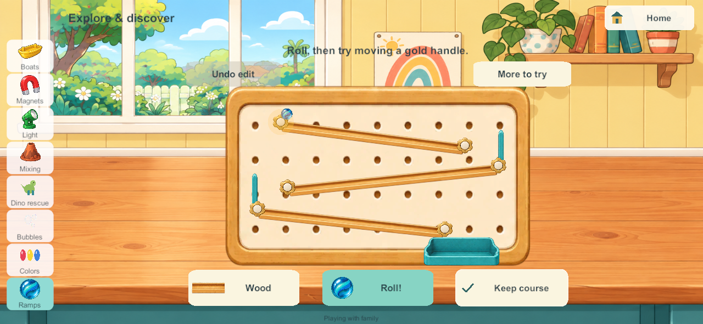
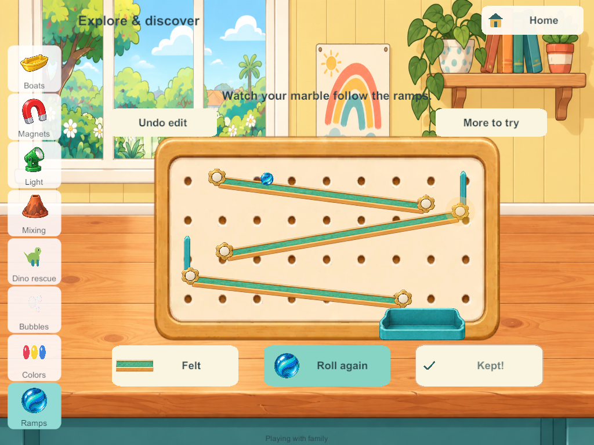
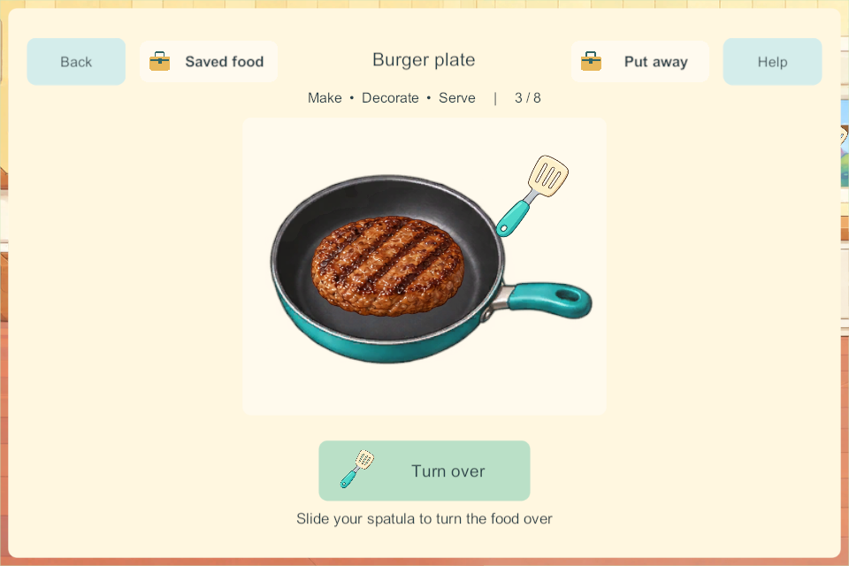

# Marble ramps in the downstairs science area

September 28, 2026. SCI-03 / SP-03 / LAB-01. Candidate 216 passes the scoped checks below. This is one bounded Home activity; the full backlog remains required.

## Research applied to play

The [applied research](marble-ramps-research-2026-09-28.html) uses Exploratorium construction/testing/revision, Tinybop direct manipulation, and PBS material comparisons. A working three-ramp course starts ready to roll. Six gold handles change actual track endpoints; drag a handle or tap it and then its new place. Roll releases one marble. Wood, felt and rubber preserve the same geometry while changing resistance. There is a wide catch basket, with no score, failure screen or compulsory restart.

Four profiles own separate courses. Other players can change activities or leave while each release continues. More to try holds starter/restore, smaller height adjustments and local sound/calm preferences. Keep course preserves one deliberate layout per profile. Undo recovers the preceding temporary layout or release. After five unused minutes, temporary play returns to the kept course or starter; kept layouts are never cleared automatically.

## Saved and shared systems

Schema **27**, content **28** adds four ramp trays. Migration maps cleanup cues by their stable keys so inserting another station cannot redirect an older pending cleanup. Course coordinates, surface, release elapsed time, one undo state and one kept course are bounded and validated. Owner and revision tokens reject foreign or stale changes. A retry cannot create a second marble.

A fixed 120-step-per-second simulation follows edited tracks and visible stops. The authority persists elapsed release time and marks completion; clients draw the same cached trajectory without sending an entire world for each ball position. At most sixteen courses are cached, with a 45-second bound per trajectory. This is a controlled learning model of slope and surface resistance, not calibrated material physics. Maximum tested shared-world payload is **101,724 bytes**, below the existing 110,000-byte test guard and 131,072-byte transport limit.

The built-in imagegen tool produced the [layered ramp atlas](../../SourceArt/Home/Science/marble-ramps.png). [Exact generation/edit prompts and output provenance](../../SourceArt/Home/Science/marble-ramps.manifest.json) are retained. The edit removed track-end caps; board, tracks, stops, handles, marble and rear/front basket layers are composed separately. Source/runtime RGBA bytes remain identical. Sprite crops avoid painting a second front basket wall over the marble.

## Validation and limitations

[All 282 core groups pass](evidence/ramps216-2026-09-28/core-results.json), including nine ramp groups: starter traversal through all three ramps, surface/slope consequences, migration and cue identity, four-player departure, retry/partial-release restore, kept-course cleanup/undo, malformed/foreign/stale edits and bounded deep copies. The starter reaches the basket after about 14.06 seconds. Unity serialization additionally passes [24 real writer/reader checks](evidence/ramps216-2026-09-28/unity-json-after.txt). [Six native groups pass](evidence/ramps216-2026-09-28/native216-results.json): actual 26→27 migration, four independent real-touch courses, one-pointer/tap-place/undo/kept controls, simultaneous rolling/departure, cold server restart with partial-release retention, and safe waiting-flip food storage/retrieval. [Private solo also reopens exactly](evidence/ramps216-2026-09-28/solo216-results.json), including geometry, surface, kept course, undo and local sound/calm choices. Phone and tablet controls are measured in bounds, nonoverlapping and at least 44 native pixels; that is a layout check, not a physical-point or toddler usability claim. [Windows source/artifact verification](evidence/ramps216-2026-09-28/windows-source-check.json) and [signed Android verification](evidence/ramps216-2026-09-28/android-source-check.json) match the current C# and ramp artwork. Both build 216 releases are ready and uninstalled.

Candidate 213's first native run exposed a nearby tap-place problem. Candidate 214 allows a small second-tap adjustment inside the handle's generous target and keeps the basket and station labels clear of controls. Candidate 215 also honors small adjustments below the UI drag threshold. Candidate 213 and later correct the Put away button for a meal safely waiting for a flip: it uses the actual heating state, allowing the core's existing safe storage behavior instead of treating completed first-side heat as still busy.

A longer candidate-215 run caught an authority save failure at the end of an edited ramp. [The Unity serializer reproduced it](evidence/ramps216-2026-09-28/unity-json-before.txt): 14.816666666666666 seconds returned as 14.816666666666668, just beyond a strict upper bound. Candidate 216 accepts one nanosecond of serialization tolerance and treats it as complete, while rejecting genuinely out-of-range times. All 24 real Unity JSON checks now pass. This disposable-game regression is separate from the Windows policy block below.

Independent production backup/restore qualification remains blocked by [Windows Application Control refusing the unsigned validator](evidence/cakes207-2026-09-28/recovery-blocker.json). The policy's friendly name is not established. Security settings were not changed or bypassed; build 205 remains the last recovery-allowlisted build. Ordinary disposable cold restart and private reopen are separate checks.

No phone, iPad or family server is updated by this work. Physical child usability, older A10 performance, mixed-device/audio/lifecycle checks and the inherited Android 16 KB gate remain open. Broader construction graphs, tunnels, connected family chain reactions, remaining science stations, freehand drawing, bathroom/laundry, Home TV, agreed book subjects and the full tracker remain required. Main integration stays held. The requested finishing sequence is ready for device review after coordinated matching deployment and the remaining recovery gate are addressed; select the next backlog slice from that review.

