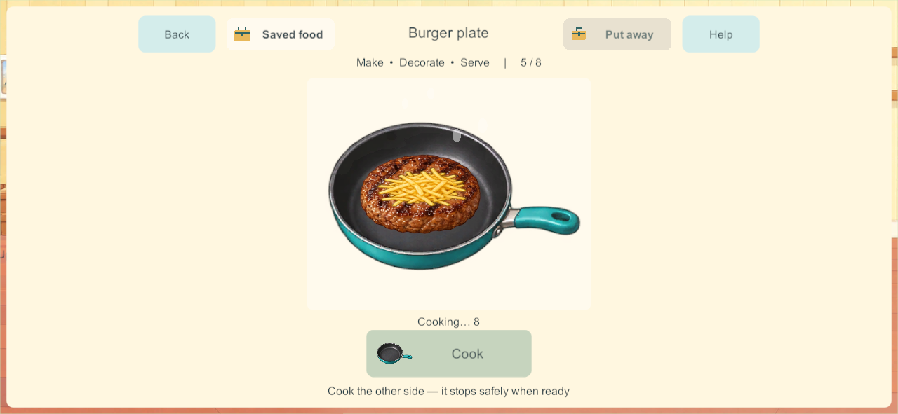
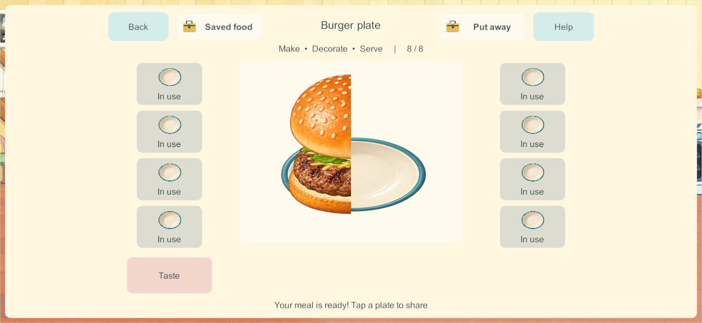
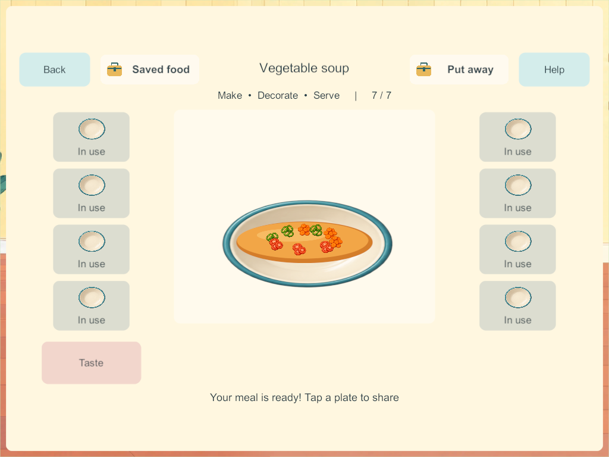

# Five pan and pot meal activities

September 28, 2026. MEAL-01 through MEAL-05 / COOK-01 / H-08 and H-10. This completes the remaining staged recipe family in the [Home finishing sequence](home-finishing-research-2026-09-28.html). The researched ramp activity follows; Home, physical acceptance and the broader kitchen backlog remain open.

## Research applied

The [meal research and acceptance contract](meal-preparation-research-2026-09-28.html) maps primary cooking references and the existing children's-app research to each interaction. Ingredients appear when the current step needs them, while visible food changes through direct gestures or pictured assistance. Short safe game timers are pretend play, not real cooking instructions.

| Meal | Implemented process |
| --- | --- |
| Burger | Move patty into pan, cook one side, flip, optional cheese, cook the other side, choose fresh bun/salad, assemble four layers, serve |
| Pasta | Fill pot, stir, boil, drain through colander, add sauce, coat, transfer to dish, optional cheese, serve |
| Vegetable soup | Select whole vegetables, chop in two directions, pour broth, stir, simmer, ladle, serve |
| Pancakes | Add egg/milk to flour, mix, pour three circles, cook first sides, flip, cook second sides, stack, add fruit, serve |
| Rice and vegetables | Add water, cook rice with visible absorption, choose/chop vegetables, stir and pan-cook them, combine with rice, scoop, serve |

Four independent hob supports reuse the existing four-burner artwork. Cakes and pizzas continue using the oven. A heat pass starts deliberately and stops safely at the next stage even when the cook leaves. First/second cooking passes match dish identity and stage in both transient heat messages and reliable snapshot merging, preventing a completed first timer from completing the second side.

Partial water, stirring, pouring, draining, coating, ladling, chopping, flips, stacking and completed heat passes stay with the persistent dish. Ingredient units and served portions retain their original identity. Put away frees the cookware; retrieving a creation restores that food. An unfinished flip can be kept, while actively heating food cannot be packed. Explicit ready-food assistance still leaves assembly or finishing to the child. Optional experiments reserve capacity for required inputs.

## Saved contracts and artwork

Schema **26**, content **27**, recipe version **4**. Older food recipes remain on their existing contracts. A bounded version-one meal payload stores eight progress amounts and five counters in 53 bytes, encoded as 72 characters. Creation archive format **2** adds that payload; its reader also accepts format **1** from previous builds. A captured disposable build-210 archive verifies old stored pizzas decode and round-trip without losing food.

The built-in imagegen tool produced the [twelve-component meal atlas](../../SourceArt/Home/Kitchen/meal-stages.png). [Exact prompts, selected output and provenance](../../SourceArt/Home/Kitchen/meal-stages.manifest.json) are retained. Source and runtime RGBA copies are unchanged; inspected sprite bounds retain complete cookware handles, food and ladle. Existing ingredient and bowl art is reused. Whole, prepared, cooked and assembled food are separate layers; finished burger/pancake portions clip against a common origin rather than showing a second whole dish.

## Validation and remaining work

[All 273 core groups pass](evidence/meals212-2026-09-28/core-results.json). Meal-specific checks cover all five paths with restore at every stage, four hobs, deliberate separate heat passes, departure, stage-specific ingredients, partial work, stale input, archived food, malformed data, ready-food assistance and old-version migration.

[Candidate 211 passes six native groups](evidence/meals212-2026-09-28/native211-results.json): four real client cooks, touch preparation, matching palettes, four shared hobs, independent departure, live second-side timers, eight conserved servings, saved remainders, the rice's separate vegetable pass, and a cold server restart followed by four food retrievals. Candidate 212 refines soup placement, the patty's pictured tool and movement while stacking; [all three focused presentation checks pass](evidence/meals212-2026-09-28/presentation212-results.json). The core and network sources are unchanged between those candidates.

Windows and signed Android source/artifact checks are recorded beside the results. No phone, iPad or live family server is changed. Independent production backup/restore qualification remains blocked by [Windows Application Control refusing the unsigned validator](evidence/cakes207-2026-09-28/recovery-blocker.json); no security policy was changed or bypassed. Build 205 remains the latest recovery-allowlisted build. Ordinary disposable server restart is separate evidence.

Physical child/A10/mixed-device/audio qualification, the inherited Android 16 KB issue, orders, the photo album, burger sides, stretchy-cheese polish, broader freehand creation and the rest of Home remain open. Main integration stays held. Next bounded implementation: SCI-03 ramps/surfaces, using the applied research and four-player retained-workspace rules.

**Follow-up in the ramp candidate:** the core already allowed a burger safely waiting for a flip to be stored, but the 212 Put away button still treated its completed first-side heat as busy. [The ramp implementation](marble-ramps-2026-09-28.html) corrects that control and records actual storage/retrieval verification.
