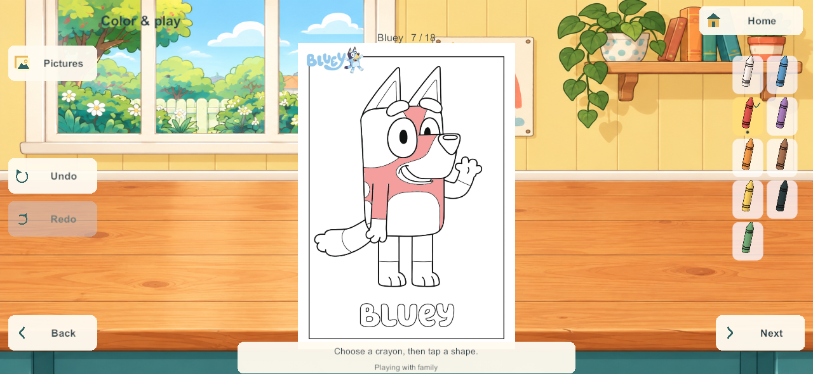
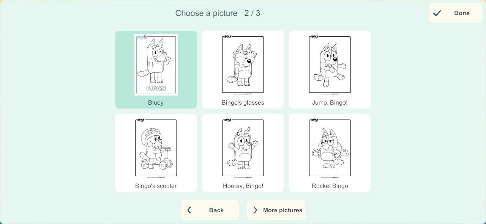

# Native coloring picture controls

September 28, 2026. COL-02 / COL-03. First implementation in the user's accepted Home finishing sequence. [Applied research](home-finishing-research-2026-09-28.html).

## What changed

- The existing coloring workspace now uses rounded cream/teal picture controls for Pictures, Undo, Redo, Back, Next and Home, keeping the illustrated workshop and all eighteen original pages.
- The chooser shows six large previews per screen, with three reachable groups and a clear current-picture highlight. Page arrows stop at the beginning/end instead of wrapping.
- A check picture reinforces the selected crayon. The full page remains fitted to its original aspect ratio; artwork is not cropped to fill a screen.
- Page-local undo/redo and the existing authoritative fill commands are preserved. The chooser blocks painting behind it; pending operations block page switches. Rejected saves remain visible.
- Saved-state feedback has a readable light background over the illustrated table.

## Validation

Windows candidate **202** passes [six native groups](evidence/coloring202-2026-09-28/results.json): exact build-200 discovery retention, all eighteen page choices and four independent fills, local undo/redo and nonwrapping boundaries, phone/tablet target/layout checks, independent departure plus server restart/rejoin, and exception-free shutdown. Essential targets measured at least 44 native pixels in the tested 1024×768 and 1280×591 windows; these are not physical-point or child-usability measurements.

[Source checks](evidence/coloring202-2026-09-28/source-check.json) match every current Unity C# file to the Windows artifact. Core rules/schema are unchanged; no new core-test or production-recovery claim is made for this client-only change. [Visual review](evidence/coloring202-2026-09-28/visual-review.json) uses the actual native captures below. The initial native test's text-array assertion was corrected before the successful full run; an early attempt to start a test before the build manifest finished was rejected by the artifact guard.

## Scope boundary

This changes client controls, not the server rules or save schema (22/content 23). Freehand drawing, creation folders/display, food storage and later cooking stages remain separate implementation work. Current phone 200, server/iPads last recorded 171, physical A10/touch/sound acceptance and the main integration hold are unchanged. This milestone is not full Home completion.
