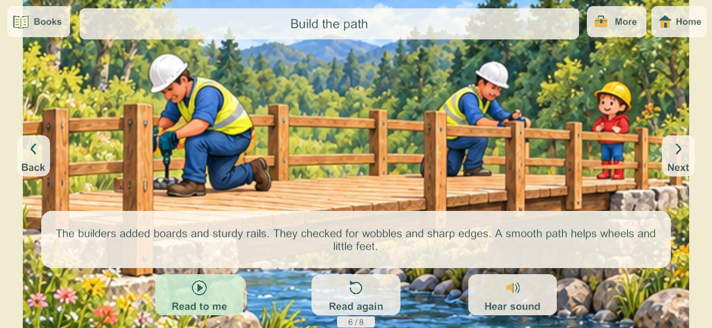
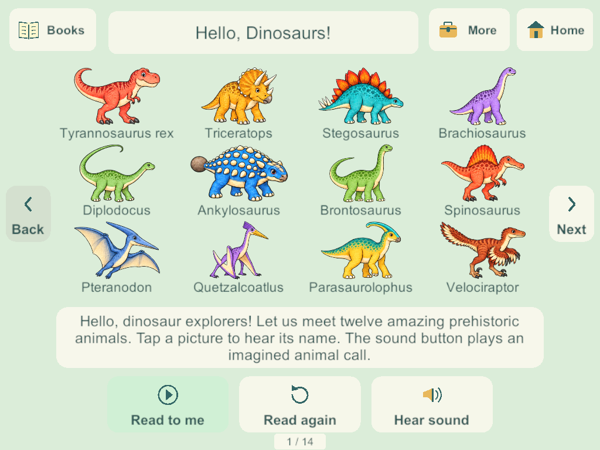

# Native picture controls for the Home books

September 28, 2026. BOOK-01 / H-19 / H-20. This bounded slice carries the accepted [browser reader and picture-control research](home-picture-controls-2026-09-28.html) into the Unity game. The six existing draft books, their 54 pages, original illustration bounds and recorded narration/name/effect assets are retained. The requested final subjects and voice acceptance remain separate open work.

## Applied research and presentation

The [Khan Academy Kids publisher guide](https://khankids.zendesk.com/hc/en-us/articles/4409036780955-Learn-more-about-the-books-in-the-Khan-Academy-Kids-app) distinguishes deliberate Read to Me from quiet reading with arrows. The [W3C enhanced target guidance](https://www.w3.org/WAI/WCAG22/Understanding/target-size-enhanced.html) recommends at least 44 by 44 CSS pixels and larger targets for frequent/sequential actions. Both sources were rechecked for this implementation. These are design references; native screen pixels are not CSS pixels or proof of physical toddler usability.

- Three main pictured actions: **Read to me**, **Read again**, and **Hear sound**. The primary action becomes Pause during playback, Cancel while requested page audio loads, and Keep reading after a pause.
- Cream translucent rounded cards, opaque teal pictures and labels, and a green primary action follow the accepted science/reader treatment. Pictures are small native meshes, with no additional raster textures or audio assets.
- Fixed Back/Next arrows, Books, and Home remain accessible. Arrows disable at the first and last page instead of wrapping. More opens the voice, effects, words and automatic-page controls.
- Full illustrations continue to fit their authored bounds. The words panel can be hidden locally; it starts visible. Page images are never cropped to fill a different screen aspect.
- New title preferences start with automatic turns off. Previously saved automatic-turn choices are preserved. Optional automatic turns follow actual narration completion and a short pause.

## Audio and four-player behavior

Opening and returning from the background remain quiet. Each profile keeps its own local page and narration sample for each title; bookmarks are not added to the server snapshot. No world schema, content version, ownership or network authority contract changes are needed.

Explicit effects now temporarily suspend the page narration, just as spoken dinosaur names do. They resume only the still-current reading intent. Pause, page change, title change, close and lifecycle interruption cancel old requests; a delayed load cannot revive them. Existing resource leases still protect a new request from an old request unloading the same clip. A failed page-audio load leaves page controls available and Read to me can retry.

The shared living-room rack and carryable physical books remain. Four players can read the same title at different pages while another player travels or plays. This change does not add a shared reading lock or pause the authority.

## Validation and delivery

Windows candidate **198** passes [eight native groups](evidence/reader198-2026-09-28/native-results.json), using disposable loopback family worlds and real Input System/uGUI touches:

1. Exact per-title pages and narration samples survive 194 to 198; saved auto preferences remain, and opening stays quiet.
2. Four readers keep separate pages and playback while a sibling travels.
3. Effects suspend/resume narration; name/page changes and closing cancel old audio and release media.
4. Manual mode stays on the page; optional automatic mode follows actual clip completion.
5. All six draft titles and 54 pages load with bounded resident textures and nonwrapping arrows; narration is exercised in each title.
6. Phone 1280 by 591 and tablet 1024 by 768 layouts keep the reader controls inside the screen, with measured native touch rectangles at least 44 pixels in each dimension.
7. Words/voice/effect choices and bookmarks survive cold process restart. Network-only interruption preserves local reading; simulated Unity application pause/resume callbacks leave it quiet.
8. Every candidate client and the authority close before final log inspection; no reader-cleanup exceptions or send-queue warnings.

[Visual review](evidence/reader198-2026-09-28/visual-review.json) uses actual native captures. [Initial review](evidence/reader198-2026-09-28/initial-review.json) records presentation polish, loading-label encoding cleanup, an intermittent shutdown cleanup fix, and correction of a test fixture that had confused network suspension with app suspension. No physical device is implied by these tests.

At the initial preparation milestone, Windows and signed Android **198** were prepared but not installed. The later Samsung delivery is recorded below. [Source/artifact evidence](evidence/reader198-2026-09-28/source-artifact-checks.json) verifies all 115 Unity C# files match both artifacts and current source, plus all 351 Windows files and the APK. All 25 Core files are unchanged from 194; its 233 core groups and full recovery evidence remain historical, not new 198 runs. Reader teardown now saves/stops/releases media without updating UI that Unity may already have destroyed. This local reader slice does not add a save migration or increase the server world payload.

[Android inspection](evidence/reader198-2026-09-28/android-artifact-inspection.json) passes Little Weeps identity, pinned family signature, non-development release and ZIP/LOAD alignment. The inherited 16 KB RELRO static check still fails; the artifact is not fully qualified for that gate. Physical runtime/speaker/A10 qualification remains open. The initial artifact qualification did not touch family data or enrollment.

## Samsung delivery

On September 28 the user supplied a reachable wireless endpoint and requested the update. Build 198 replaced 188 using the pinned family signature and `adb install -r`; the installed APK matches the release artifact exactly. All 21 primary saves and 21 backups remain. Twenty primary saves and twenty backups are byte-identical; the active private world migrated 18 to 21, retaining all 118 objects, four bedrooms, four secret rooms and prior coloring pages while adding the new labs. Its checksums remain valid. A few normal player/item/radio changes also occurred after launch.

The unlocked phone visibly launched Little Weeps with its existing kitchen and food; the user subsequently opened coloring. This verifies launch and visible saved content, not physical speaker quality or a complete reader acceptance pass. The phone has 4096-byte pages. Server, iPads and iPhone were not updated. [Sanitized update evidence](evidence/reader198-2026-09-28/android-update.json).

## Remaining work

No physical speaker-route, A10 performance, child usability or sustained mixed-device acceptance is claimed by native Windows media-state tests. The existing Android 16 KB qualification issue, production recovery/deployment, reported physical book audio and branch integration hold remain open. Home and BOOK-01 remain Partial.

The requested final catalog remains dinosaurs, snakes/reptiles, cars/trucks, Hello Kitty, Tangled and unicorns. This controls pass does not approve or replace the installed original story drafts or narrator.

Next bounded implementation: apply the accepted picture controls to the native coloring workspace, preserving its eighteen pages, four independent creations and undo/redo. Cooking controls, remaining science activities and the full Home backlog remain required. Review the current reader and science candidates on devices when deployment is requested.

## September 30: restart the whole book and hear dinosaur calls

BOOK-01 / H-19 / H-20: Windows candidate **230** replaces the current-page Replay action with a large **Start again** button. It returns any of the six installed books to page one and starts narration if voice is enabled. Once the last narration finishes, the main action reads **Read book again**, which also restarts from page one. Books do not loop automatically. Opening remains quiet, and restarting changes only that reader's local bookmark.

Tapping a dinosaur now plays its pronunciation followed by its species call. With voice off, it plays just the call; Sounds off still suppresses effects. The separate **Dinosaur call** action remains available. Restart, page/title changes and closing cancel obsolete audio before new reading starts.

### Research applied to the sound design

Exact extinct-animal voices are unknown. [Carnegie Museum's paleoacoustics interview](https://carnegiemnh.org/what-did-dinosaurs-sound-like-paleoacoustics/) discusses crocodilian growls, bird-like booms and modern-animal ingredients in imaginative dinosaur sound design. [Natural History Museum's Diplodocus explanation](https://www.nhm.ac.uk/discover/quick-questions/what-did-diplodocus-sound-like.html) also distinguishes evidence from speculation. Accordingly these are original imagined calls, not authentic recordings or claims about exact dinosaur voices.

The user's existing PC audio environment generated twelve distinct calls: T-Rex, Triceratops, Stegosaurus, Brachiosaurus, Diplodocus, Ankylosaurus, Brontosaurus, Spinosaurus, Pteranodon, Quetzalcoatlus, Parasaurolophus and Velociraptor. Pterosaurs remain identified as flying reptiles. Prompts differentiate growls, bellows, grunts, honks, croaks, squawks and chirrups; phone-oriented mastering uses 90 Hz high-pass, -18 LUFS and short fades. All calls are 3.5-second mono 32 kHz PCM16, about 2.7 MB combined.

Generation uses the already installed [MMAudio large_44k_v2](https://github.com/hkchengrex/MMAudio), with CC-BY-NC-4.0 model attribution recorded per asset. Reproducible prompts/seeds/mastering live in `SourceAudio/Books/dinosaur-call-jobs-2026-09-30.json`; each output has a provenance JSON. The content/effects tools preserve these jobs on regeneration. Existing narration and picture assets remain.

### Targeted verification and delivery

[Five focused native checks](evidence/book-restart230-2026-09-30/results.json) pass on a disposable loopback server/client: restart across all six titles; names followed by T-Rex/Spinosaurus/Pteranodon calls; cancellation and muted restart; finished-book restart; and all twelve distinct source/runtime WAV matches. [Call hashes](evidence/book-restart230-2026-09-30/calls.json) and [asset properties](evidence/book-restart230-2026-09-30/call-assets.json) record the generated content. [Native phone-sized capture](evidence/book-restart230-2026-09-30/restart-phone.png) confirms the accepted translucent control style.

Windows client/server release **230** built successfully. This reader-only change adds no save/schema/network contract; schema 32/content 33 remain from 229. No phone, iPad, live-server rollout or physical listening acceptance is claimed. The full commercial qualification suites were not repeated, following the user's targeted-check preference. Next bounded task is installing this reader update when requested; final story subjects and the wider Home backlog remain open. Preserve the main integration hold.
