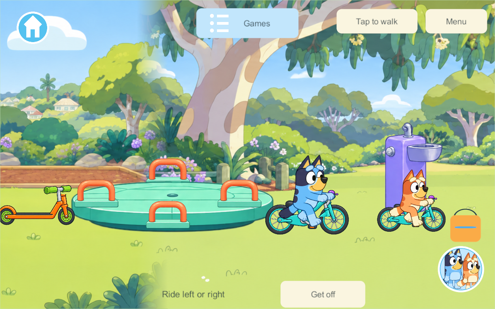
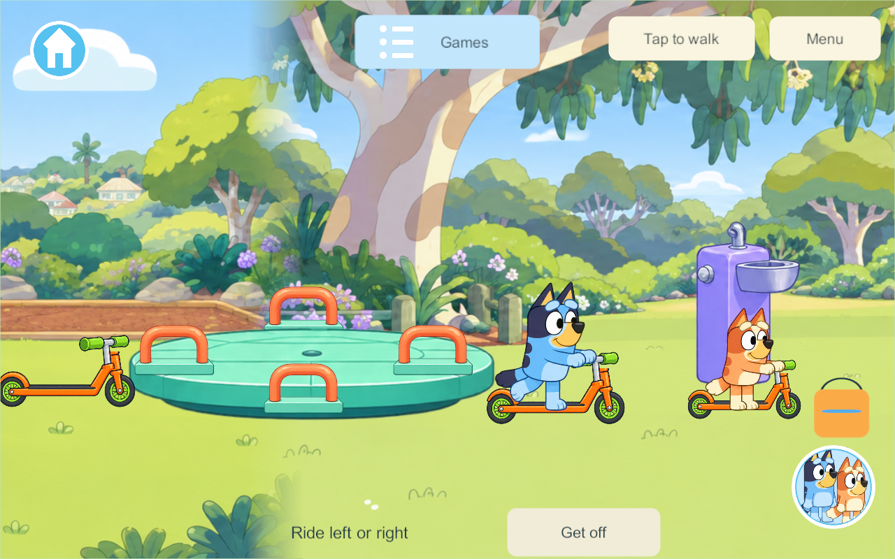

# Park bikes and scooters

September 30, 2026 — PRK-10, free riding in Playground & park.

## Controls and scope

Tap an available bicycle or scooter to get on. The existing joystick steers left/right; tap-to-move rides toward the tapped horizontal position. Vertical input is projected to a safe lane. Release the joystick or arrive at the destination to stop. The **Get off** button ends the ride. Switching character keeps the ride; picking up a toy, travelling, suspending or disconnecting releases it.

Four bicycles and four scooters are available, with up to four simultaneous family riders. Each vehicle belongs to one rider at a time. Players can mix vehicle types, pass one another without punishment and leave independently. These are direct park objects, not another Games-menu entry or a forced race. Bluey/Bingo now have dedicated pedalling and scooter coast/kick drawings. Other characters and outfits retain supported existing poses until their own riding art is prepared. Bell, delivery tasks, authored loops and final animation polish remain later work.

## Research applied

The touch controls reuse the same movement vocabulary rather than adding a second steering controller. Large object hit regions and an explicit exit reduce precision demands. This is a design application of [Apple game controls](https://developer.apple.com/design/human-interface-guidelines/game-controls); it is not an Apple-prescribed bicycle mechanic.

The existing PC/VPS movement authority owns position and the exclusive fixture lease. Client anticipation and remote interpolation evaluate the same lane rule. Rider and vehicle are drawn from the exact same displayed position, so the vehicle cannot lag behind a smoothed character. [NGO 2.13 client-side interpolation](https://docs.unity3d.com/Packages/com.unity.netcode.gameobjects@2.13/manual/learn/clientside-interpolation.html), [NGO network time](https://docs.unity3d.com/Packages/com.unity.netcode.gameobjects@2.13/manual/advanced-topics/networktime-ticks.html).

Frame-based movement advances toward a target with a bounded step, stops at the target, and clamps to the park path endpoints. Unity documents this pattern in [MoveTowards](https://docs.unity3d.com/6000.3/Documentation/ScriptReference/Mathf.MoveTowards.html). The pure rules core uses the existing equivalent `Walking.Step` rather than importing Unity types or running a balance simulation. Flat illustrated paths need authored attachment and motion, not a rigid-body bicycle simulator.

The show's [Bike episode](https://www.bluey.tv/watch/season-1/bike/) supports the playful practice theme. We choose assisted riding and no failure countdown for these preschool players; that difficulty choice is our design.

## Authority, persistence and artwork

Vehicle IDs use the existing temporary fixture leases; no saved inventory copies or vehicle-placement fields are added. Dismounting makes the same vehicle available at its parking place. Restore releases temporary riders through the existing fixture cleanup. Riding introduces content 44 because an older authority cannot validate those fixture IDs or movement rules. The combined working candidate also includes concurrent pond/outfit contributions at schema 36; the riding feature itself does not advance the save schema. The installed server 227 remains untouched, and a future shared rollout must use matching content on server and clients.

Transparent vehicle artwork is preserved in `Resources/ParkArt/bikes-scooters.png`; the exact generation prompt is in `ParkArt/provenance.txt`. Character and equipment share a support scale and depth anchor. The initial preview was rejected because the whole bicycle—including the saddle—was drawn in front of the body. The corrected frame/saddle/handlebar parts draw behind the rider, with explicit seat/deck pixel pivots and new Bluey/Bingo riding drawings. This applies the Canvas hierarchy order described in [Unity uGUI Canvas](https://docs.unity3d.com/2022.3/Documentation/Manual/UICanvas.html); documentation does not certify visual correctness. [Editable riding pose sources](../../SourceArt/Park/Riding/README.md). Mounted vehicle hitboxes are disabled so an occupied vehicle cannot block tapping an available one underneath it. Family visual approval remains distinct from compilation and test evidence.

## Verification

Windows release **276** compiled from committed baseline `7d19c1d` plus only the riding source, excluding unfinished concurrent Zoo/Creek work. Core park rules pass. The [successful native result](evidence/park-wheels-2026-09-30/result.json) covers four simultaneous bicycles and scooters, exclusive leases, tap riding in both directions, joystick riding, explicit dismount, mixed vehicle types, phone/tablet layout and independent disconnect/area departure. Earlier native runs exposed test setup/visibility problems; the successful run places the player beside the parked vehicle before tapping it. No physical-device or live-family-server update is part of this task.

The corrected actual-game screenshots show the saddle behind the rider, hands at the grips and feet at the pedal/deck area. These are visual-review candidates, not family-approved final art. Other cast/outfits still need dedicated riding drawings; separate wheel rotation and further contact/animation polish remain open.

