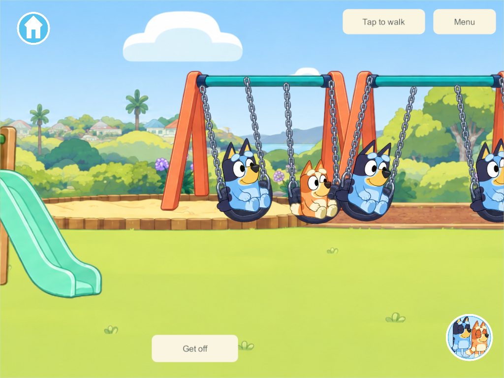
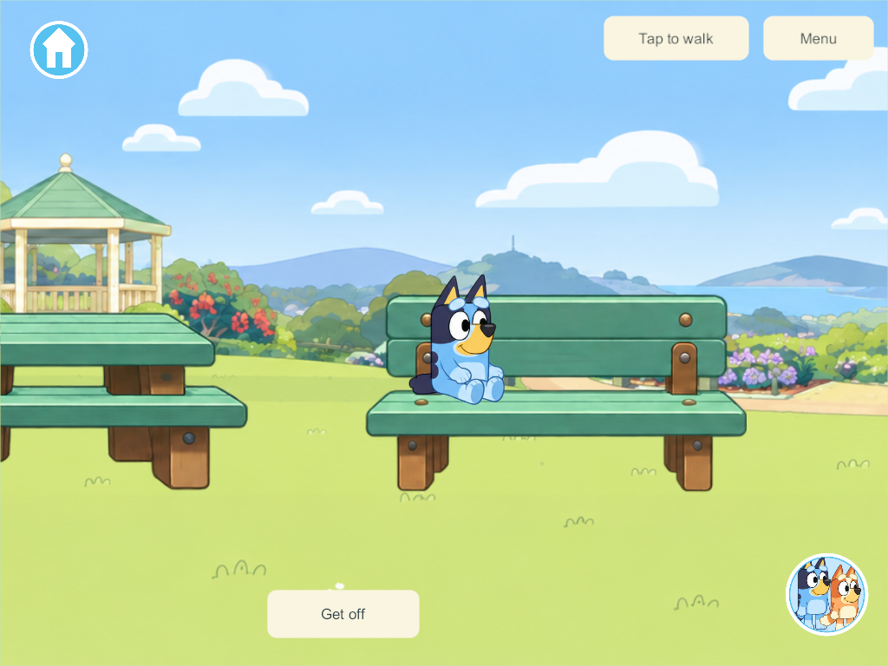
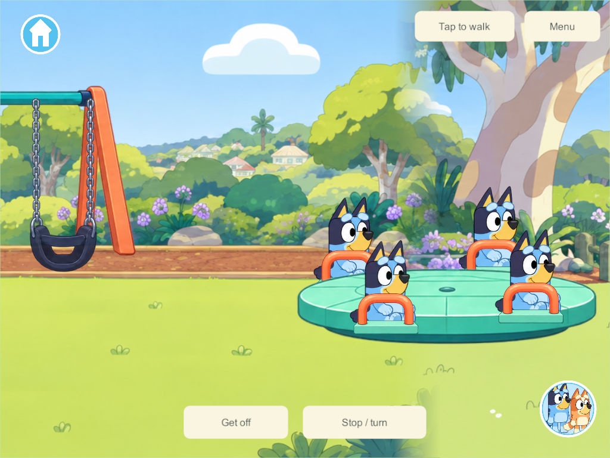
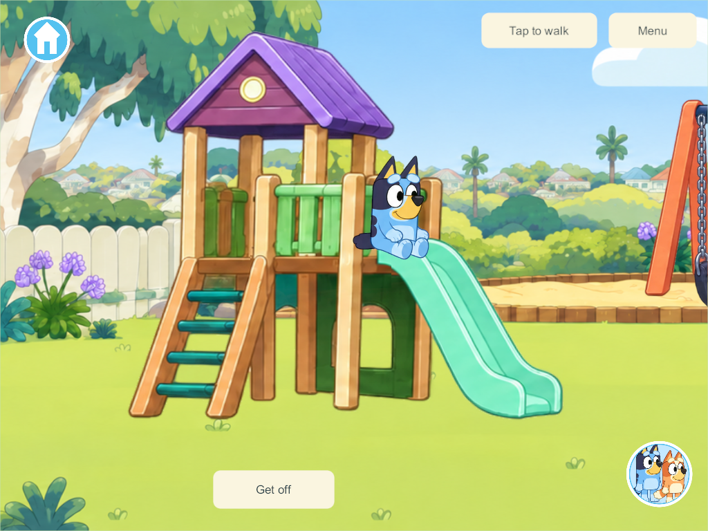

# Playable park equipment

September 30, 2026 — PRK-01, PRK-02, PRK-05, part of PRK-04/PRK-11, plus fountain and bench fixtures.

## Current list and rollout

The [updated park inventory](../bluey-game-research-2026-09-23.html#updated-park-completion-and-remaining-list-september-30) records all original PRK-01–12 activities, the earlier ball-basket picture quest and the later fountain/bench request, with built and remaining behavior kept separate.

## What changed

The playhouse, swings, roundabout, drinking fountain and seating are separate interactive objects. Clean background plates remove their painted copies while retaining the trees, paths and gazebo. The original panoramas remain available for older compatible source and as art references. The new layer appears only in saves that have the park migration.

Tap the ladder or platform to climb and slide; tap a swing seat to ride; tap the roundabout to take an available place. Four players have real separate swing seats across two frames, four roundabout places and four seating slots. Get off, movement, travel or departure releases only that player's place. The roundabout's Stop / turn button controls the same shared ride. Tap the fountain for a short water arc or drag the park bucket to it to fill it. Benches and the picnic table support sitting; picnic orders are not implemented.

These are direct object interactions. The Games menu still contains Hide & seek only. Keepy Uppy stays balloon-triggered, and watering/cleanup remain legacy prototype activities.

## Research applied to this project

The existing scenery is a flat UGUI panorama, not a Rigidbody playground. A Unity hinge can support a physical swing with angle limits and a motor, but attaching it to a background image would not create seats, child controls or synchronized rides. We keep the existing walking model and use compact controlled ride state in the rules core. [Unity 6.3 HingeJoint2D](https://docs.unity3d.com/6000.3/Documentation/Manual/2d-physics/joints/hinge-joint-2d-reference.html).

The swing uses a small-angle pendulum trajectory with a soft start. Its authored equivalent length is 2.2m, and its maximum amplitude is about 14 degrees. Those values are game tuning, not a measurement of the illustrated structure. [OpenStax pendulums](https://openstax.org/books/university-physics-volume-1/pages/15-4-pendulums).

The PC/VPS owns occupancy, clocks, roundabout speed/angle and bucket contents. The motion lane carries compact park samples; the display evaluates between them with a bounded presentation clock. Clients do not become authorities. Predictable environmental movement can be evaluated from synchronized time instead of networking every rendered transform. [NGO network time and ticks](https://docs.unity3d.com/Packages/com.unity.netcode.gameobjects@2.13/manual/advanced-topics/networktime-ticks.html), [NGO physics authority](https://docs.unity3d.com/Packages/com.unity.netcode.gameobjects@2.13/manual/advanced-topics/physics.html).

The water arc is ten reused local graphics with a parabolic path and an authoritative four-second cutoff. It is not a networked fluid simulation. Bucket quantities still change through the existing accepted transaction. [Projectile motion](https://openstax.org/books/university-physics-volume-1/pages/4-3-projectile-motion).

Boarding targets and exits use large picture hit regions. Platform scaling and real-device visual/touch acceptance remain relevant; design pixels are not automatically points or dp. [Apple button targets](https://developer.apple.com/design/human-interface-guidelines/buttons), [Android touch targets](https://developer.android.com/develop/ui/compose/accessibility/api-defaults).

## Character contact correction

The parent's first visual review identified floating characters. The Home sitting pose already lifts its drawing by 60 units, while the first park route added its own lift. The correction gives the park its own explicit support presentation: remove the Home lift and ground shadow, rotate the drawing with the swing seat, and anchor the selected drawing to the equipment contact point. It preserves Home seating behavior.

The ladder foot/top, platform, slide lip and landing come from the actual equipment atlas. The slide follows a cubic curve through those locations. A foreground rail covers the appropriate lower body on the playhouse. Multiple riders use short staggered starts instead of occupying the exact same route at the same instant. Bluey and Bingo use their existing selected-sheet drawings. This is attachment improvement, not new climbing hand grips or finished character animation.

## Verification and rollout boundary

Native Windows **235** server/client builds pass the gameplay checks; **250** compiles the final contact/depth correction and supplies the final four-rider foreground capture. Six focused four-client groups check climb/landing, four swing seats and same-seat rejection, one shared roundabout with stop/restart and independent departure, fountain/bucket transfer, bench/picnic seating and independent major-world travel. Phone and iPad captures are from the actual release player. The focused core check verifies additive migration, preserved identities/placements, four-player occupancy, departures, stop/restart, water contents and saved-world restore with temporary leases released.

Park itself adds schema **33** and two park props. The same checkout's concurrent zoo work advances the Windows 235/250 manifests to schema **34/content 35**; the park evidence does not qualify zoo gameplay. This is an incompatible shared-content update and requires a coordinated rollout under [server update policy](../server-update-policy.md). Android 260 was subsequently built, signed and installed in place on September 30; its exact installed hash and launch were verified and the park was visible. This does not qualify all physical park interactions. The live server and iPads were not updated. [Android installation receipt](evidence/park-play-2026-09-30/android-260-installation.json).

Remaining park work: seesaw, monkey bars/branching climbing, tag, park hiding arena, shadow stepping, buildable trail, bikes/scooters, actual picnic/pretend orders, musical statues/follow-the-leader, spoken park help, physical child visual acceptance and A10 performance. Optional pushing a sibling/NPC and dedicated drinking poses also remain open.

[Goal sheet §39](../bluey-game-research-2026-09-23.html#39-playground-and-park-equipment-that-really-works) · [Build guide](../family-playset-build-guide-2026-09-23.html#18-current-work-record-and-research-basis)

[Native four-client results](evidence/park-play-2026-09-30/result.json) · [Core migration/results](evidence/park-play-2026-09-30/park-rules.json)

[Final contact capture evidence](evidence/park-play-2026-09-30/contacts-250.json). A Windows diagnostic-file replacement conflict interrupted the first 238 capture attempt; subsequent capture retries were limited to idempotent inspect/resize/capture. Gameplay commands were not repeated. The independently staged park core also passes the focused migration/ride/save test, excluding concurrent zoo/character changes.
