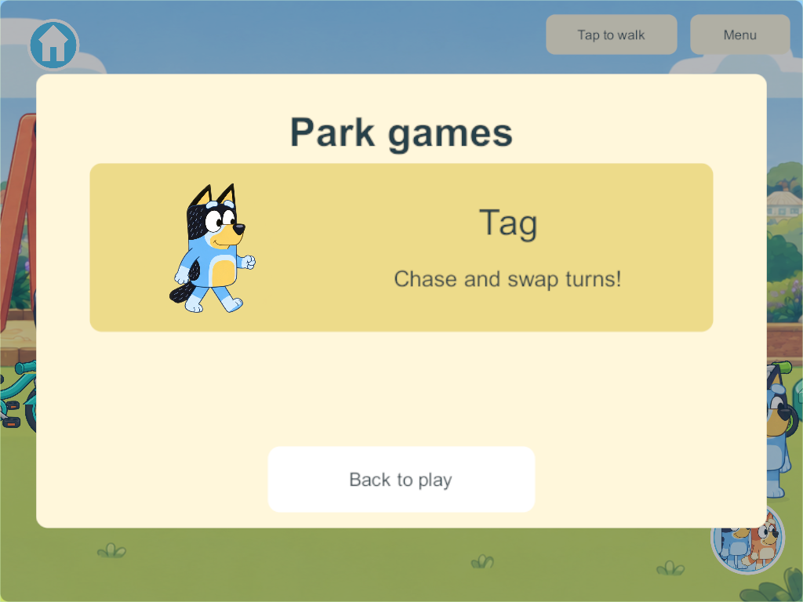
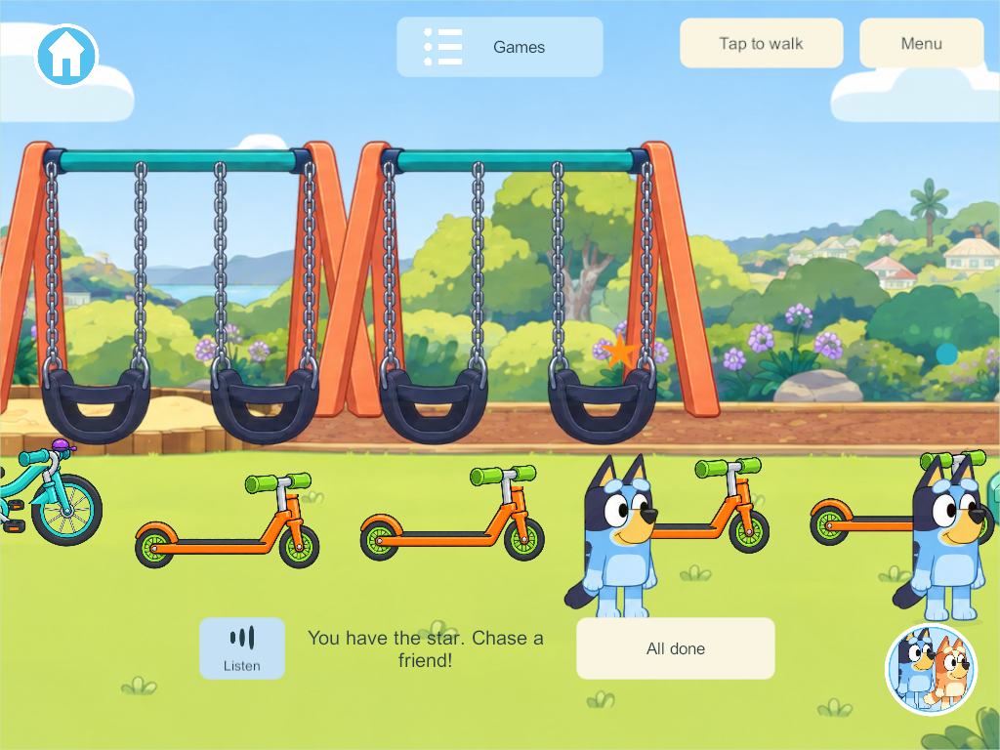
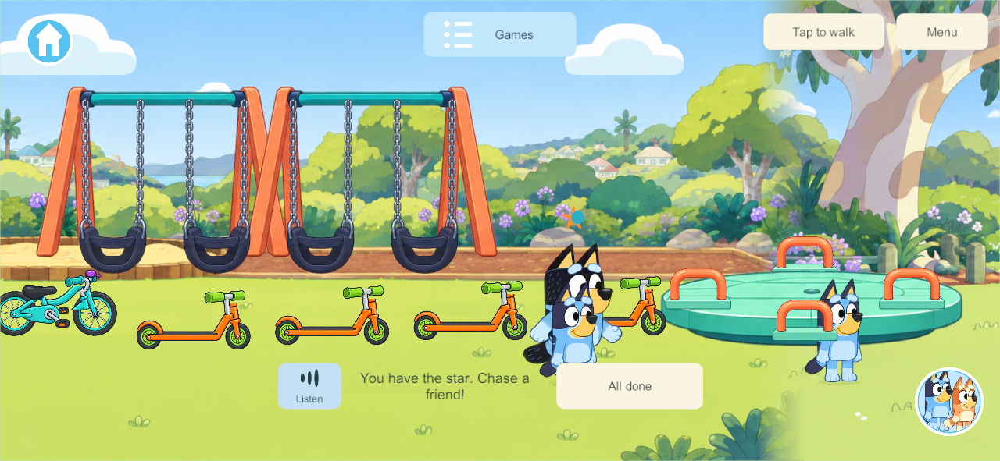

# Shared park tag

September 30, 2026 — PRK-06. Research first; implementation and evidence follow below.

## Research and applied design

[Playworks' inclusive recess guidance](https://www.playworks.org/resource/enhancing-your-recess/) identifies the ordinary one-tagger problem: a child who cannot catch anyone can remain stuck in that role. It recommends adapting roles and using clear visual cues. Its [Animal Tag rules](https://www.playworks.org/game-library/animal-tag-2/) describe clear boundaries, gentle touch and changing roles. These are school-play sources, not proof that a particular digital implementation suits a three-year-old. Our first digital adaptation keeps everyone playing, with no elimination, score requirement or punishment.

The official [Bluey Octopus episode](https://www.bluey.tv/watch/season-2/octopus/) shows a parent playing an imaginative chasing game that the children adapt. Park tag is our separate activity; it is not being described as an exact recreation of Octopus or Shadowlands.

[Unity NGO 2.13 network time/ticks](https://docs.unity3d.com/Packages/com.unity.netcode.gameobjects@2.13/manual/advanced-topics/networktime-ticks.html) explains authority simulation and shared time. [Client-side interpolation](https://docs.unity3d.com/Packages/com.unity.netcode.gameobjects@2.13/manual/learn/clientside-interpolation.html) distinguishes displayed smoothing from simulation. Accordingly, one PC/VPS authority owns participants, countdown, contact tests and role swaps; clients display that state. Rendered overlap cannot itself award a tag. A swept relative-distance check will cover motion between authority samples instead of depending on frame-perfect collision.

## First implementation contract

- Park Games → Tag closes the menu and joins one shared session. The first player starts one three-second countdown; later arrivals never reset it. Joining is voluntary; free-playing bystanders are never tagged.
- Up to four family participants use the existing joystick or tap-to-walk. The player with the orange star chases a participating friend; running close exchanges roles automatically. No tiny target or reflex button is required.
- A short common handoff grace period and join protection prevent rapid back-and-forth role changes. These values and the forgiving contact radius are game tuning, not prescribed research measurements.
- One participant gets a recognizable Bandit NPC playmate. A second human replaces the NPC without restarting siblings. NPC movement is slower and predictable so the preschool child can catch it.
- Everyone shares the same tagger and progression. Leaving, travelling, using equipment, picking up a toy or disconnecting removes only that participant. If the tagger leaves, remaining players get a new tagger with grace. Character changes preserve participation.
- A picture card, star/role indicators and offline English spoken hints explain the game. All done exits only the current child. No screen locks, elimination or mandatory timed round.
- Temporary tag state is optional within the existing park record. Older records default to idle; reopening/recovery clears temporary participation. No offline edits are uploaded into family play. New shared rules require a matching future content rollout; the live family server is not part of this implementation task.

## Implementation and verification

Final Windows release **308** client and dedicated server compiled with zero errors/warnings from committed baseline `96b3269` plus only Tag; unfinished concurrent features were excluded. The [native four-player result](evidence/park-tag-2026-09-30/result.json) on **306** covers the unchanged gameplay and UI: the picture menu, shared countdown, staggered and late joins, ignored bystanders, automatic tags with grace, native tap/joystick movement, avatar changes, tagger disconnect, independent area departure, All done, Bandit fallback and the loaded/playing spoken hint at phone/tablet sizes. The [core result](evidence/park-tag-2026-09-30/core.json) additionally covers optional old-save initialization, copied state, temporary-round cleanup on restore, swept crossings and invalid-state rejection.

The first native run exposed continuous Tag clock/NPC motion incorrectly triggering durable revisions, saves and full-state publication. Those continuous values now use the existing park motion stream; phase/role/member changes remain authority events. The repeat passed after that product fix and correction of test button-name lookups. Build 306 adds a visible Listen button because the old prototype Listen control is hidden in the current play layout. Automated audio checks use muted test playback; physical listening and family usability are still pending.

The contact radius (145 world units), three-second countdown, 2.5-second protection and Bandit behavior are initial design tuning. Research does not establish that these are ideal for either child's age. There is no elimination, mandatory round timer or merging of offline play into the server. Schema 36 remains unchanged in this isolated baseline; Tag adds an optional temporary park field and shared content **45**. Combined concurrent content still needs integration before a coordinated rollout. No physical device or live family server was updated.

The maintained goal row, work record and PRK-06 inventory are updated. The global plan/link check reports unrelated concurrent unclassified documents and a missing bathroom evidence path; it is not recorded as an overall pass. Tag itself is classified and its evidence links exist.

Final 308 additionally increments the durable revision when reopening clears an active temporary Tag session, so that cleanup is saved. The affected JSON/reopen rule test passes; continuous gameplay/UI are unchanged from the successful native 306 check.
