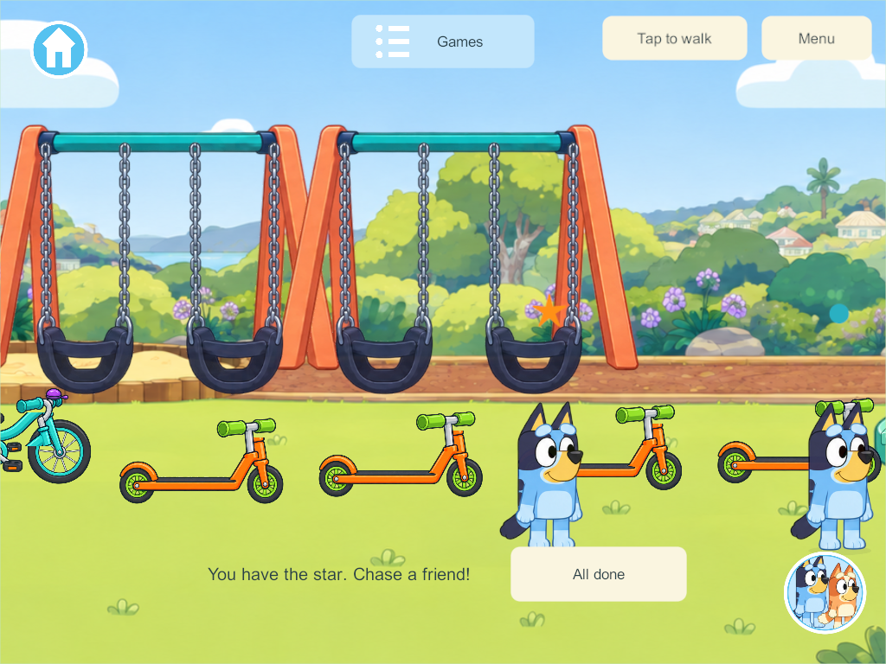

# Tag includes the park group and stays quiet

September 30 user correction: the previous game required each sibling to press Join tag, so one starter initially played with Bandit. That did not match the requested group behavior.

**Windows 346, content 53, schema 42:** one Park Games → Tag click enrolls all connected players already in the park. Players arriving in the park join the same countdown/round automatically. Players in other areas stay there. Human players tag each other; Bandit appears only when one participant remains. All done and choosing other activities opt out without stopping siblings or immediately enrolling the departing player again. Leaving and returning to the park permits automatic participation again. Admission uses actual server connections; old saved profiles never become phantom playmates in solo.

All Tag narration, role announcements, voice loading and its Listen button are removed. Other activities’ sound settings are unchanged.

Focused core checks pass for one-start group enrollment, arrivals, personal exits, return, tagger disconnect, human contact/grace and solo saved-profile separation. The [native four-client result](evidence/park-tag-group-2026-09-30/result.json) passes one actual start, three park participants plus a fourth in the creek, the fourth’s automatic arrival, human tagging, both controls, avatar change, independent departures and the absence of Tag speech/NPCs during multiplayer. Windows server/client 346 compiled successfully. Source is based on the integrated delivered game at `71fd07c`, retaining the roar/outfit fixes and other completed worlds.

This changes server-owned rules, so content 53 requires a matching server/client update from installed server 340/content 52. At this record's creation the live server and devices are unchanged; Signed Android 346 and iPad Xcode export 346 are prepared. Device installation and Mac signing are pending device availability. Keep the main integration hold.

