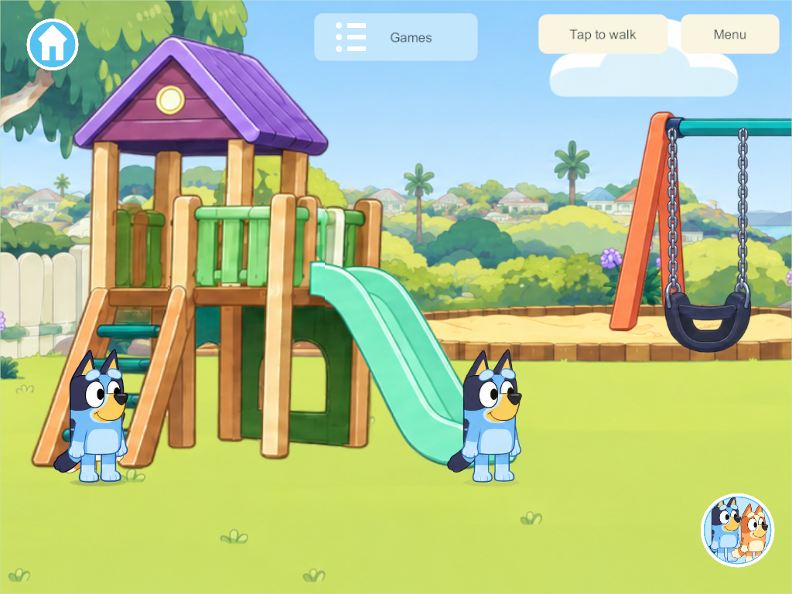
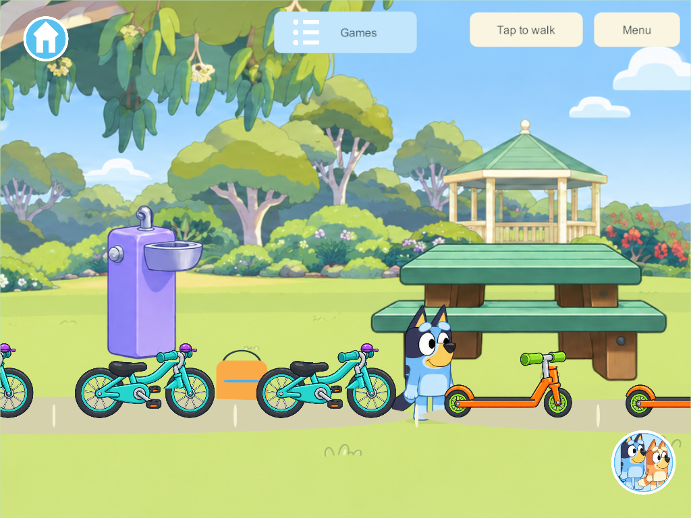

# Park bike and scooter parking

September 30, 2026 — PRK-10 layout correction.

Four bicycles and four scooters now occupy two marked parking bays on the right-hand foreground lawn. The playhouse ladder, slide landing and swing approaches are clear. Available vehicles retain individual touch targets; occupied vehicles do not intercept another vehicle's touch. Get off, travel and disconnect return equipment to its own bay. Existing riding controls and character poses remain.

Windows **349** compiled with zero errors/warnings. The focused native four-client check passes slide/swing entry, all eight mounts, exclusive ownership, both riding controls, Get off, phone/tablet framing and independent travel/disconnect. [Result](evidence/park-wheel-parking-2026-09-30/result.json).

This candidate includes the corrected group Tag game without Tag speech. Moving the server-owned mounting positions is included in the pending content **53** update; schema **42** is unchanged. Source is on `codex/park-tag-group`. No live server or physical device was updated by this parking task. Mobile builds/installations remain for the requested coordinated update; use this source rather than the older 346 parking layout. Main integration hold remains.

