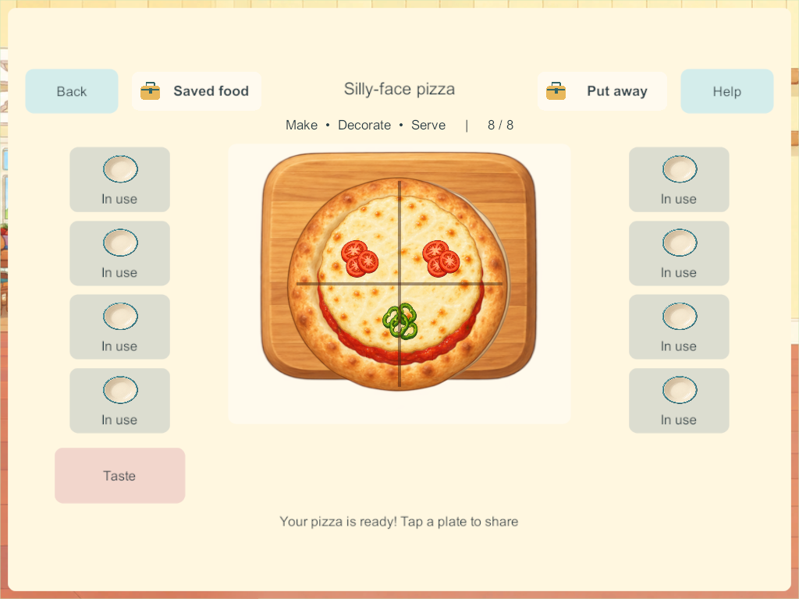
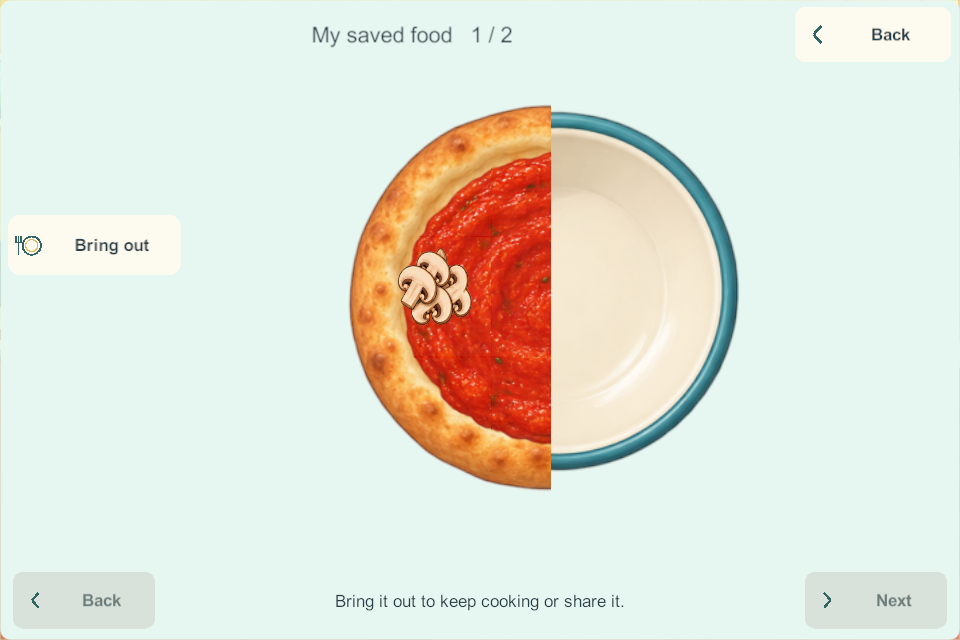

# Five staged pizza activities

September 28, 2026. PIZ-01 through PIZ-05, the next bounded slice of the [Home finishing sequence](home-finishing-research-2026-09-28.html). The five meal paths and researched ramp activity follow. This is a source/build milestone, not a device rollout or completion of Home.

## Research applied

The [staged cooking research](kitchen-staged-cooking-research-2026-09-27.html) and [Home finishing research](home-finishing-research-2026-09-28.html) require the central food to change through meaningful actions. [King Arthur's pizza guide](https://www.kingarthurbaking.com/learn/pizza) separates shaping, topping and baking, and its [crust recipe](https://www.kingarthurbaking.com/recipes/pizza-crust-recipe) supplies the kneading reference. The child now kneads and rolls dough, adds and spreads sauce, places the matching toppings, bakes and slices. Rolling is our accessible pretend-play choice; brief game heating is not a real recipe timer. [Sago Mini Diner](https://sagomini.com/apps/diner/) informs the visible food and recognizable ingredients. Optional pictured assistance performs the same progress as direct gestures.

## Implemented behavior

All five recipes use counted dough, a saved kneading amount, saved rolling amount, nine touched sauce regions, persistent topping positions, safe authoritative oven progress and two slicing directions. Vegetable pizza adds whole capsicum, mushroom and tomato, then visibly chops them before sauce and toppings. Cheese is optional for that recipe, as specified in the research. Pepperoni, cheese, ham/pineapple and silly-face recipes keep their own ingredient sets. Experiment mode remains explicit and reserves room for required inputs.

Four cooks can work independently. Ingredients consume existing stock identities; chopping and baking do not respawn them. Portions share the original food identity with disjoint remaining-portion bits. Stored food retains every preparation value and topping position. A reused empty tray left in the oven now moves to a free counter before new ingredients are consumed, so a new recipe waits for an explicit Bake action. A full worktop rejects that transfer without losing food or stock.

Schema **25**, content **26**, recipe version **3**. Existing versions 0–2 migrate unchanged. The existing creation-storage codec retains the fields without a new archive format. For version 3, `mixed` is kneading, `poured` is rolling, `step` holds vegetable chopping bits, `icingMask` holds sauce coverage, and `cutMask` records slices. Version-specific validation rejects incompatible records. Existing inspected ingredient, topping, utensil and cooking-layer artwork is reused.

## Validation and limits

[All 265 core groups pass](evidence/pizza210-2026-09-28/core-results.json), including five recipe paths at each saved stage, partial preparation, stale commands, phase palettes, experiment capacity, four cooks, archived food and legacy migration. The reused-oven-tray regression includes a full-counter rejection with unchanged state. [Windows 210 source check](evidence/pizza210-2026-09-28/windows-source-check.json) matches all game C# source.

[Candidate 209 passed all five native groups](evidence/pizza210-2026-09-28/native209-results.json). [Candidate 210 passes all five native groups](evidence/pizza210-2026-09-28/native-results.json), including real partial kneading, chopping and sauce strokes; recipe-specific palettes; four simultaneous server bakes and a departing cook; eight distinct servings; saved remainders; actual silly-face topping drags; and four-client cold restart/retrieval. [Visual review](evidence/pizza210-2026-09-28/visual-review.json) corrected each layer to clip at the shared food origin, preserving proper slices instead of clipping each sauce patch around its own centre. Phone and tablet captures show the central food and surrounding picture controls.

Independent production recovery remains unqualified: [Windows Application Control blocked the unsigned validator](evidence/cakes207-2026-09-28/recovery-blocker.json) during the preceding cake milestone. Security settings have not been changed or bypassed; ordinary server restart/rejoin does not replace independent backup/restore qualification. Build 205 remains the latest allowlisted recovery build.

The signed Android **210** release is ready and [its game source matches](evidence/pizza210-2026-09-28/android-source-check.json). It has not been installed. Phone, iPads and the family server are unchanged. Physical child usability, A10/mixed-device play, audio, the inherited Android 16 KB issue, stretchy-cheese polish, picture orders and broader kitchen/Home features remain open. Main integration remains held.

