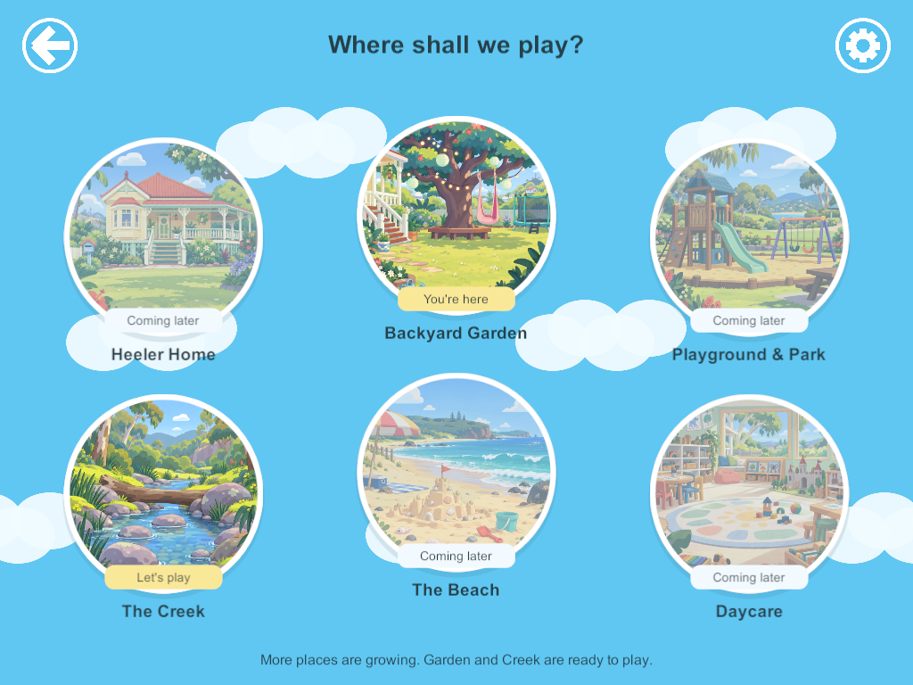
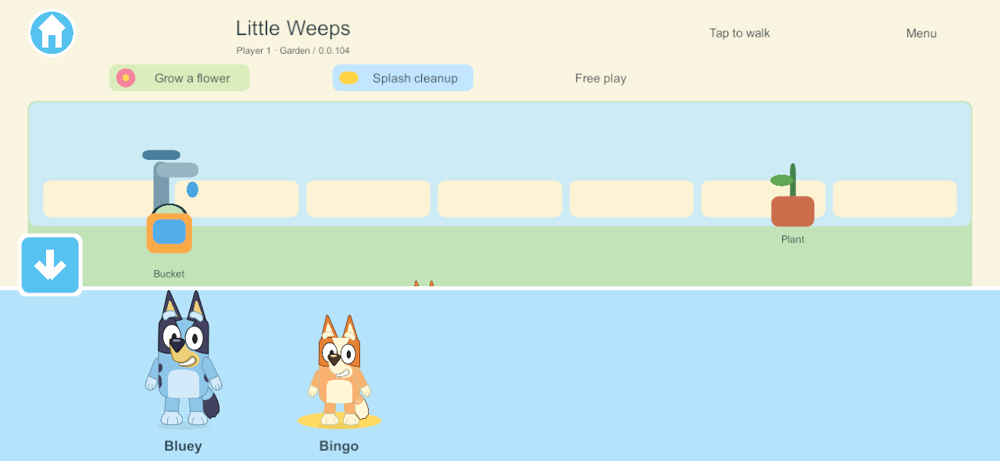
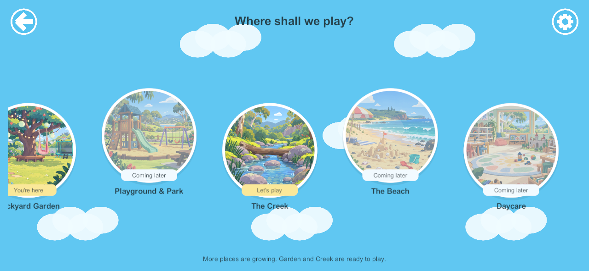

# Reference world and character menus — September 25, 2026

**NAV-REF-01: native Windows build 104 passes the scoped navigation checks.** Goal IDs CHAR-01, WORLD-01 and WORLD-02; G2/G6 presentation. The six picture bubbles follow the user's sky/cloud reference; only Garden and Creek are playable in this milestone. The lower-left Bluey/Bingo family circle opens a light-blue full-body tray, with a large down arrow to close. Existing layered character art, player identity, authoritative commands and saves are retained.

[Native test result](evidence/reference-menus-2026-09-25/result.json) · [76 core checks](evidence/reference-menus-2026-09-25/rules.json) · [Release build](evidence/reference-menus-2026-09-25/build-summary.json) · [Exact runtime source verification](evidence/reference-menus-2026-09-25/source-verification.json)

## What passed

- Actual Unity Input System touch events select Bingo, preserve the player's remaining fields and replicate the selection to a sibling.
- Swiping or canceling a touch does not choose a character. The close arrow does not move the player underneath it.
- Opening the tray stops and hides the joystick; closing restores it without replaying the old finger gesture. Opening during pickup settles the lease without changing the prop.
- A sibling walks and fills a bucket while the world browser is open. Garden → Creek → Garden changes only the traveler and preserves the same shared objects.
- The 1024×768 tablet view shows all six bubbles. The 1280×591 phone view scrolls sideways to Daycare without traveling during the swipe. Unbuilt entries are inactive and marked Coming later. Back and settings controls work.
- Native captures and bounds checks confirm full character artwork inside the tray and visible controls inside the screen's safe area. These are Windows renders at device aspect ratios, not physical device qualification or a simulated notch test.

The existing core checks include changing avatars while holding a prop. This prototype still uses direct touch dragging: opening a menu safely cancels that active gesture; persistent character-carried inventory is later item-system work.

## Native captures

## Art and implementation

Six new illustrations were generated with the built-in image_gen tool. [Final prompts, saved asset paths and limits](../../SourceArt/WorldMenu/README.md) · [provenance and hashes](../../SourceArt/WorldMenu/manifest.json). They are menu thumbnails, not complete gameplay scenes or user-approved final artwork. Unity imports each at a maximum of 512 pixels. Menus reuse the existing Bluey/Bingo layered art and do not load a new character atlas. The portrait currently contains those two characters; the wider cast remains planned.

New menu/input code is isolated in `SoloNavigation.cs` and `NavigationTap.cs`. Gameplay commands and wire/save contracts were unchanged. The original prototype board remains behind the tray. Native capture review caught and corrected initial anchoring/clipping and circle-edge quality before qualification; earlier 102/103 builds are not the accepted milestone.

## Latest user direction and next task

The user now wants **all six worlds visually finished enough to walk through, with no new activity features outside the house**. Build scenic shells and local camera exploration first, then concentrate sustained feature development on **Bluey's house and its connected backyard**. Existing working play is preserved; new cooking, seating, storage, radio/dancing and other features are developed in the house/property first.

Home and Backyard are entrances into one connected property: front entrance → living spaces → kitchen/dining → veranda → garden/play area → far yard and shed. Room doors and stairs connect bedrooms and the remaining household spaces without returning to the world menu. Preserve reading/TV, science/dinosaurs, personal bedrooms and secret rooms in the room plan. Each player's camera stays independent; the two menu entrances must not duplicate the house or its saved contents.

**Deployment limit:** devices remain on 101 and the live family server/helper remains on 91. Only isolated Windows clients/server were used. Physical menu acceptance, connected-property scenery, room/save integration, action poses and the other phase gates remain open. The incomplete bedroom rule checkpoint remains separately preserved on `codex/saved-bedrooms`.
