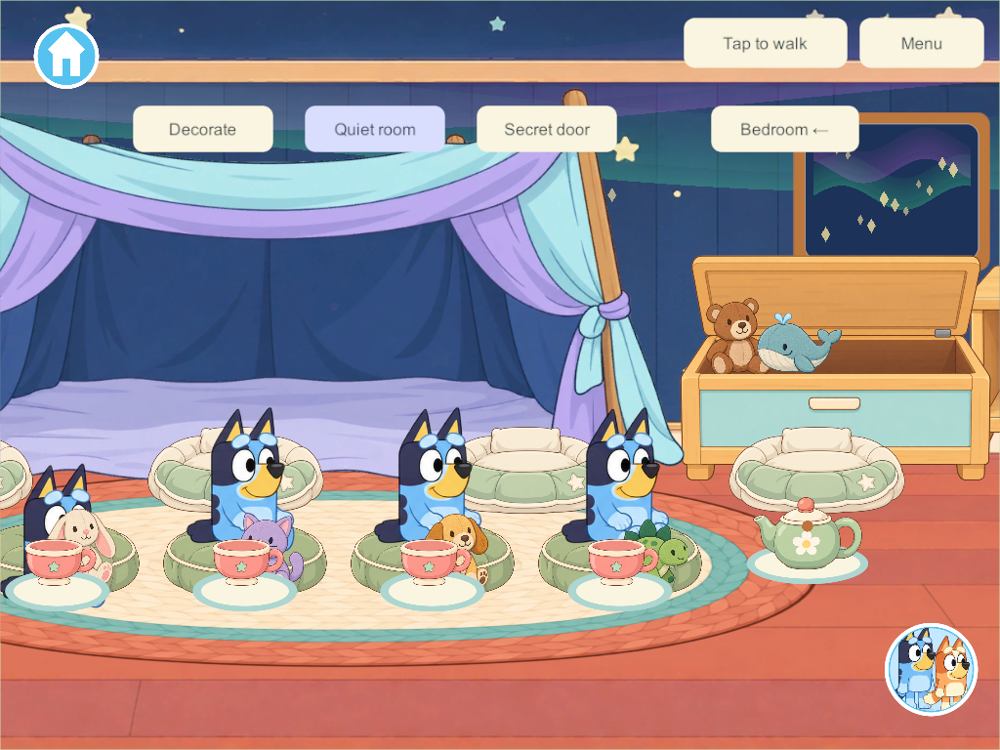
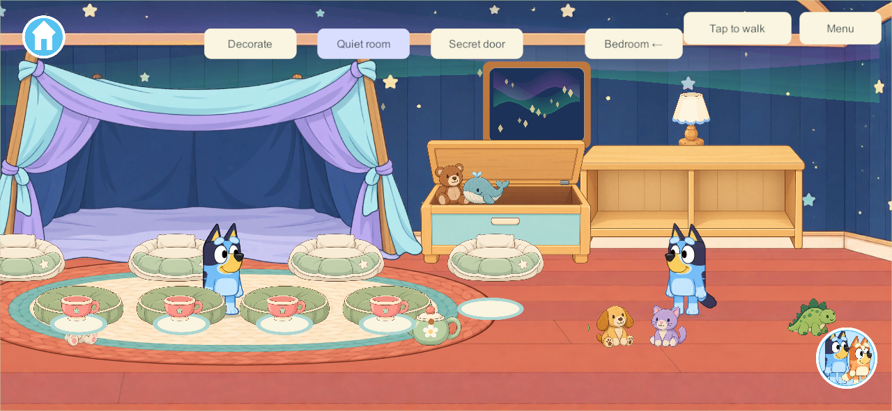
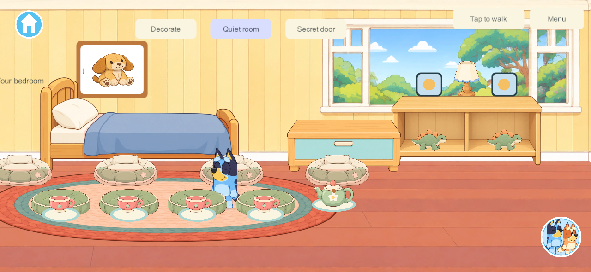

# Bedroom and secret-room object play — September 26, 2026

Scope: the user clarified **finish the bedroom and secret-room objects**. This extends the four owned bedrooms and four optional persistent secret rooms. It does not close the wider Home backlog. Baseline is `codex/home-reading` at `1c060cd`; accepted character artwork, movement, menus and the connected property are retained.

## Research applied

The [upstairs room research](upstairs-bedrooms-research-2026-09-26.md), [secret-room research](secret-rooms-research-2026-09-26.md) and [quiet-play object contracts](home-reading-quiet-play-research-2026-09-26.md#plush-interactions-next-bounded-contract) informed these choices:

| Requirement | Implemented contract |
| --- | --- |
| Four independent cuddles | Tap a plush to sit with that actual toy on an available cushion. An already seated player can cuddle there. Bed/fort/cushion changes retain the same held plush. Walking or leaving settles only that player's plush; dragging it starts an ordinary carry. |
| Four tuck-in supports | Each room has four small blanket nests. Drag a plush into one; the same identity is persisted on the support. Rear cushion, toy and quilt foreground render separately. Drag out to retrieve. |
| Stable toy piles | Plush and soft blocks stack up to three high in furnished rooms. One parent/child slot, same-room checks, no cycles or held parents. Taking a lower toy out settles dependents separately and atomically. Owner tidy preserves a stack rather than dismantling the creation. |
| Pretend tea picnic | Four cup/plate places plus one reusable pot per room. Tap the pot to refill three pretend pours, drag onto an empty cup, tap a cup to sip. No recipe dependency, timers, global lock or unlimited object spawning. Plates are fixed supports, not extra inventory. |
| Saved decoration choices | Separate bedding, rug, picture and lamp-color choices use the existing owner/Together permission and actor-scoped, one-operation undo. Two safe furniture arrangements remain. |
| Optional aurora fact | Tap the wall picture in a secret room, then Read to me. Original caption and locally generated narration explain the fantasy sky, with no autoplay on entry. It shares the existing local narration/mute lane and stops on close/travel/background. |

The brief aurora explanation was checked against [NASA Space Place](https://spaceplace.nasa.gov/aurora/en/) on this pass: particles interact with atmospheric gases, producing light high above Earth. The indoor aurora remains a fantasy projection. The line is original wording; the image is not a physical simulation. [Voice script and provenance](../../SourceAudio/Home/RoomPlay/scripts.json) use the previously selected local narrator workflow. Voice generation does not establish final listening acceptance.

The existing four cushions supply the four cuddle places; a separate large shared cuddle-pillow illustration remains a possible art refinement. The present implementation does not claim arbitrary furniture placement, the full creation gallery, full dinosaur catalog or hiding-round integration.

## Persistence and authority

`RoomPlay.cs` adds schema **12**, content **13** and build contract **14**. Existing objects, room IDs/owners, balloon state, receipts and enrollment are retained. Four bedrooms add 20 bounded tea pieces. Each already-created or newly-created secret adds five more; four created secrets produce 97 total registry objects, including existing Home and book stock. Repeated upgrades/creation do not refill or duplicate stock.

Tucked state and piles use the existing single-container field. Stacks permit three objects at most. Tea uses bounded persistent fill state. Temporary cuddle holds follow the same single-holder rules and clear on disconnect/cold reopen; decor, nest placement and stacked objects persist. PC/VPS remains the only shared authority. Offline changes stay private; reconnect takes server state.

Normal fragmented reliable view messages have a 32 KiB cap to fit the bounded expanded registry; unreliable motion retains its 1,200-byte budget. Recovery remains chunked with its existing 256 KiB bound. PC helper/checkpoint validation recognizes the new schema; the production recovery qualification allowlist is not silently extended.

## Artwork and interaction

[Room-play source art](../../SourceArt/Home/RoomPlay/README.md) contains the three unchanged imagegen originals and prompt/hash provenance. Runtime imports share three 512-pixel textures, with alpha retained, no Read/Write and no mipmaps. Nest fronts use registered polygons rather than copied plush sprites. Existing furniture/fort and character sources are reused.

Plush and tea pieces distinguish a deliberate tap from a drag using the existing input-system drag threshold. A second pointer can continue movement. Book tap-versus-drag behavior remains in the same surface handler. The wall picture in a secret room is placed clear of the blanket fort. The downstairs book collection remains shared; this change creates no private duplicate books.

## Validation and delivery

Validation for candidate **155** is recorded in [the evidence directory](evidence/room-play155-2026-09-26/). Core rules: **168 passed**, including all prior book, movement, Home and persistence rules plus 11 focused room-play contracts. [Core results](evidence/room-play155-2026-09-26/core-tests.json).

Final Windows 155 passed **six native room-play groups**, using real tap/drag input across four independent clients: beds/decor/stock, cuddles/movement, tuck/retrieve/layer order, stacking/removal, tea, and picture/reader/exit behavior. [Room-play results](evidence/room-play155-2026-09-26/native-room-play.json). All **13 solo/four-player balloon movement regression checks** also passed. [Movement results](evidence/room-play155-2026-09-26/balloon-movement-regression.json). Both final Windows and signed Android artifacts match all 189 current code-file hashes. [Source verification](evidence/room-play155-2026-09-26/source-verification.json).

Native phone/tablet compositions were inspected. These are desktop client captures at the recorded aspect ratios, not physical-device screenshots:

Samsung was updated in place from 151 through preview 154 to fresh signed **155**. Exact installed APK and established signing identity were verified. All **16 saved records remain byte-identical** across the final update. The launch command succeeded, but the secure lock screen remained active; visible room behavior and the active save's first-launch migration still await unlock. No physical play acceptance is claimed. [Android update evidence](evidence/room-play155-2026-09-26/android-update.json).

Actual build-151 migration, private room play/cold reopen/rejoin, and restored-old-backup migration: **three native groups passed in 153**. [Continuity results](evidence/room-play155-2026-09-26/continuity-build153.json). Full isolated server backup/restore/rollback, original four-profile rejoin, ten invalid-bundle refusals and interrupted/missing-world recovery: **six groups passed in 153**. [Recovery results](evidence/room-play155-2026-09-26/recovery-build153.json). Final UI revisions retain identical core and network source; [qualification scope](evidence/room-play155-2026-09-26/qualification-scope.json) records the exact changed paths. These tests did not touch the live family server. Desktop screenshots establish composition, not A10/iPad acceptance.

Known remaining qualification: older A10 iPad memory/frame time, sustained mixed-device play, physical lifecycle/audio routes, final narrator listening and user visual/play acceptance. Current server/iPads remain recorded at 128 and iPhone at 101. A content-13 client needs a coordinated matching server for shared play; private solo remains available.

Next bounded work: obtain feedback on this room-object pass and complete device qualification when available. The full Home tracker, requested final book subjects, working kitchen, TV, science, dinosaur catalog, hiding and backyard features remain required.
