# Six long scenic worlds — SCENIC-01

**Native Windows 110 and signed Android 110 · September 25, 2026.** All six destinations now open as long illustrated levels. Home and Backyard share one continuous property. This milestone implements scenery and exploration; new furniture, trampoline, storage and other object interactions remain for the house-focused work next.

The screenshots below are captured from the actual Windows release player at phone proportions, with the existing layered Bluey character. They are not image-generation mockups. Android 110 has since been installed and its Creek scenery checked on the phone; user visual approval remains pending.

## What is built

| Place | Walkable layout | State |
| --- | --- | --- |
| Home | Living/reading room and stairs → kitchen/dining → veranda | First half of the shared property, x −4800 to 0 |
| Backyard Garden | Large tree and lawn → trampoline area → fruit tree and far shed | Second half of the same property, x 0 to 4800 |
| Playground & Park | Playground → picnic lawn and lookout | 4800 units |
| Creek | Bush bank → stepping-stone pool | 4800 units |
| Beach | Dunes and shore → rock pools | 4800 units |
| Daycare | Timber playroom → outdoor cubby garden | 4800 units |

The previous play board was 1000 units wide. Each standalone world is now 4.8 times as long; the connected house/property is 9.6 times as long. Walking speed stays 210 units/second. Dragging empty ground pans only that player's camera; joystick or tap walking resumes following. The family circle stays lower-right, away from the lower-left joystick. The combined horizontal cast / vertical places menu enables all six destinations.

Major travel shows the destination screen until gestures settle, applicable saves finish, authority acknowledges shared travel, and visible scenery textures are ready. At most three panorama textures are loaded or requested per client. Distant textures are released. Twelve backgrounds use no mipmaps/readable CPU copy; Android/iOS imports request ASTC 6×6. Runtime overlap softens section joins. Physical iPad memory and frame-time measurements are still required.

## In-game preview

### Home

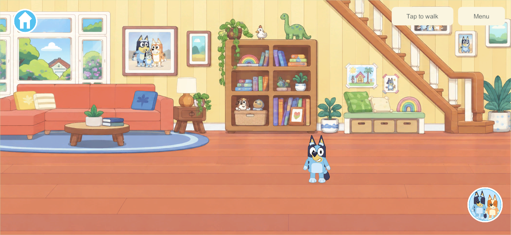
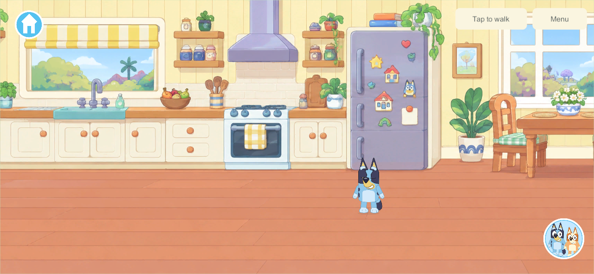

### Backyard Garden

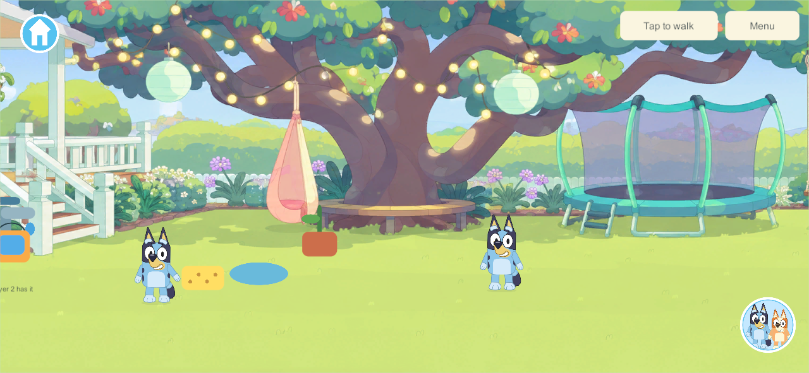
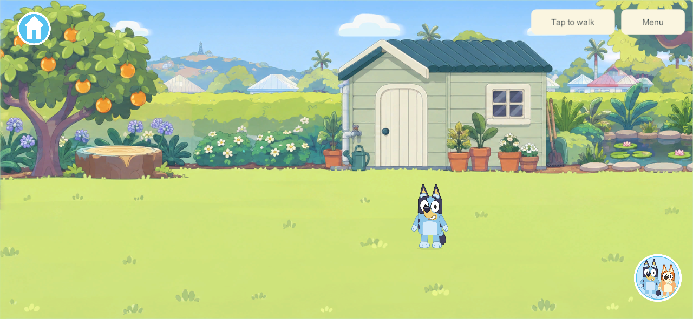

### Playground & Park

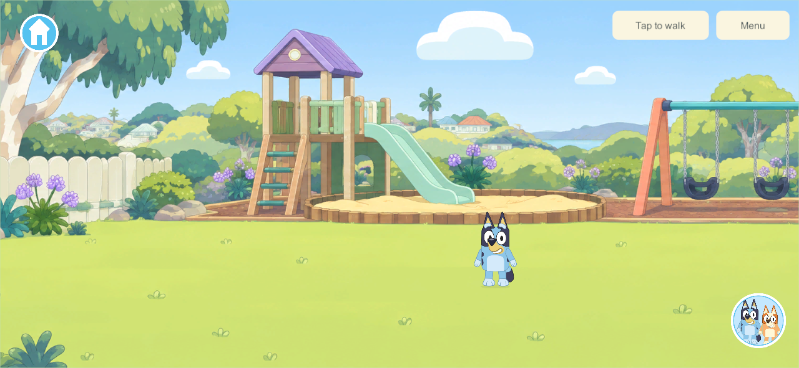
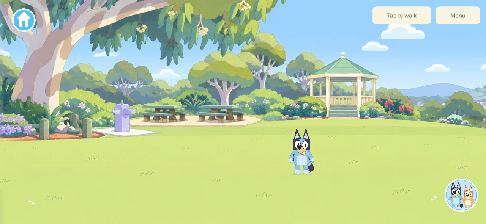

### Creek

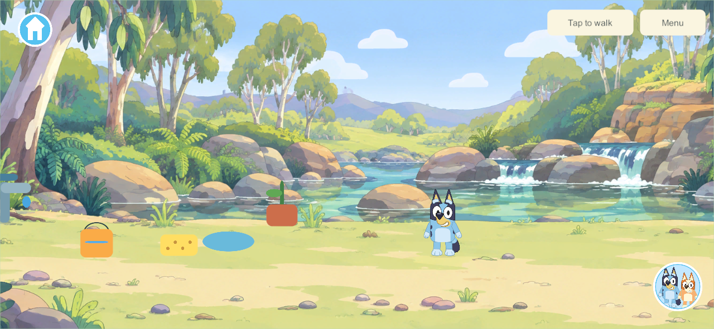
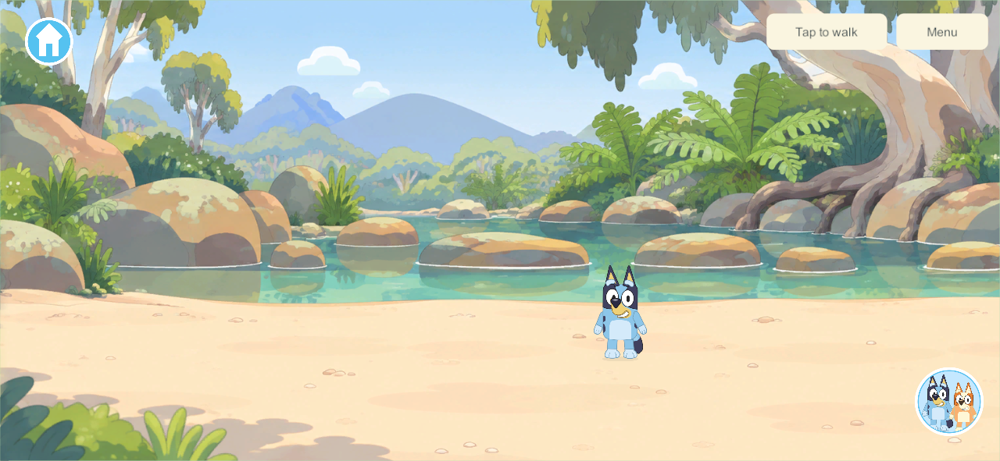

### Beach

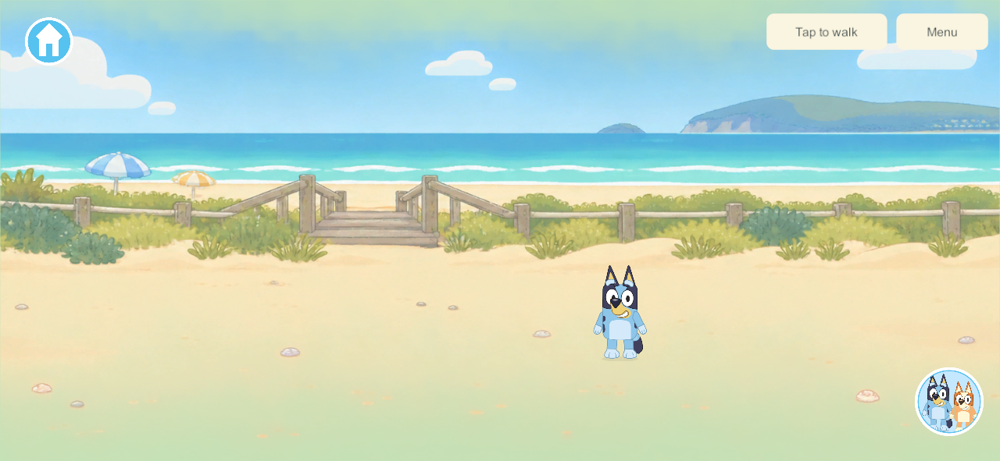
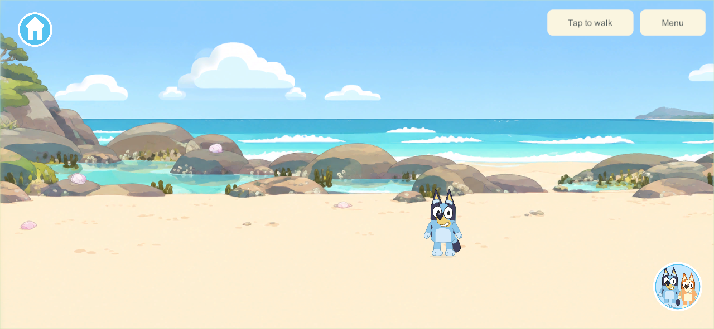

### Daycare

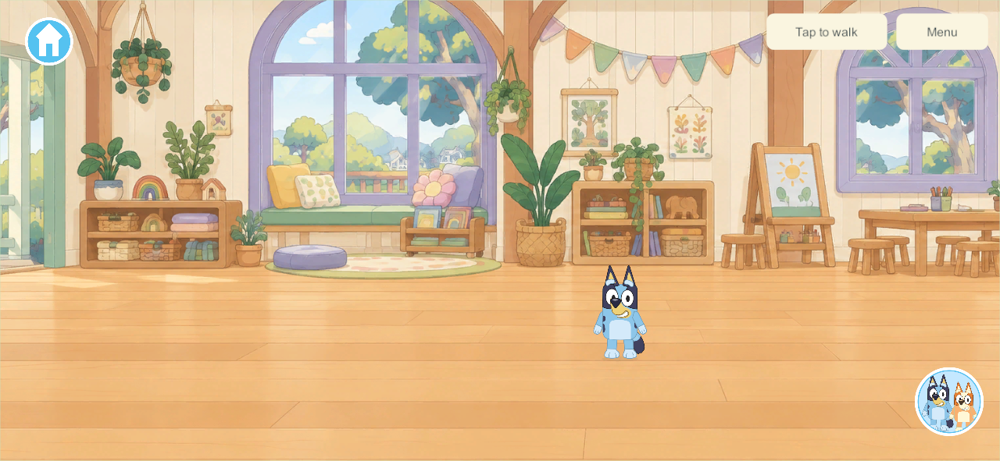
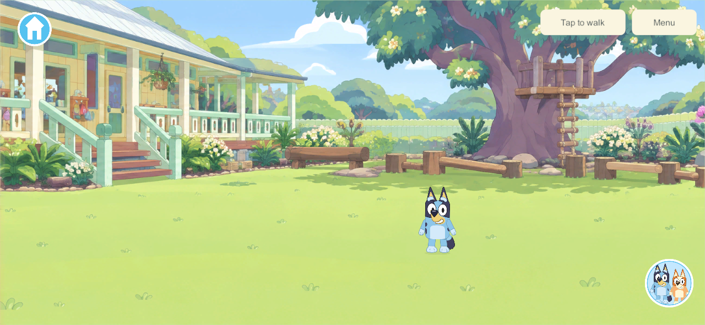

### Controls

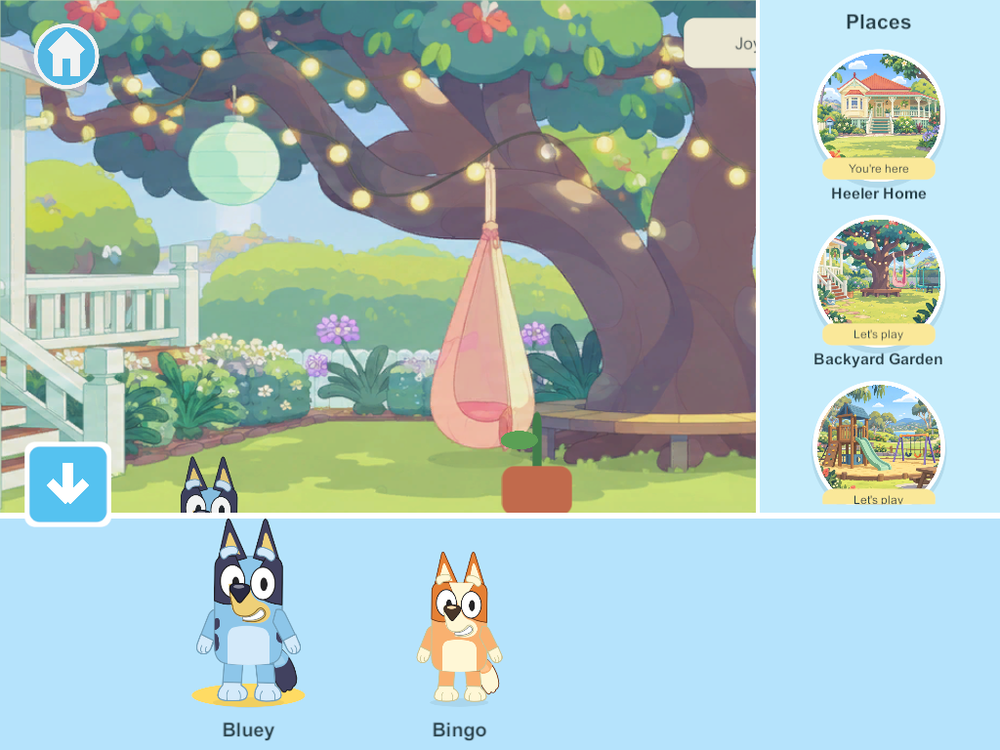

## Validation

- **81 core checks pass**, including five new scenic checks: additive save upgrade; six arrivals and long bounds; continuous Home/Garden walking; invalid coordinates/aliases; schema-3 recovery. [Results](evidence/scenic-worlds-2026-09-25/rules.json).
- **Seven native acceptance groups pass**: existing bucket filling; six touch-selected destinations and sibling/item continuity; all twelve installed panorama segments; real tap walking beyond the old 1000-unit limit; joystick crossing between house and yard without a new visit; independent panning and safe phone/tablet controls; offline save and cold reopening inside Home. [Results](evidence/scenic-worlds-2026-09-25/result.json).
- **Windows 110 server/client release builds pass**. [Build summary](evidence/scenic-worlds-2026-09-25/windows-build.json).
- **Android 110 ARM64 release builds and family signing pass**. [Build summary](evidence/scenic-worlds-2026-09-25/android-build.json). It is now installed in place on the Samsung; see the phone delivery below.
- Native captures were inspected for scenery presence, character placement, open walking space and menu layout. Visual approval still belongs to the user. Earlier compile/harness cleanup issues were fixed before the final successful build/test run; they are not device failures.

## Persistence and compatibility

Schema 3 adds the scenic bounds and areas while retaining world/profile IDs, coordinates, avatar IDs, ten existing Garden/Creek props, water and receipt history. Old schema 1/2 saves remain readable and upgrade additively. Home is a Garden arrival shortcut at negative x; it does not clone the house or its objects. Crossing the boundary on foot preserves the visit and held item. Traveling via the menu follows the existing station-tool settlement policy.

The network protocol remains 3; scenic content is **4**, advertised and checked at admission. Existing deployed content-3 clients/server cannot use the new areas, so deployment needs a coordinated server/client update with verified backups. The follow-up phone delivery installed Samsung 110. The subsequent [family rollout](family-scenic-rollout-2026-09-25.html) deployed server/helper 110 with the original shared world retained and local/portable recovery tests passing. Recovery explicitly admits 110 while keeping intermediate experimental writers excluded. Apple clients remain 101 pending signing/delivery; the server now matches Android.

The unfinished `codex/saved-bedrooms` checkpoint used experimental room schema 3 before this milestone. It was never integrated or deployed. Its eventual integration must rebase onto the scenic schema and use a later explicit version; copying that old schema-3 implementation over these saves is not an acceptable merge.

## Android phone delivery

The user's supplied wireless endpoint was used to update the Samsung **107 → 110** with `adb install -r`. The installed APK matches the signed artifact SHA-256, the pinned family certificate is unchanged, and the exact Little Weeps package launched successfully. Current Android source was checked against the build manifest: 645 files match byte-for-byte and 11 differ only by Git newline normalization. Two unrelated Windows build profiles are excluded.

All **19 existing save/enrollment files** remain, **17 byte-identical**. Both solo world identities, every original player/toy identity and receipt history are retained. The active schema-2 world upgraded to schema 3; current walking coordinates, one water value, idle timers and revision advanced while the game ran. The untouched older solo save remains identical. Local private backups retain the full before/after data; the repository evidence contains only aggregate checks.

The phone visibly renders the Creek, Bluey, existing props and separated joystick/family-circle controls. The process remained alive with no crash markers in the scoped launch log. This is a delivery/launch check, not sustained performance or four-device qualification. At phone delivery, server 91/Apple 101 were still content 3. The [subsequent server 110 update](family-scenic-rollout-2026-09-25.html) now matches Android; Apple delivery remains pending.

[Installation](evidence/scenic-worlds-2026-09-25/android110/installation.json) · [Retained saves and visible checks](evidence/scenic-worlds-2026-09-25/android110/phone-verification.json) · [Source correspondence](evidence/scenic-worlds-2026-09-25/android110/source-verification.json).

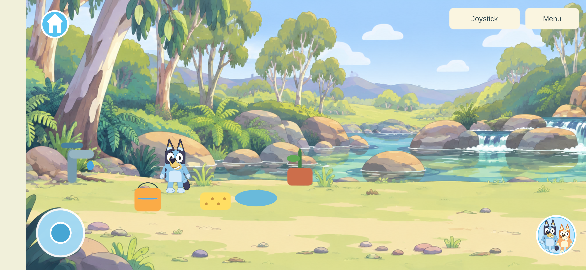

## Scope and next work

No new other-world activities were added. Garden/Creek prototype props and optional activities remain; their simple drawings are visibly unfinished beside the new scenery. All other pictured equipment is scenery for now. House room branches, working furniture, proper sit/jump/dance poses, containers, cooking and the bedroom/creation contracts remain open. The next content task is the connected house/property, with the sustained focus the user requested. G1–G3/G5–G9 acceptance gates remain scoped; this does not mark an entire production phase complete.

The built-in image-generation tool produced the twelve background assets. [Art layout and limitations](../../SourceArt/Scenery/README.md) · [Exact prompts and source paths](../../SourceArt/Scenery/manifest.json). The assets follow the user's screenshots and the [research](../bluey-lets-play-reference-study-2026-09-25.html); generated scenery is not official artwork.
