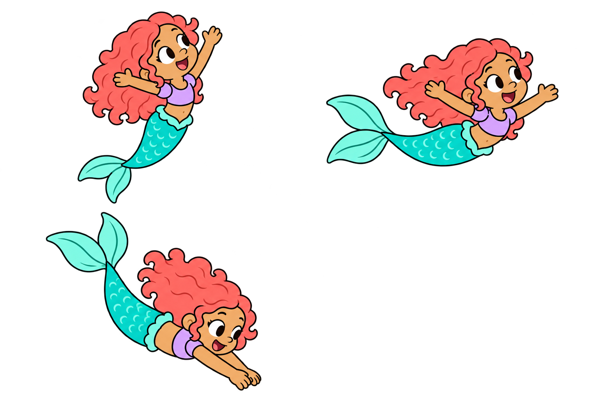
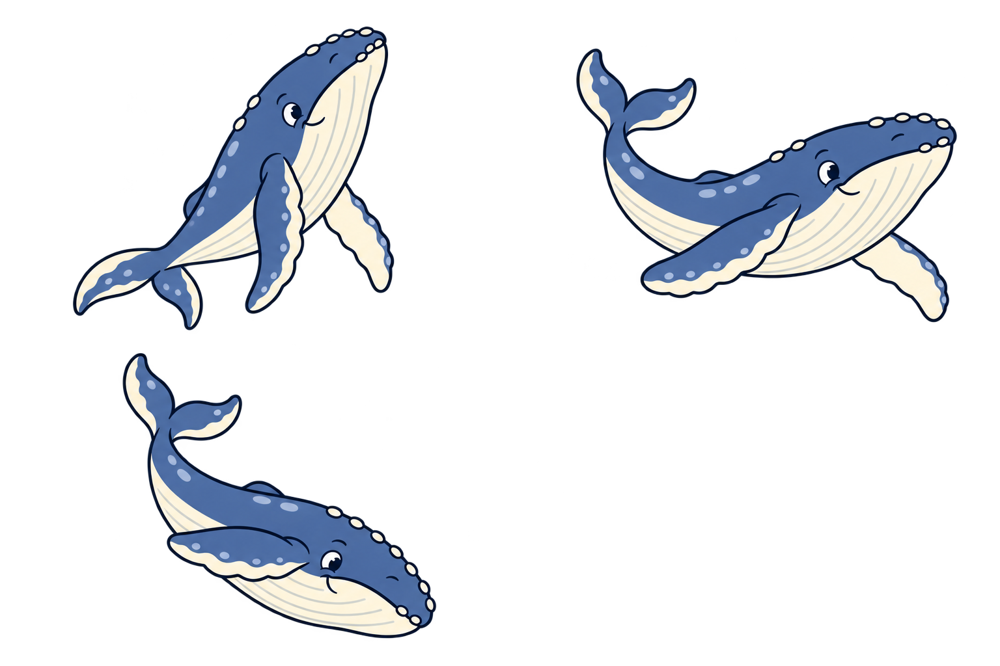
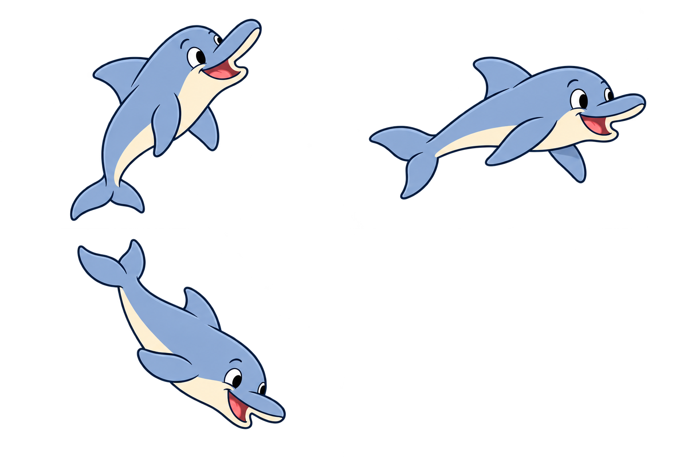
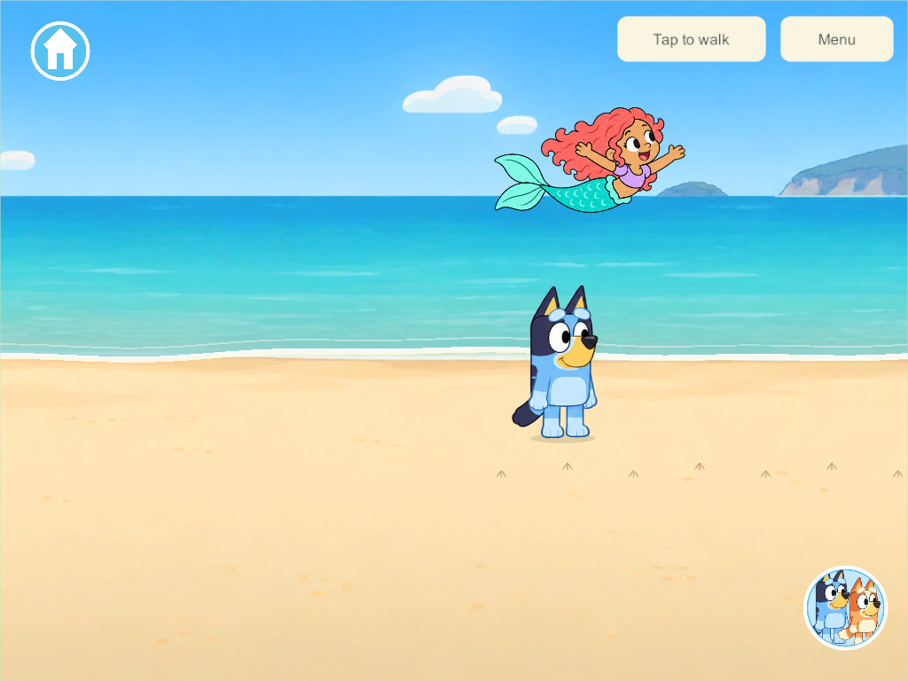

# Sea visitor model sheets and mermaid correction

September 30, 2026 · BCH-03 / OUT-01 · Client artwork/presentation follow-up.

The initial mermaid's darker brown skin was an implementation artwork choice, not a user-specified requirement. The user requested a Hispanic mermaid with light-brown skin and asked whether emerging, airborne and re-entry model sheets existed. At that point each visitor used one drawing translated and rotated along an arc. This follow-up prepares three distinct drawings for **each** visitor and uses them in the actual animation.

The mermaid now has the requested light warm brown/honey-tan skin on her face, arms, hands and exposed belly throughout all three poses. Coral curly hair, lavender short-sleeve top and turquoise tail remain.

## Three drawings per visitor

| Stage | Runtime timing during a jump | Drawing |
| --- | --- | --- |
| Emerging | 0–1 second | Head/upper body rise, tail trailing down; arms/flippers follow ascent |
| Airborne | 1–2.75 seconds | Curved midair body with open limbs/flippers and flexed tail |
| Re-entering | 2.75–4 seconds | Head/body dive down, streamlined arms/flippers and tail lifted behind |

The same authoritative event clock selects the frame for everyone. The existing world event lasts 4.8 seconds including its finishing splash; random quiet gaps remain 18–42 active beach seconds. The sea surface clips the lower body during emergence and clips the head/body as the creature dives back. The drawings contain full bodies and transparent surrounding pixels; the game supplies water and splashes separately.

### Mermaid — light brown skin

### Whale

### Dolphin

Each atlas is arranged emerging at upper left, airborne at upper right and re-entry at lower left. The lower-right cell is unused. [Named editable OpenRaster layers and measured frame bounds](../../SourceArt/Beach/Shore/README.md) · [Exact built-in image-generation prompts](../../SourceArt/Beach/Shore/pose-prompts-v2.json).

## Verification and delivery

Windows **307** client/server release builds compile the new sheets and runtime frame map. A focused native phone/tablet presentation pass observes all nine frames in real shared random events; shared wave/sighting rules and wire/save contracts are unchanged from the preceding checked candidate. [Native result](evidence/sea-visitor-models-2026-09-30/result.json) · [Build result](evidence/sea-visitor-models-2026-09-30/build-summary.json) · [Runtime source comparison](evidence/sea-visitor-models-2026-09-30/source-check.json).

Schema 40/content 46/protocol 3 remain unchanged. No phone, iPad or live-server rollout; the candidate continues on `codex/beach-waves` with the existing main integration hold.

These are generated model-sheet candidates with three key drawings, not a full frame-by-frame swimming sequence. Additional transition frames, creature sounds and family art acceptance remain open. [Earlier waves and footprints research/evidence](beach-waves-2026-09-30.html).
