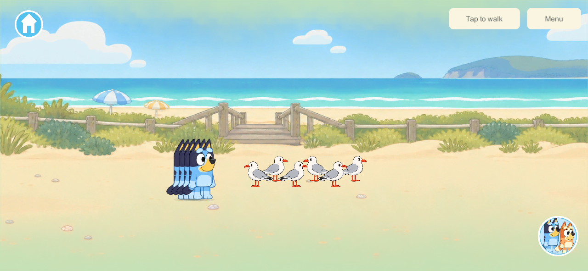
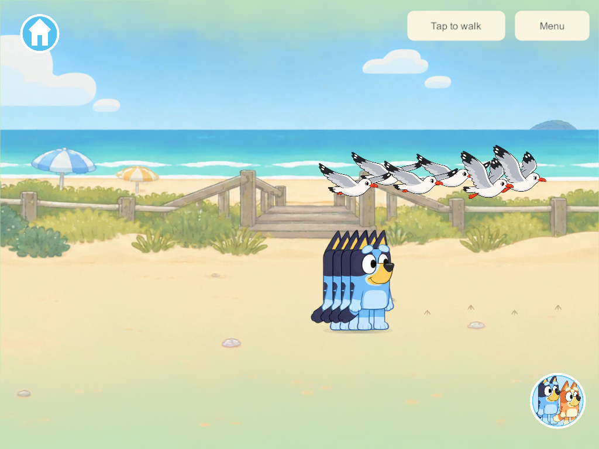
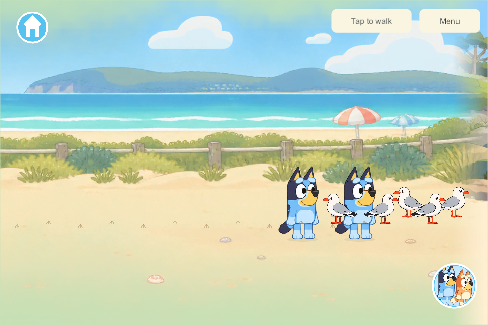

# Seagull surprise at The Beach

September 30, 2026. The user selected **BCH-02 Seagull surprise** and requested research followed by implementation. This bounded slice adds a small shared flock that reacts when players approach or tap a nearby bird, flies to another patch of sand and settles. It is direct object play for up to four family players.

## Research and applied choices

| Primary source | What the source establishes | Application to Little Weeps |
| --- | --- | --- |
| [Bluey The Beach](https://www.bluey.tv/watch/season-1/the-beach/) | Bluey's walk includes seagulls and following footprints. | Keep the flock within the existing walkable beach. A small bird-footprint trail points toward its new sand patch. No new world, chase score or reward gate. |
| [BirdLife Australia Silver Gull](https://birdlife.org.au/bird-profiles/silver-gull/) | Adult silver gulls have white plumage, a grey back, black wing tips and orange-red bill/legs; they use coastal habitat and gather in flocks. | Prepare six recognizable silver gulls with standing and wing poses. This is a cartoon adaptation, not a wildlife simulation. |
| [Existing goal sheet section 37](../bluey-game-research-2026-09-23.md#37-the-beach-collecting-building-and-playing-together) | Approach/tap, flap away, settle, footprint discovery and a cooldown; no capturing, hitting or repeated-chase score. | One authority chooses each flock destination. Rest, notice, take-off, flight and landing are explicit shared phases. |

**Authored game tuning:** six birds, three patches, a 165-unit approach radius, a 290-unit nearby-tap radius, a 0.55-second notice, 1.15-second lift-off, 3.4-second flight, 1.4-second landing and three seconds of calm after landing. The timings and distances are design choices, not measurements from the sources. Standing beside a landed flock does not repeatedly trigger it; a player must approach anew or make a new nearby tap after the calm period.

## Shared behavior and persistence

All four players see one flock and one route. Flight is ordinary free play without rounds or a start lobby. Approaching together starts one encounter. Tapping during flight or the calm period cannot restart it. The authority selects an alternative patch with space from beach players; presentation only interpolates its route and wing drawings. Avatar changes have no effect on the flock. Independent travel and disconnection leave the siblings' flight intact; an empty beach suspends its clock until someone returns.

The snapshot contains the flock phase, route, clock, recent approach identities and footprint origin. Mid-flight saves reopen in the same phase. Migration adds the record while retaining existing worlds, objects, rooms, creations and player profiles. Schema **37** reserves the concurrent pond's schema 36; shared content **42** adds this authoritative flock and tap command, so eventual device delivery requires coordinated server compatibility. This is not an app-only presentation change.

The candidate is isolated on `codex/beach-seagulls` from committed source `0cee842`. It excludes unfinished concurrent Zoo/pond/wheels work. The committed baseline included a dangling `ResetZoo()` call without its untracked implementation; this isolated candidate removes that call when adding flock cleanup. Integration must preserve `ResetZoo()` wherever the Zoo implementation is present.

## Artwork

Built-in image_gen prepared a transparent four-pose sheet, followed by an edit retaining the poses and requesting clean cutout edges. Unity slices the original atlas in-engine and aligns poses around the body instead of stretching every frame to one rectangle. Six fixed offsets and alternating resting directions make a small flock. [Editable source, exact prompts and pose map](../../SourceArt/Beach/Seagulls/README.md).

The first slice includes bird footprints and silent wing animation. Recorded gull calls, peck/preen variety and final family visual approval remain later polish; no unreviewed synthetic gull sound is added.

## Verification and delivery

The focused core check passes additive migration, retained rooms/objects, four approaches producing one flight, ignored flight spam, independent travel/disconnect, landing/calm, a nearby tap, mid-flight JSON reopen, copy isolation, malformed-state rejection and bounded artwork paths. [Core result](evidence/seagull-surprise-2026-09-30/core.json).

Windows **295** client/server release builds succeed with zero errors or warnings. Unity JSON passes legacy-record validation and save/reopen for all five bird phases. [Build summary](evidence/seagull-surprise-2026-09-30/build-summary.json) · [Built source hashes](evidence/seagull-surprise-2026-09-30/source-check.json). Attempt 294 stopped at a verification-field namespace error, corrected before 295; no older artifact was substituted.

One native four-client pass succeeds: real picture-menu beach travel, six birds on all clients, four approaches starting one shared flight, phone/tablet composition, independent travel/disconnection, landing and calm with a nearby sibling, sixteen footprint marks, a real bird tap starting the next encounter, and birds hidden only on the traveler who leaves. [Native result](evidence/seagull-surprise-2026-09-30/result.json). The pictured characters overlap in the simultaneous-approach setup because the test deliberately places them close together; the landed capture shows the remaining siblings separately.

No phone, iPad or live family server is changed. Physical-device and family visual/sound acceptance remain open. Preserve the main integration hold and the other nine beach activities.

Next: family playtesting on requested delivery; gull calls or idle-pose polish can follow without expanding this into the other beach games.
