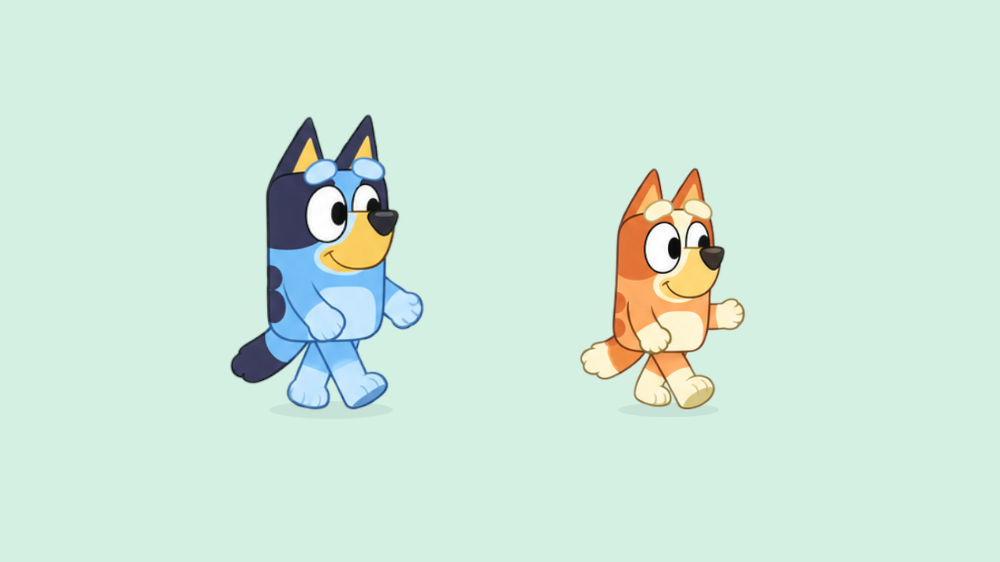
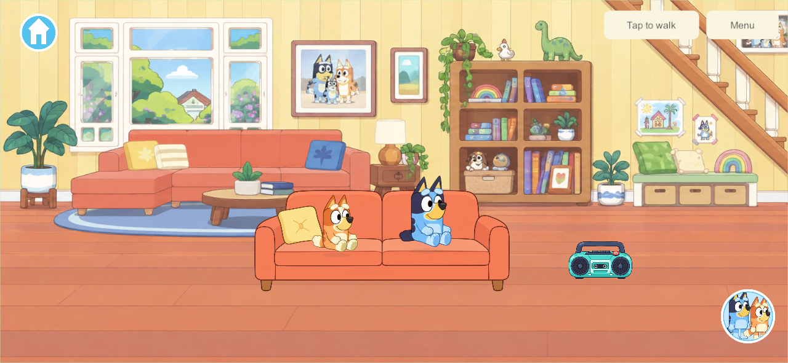

# Selected Bluey artwork and matching Bingo — builds 122–123

September 26, 2026 · **CHAR-01 / WALK-01**, G6 presentation. The user selected an earlier Bluey movement sheet and explicitly requested matching Bingo artwork and integration into the app. Both are now in the actual game and character chooser. They replace the separate SVG redraws for every current runtime pose.

## Artwork and runtime

[Bluey actions](../../SourceArt/Characters/AnimationSheets/bluey-actions.png) adapt the selected sheet's appearance; [Bingo actions](../../SourceArt/Characters/AnimationSheets/bingo-actions.png) match that style using her orange/cream identity and the inspected official reference. The built-in imagegen tool made the two sheets. The [exact original](../../SourceArt/Characters/SelectedReference/bluey-movement-sheet.png) remains unchanged. [Prompts and provenance](../../SourceArt/Characters/AnimationSheets/prompts.md) · [editable frame contract](../../SourceArt/Characters/AnimationSheets/animation-contract.json).

Each sheet has 16 drawings: idle, blink, two waves, eight walk drawings, sitting, carry-ready and two dances. Walking advances by displayed distance at the existing speed, mirrors for leftward travel and returns to idle when stopped. Carrying while walking uses the walk drawings; stopped carrying uses its dedicated pose. Sitting, radio dancing and trampoline movement use the same new artwork. The real object system still owns and draws held items; no demonstration bucket is added.

`CharacterSheetView` displays one drawing using texture coordinates. The character adapter preserves player identity, root coordinates, current action and visual phase through character changes. The build hook validates source/import hashes and frame bounds. Old layered studies remain editable, but their texture references are removed from the runtime character assets. Both sheets together contain 12,580,128 uncompressed RGBA bytes before Unity overhead; this is an asset calculation, not physical A10 memory qualification.

The preparation tool reads alpha-connected silhouettes to describe crops and floor pivots; it copies the generated PNGs byte-for-byte. The first preview exposed neighboring ear tips below some frames. Corrected boundaries exclude those disconnected fragments. The generated alpha contains negligible low-opacity noise; native captures show the characters against light scenery without the bright fringe seen in black-background source previews.

## Native verification

<video controls loop muted playsinline style="width:100%;max-width:1000px" src="evidence/selected-sheet-2026-09-26/walking-122.mp4"></video>

[Three-second native preview](evidence/selected-sheet-2026-09-26/walking-122.mp4). This is a fixed-time 180-frame preview covering start, rightward walk, leftward reversal and stopping, not measured device frame rate. Frame samples and real-home captures were inspected. Appearance and animation quality still need the user's review.

| Check | Result |
| --- | --- |
| [Sheet playback](evidence/selected-sheet-2026-09-26/sheet-checks.json) | All 12 character/direction/FPS combinations pass. Every walk drawing is exercised at 30/60/120 FPS; equal distance retains phase, facing matches travel and animation never changes player coordinates. One sheet renders and the legacy redraw is absent. |
| Action and switch continuity | Idle/carry/sit/bounce/dance/wave select the prepared artwork. Switching preserves action/root and one visible drawing. Teleport reset and facing hysteresis pass. |
| [Actual two-client walking](evidence/selected-sheet-2026-09-26/walk-result.json) | Both characters walk, reverse and stop in the home. Slower carrying retains the one real bucket holder. |
| [Home behavior](evidence/selected-sheet-2026-09-26/home-result.json) | Seat occupancy/switching, radio/dance/mute, trampoline/exit, shed storage/travel/retrieval and offline cold reopen all pass. |
| [Navigation](evidence/selected-sheet-2026-09-26/navigation-result.json) | Phone/tablet chooser visibility, the single Heeler Home destination, real travel readiness and continuous house/backyard movement pass. Bounds checks include the actual RawImage character. |
| Builds | Fresh Windows client/server and signed Android release 122 pass with no build errors. [Android build and artifact](evidence/selected-sheet-2026-09-26/android-build.json). |

Commands: `Tools/Build-NetworkProbe.ps1 -BuildNumber 122`; `uv run --offline --with cryptography python Tools/Test-WalkAnimation.py 122`, `Tools/Test-HomeWorld.py 122`, `Tools/Test-HomeNavigation.py 122`; `Tools/Build-AndroidLAN.ps1 -BuildNumber 122`.

The tests use isolated temporary worlds, never the live family world. Raw runs: `LocalData/SharedGarden/34e95665b5e84d4780d6e5d29d7ced48/walk`, `7934102e09ec4c16935cdde432e2467b/home`, `3e594edebff04419868290ef67d5fed8/home-navigation`. Build 120 caught and rejected a rectangle-deserialization error before producing a usable player; 121 supplied the first visual proof, and 122 corrects frame registration. Only the final qualified build is for delivery.

## Delivery and remaining work

Android **122** was installed in place over 119 after the new wireless endpoint was supplied. The installed APK hash matched `71168cf8998830f7114eefb3648aaf8ef40dfd1847fcdf3ea5127a3de4120a80` and the pinned family certificate. Eight saved records survived: seven byte-identical, one active world changed only player x/y plus revision/receipts as the user played; toys, home state and identities remained. [Delivery evidence](evidence/selected-sheet-2026-09-26/android-122-delivery.json). The user opened it and reported: **“Looks way better but the arms and legs move way to much.”** Appearance improved; the walking performance still needed correction.

The sheets use a mirrored three-quarter view, not a full asymmetric turnaround. Several generated walk silhouettes repeat; these checks prove correct playback and integration, not perfect authored gait or planted-foot accuracy. Earlier procedural-rig contact numbers do not apply. Further pose cleanup, moving hand/prop grip registration, additional cast/actions and physical A10 performance remain open.

Live server/helper stays **110/content 4**; new client remains **content 5/schema 4**, currently intended for solo until coordinated shared delivery. iPads/iPhone remain **101**, with updates deferred. **ART-HOME-02** scene/fixture cleanup follows this character correction; duplicated furniture is not changed by this build. [Current plan](../family-playset-build-guide-2026-09-23.html#18-current-work-record-and-research-basis).

## Quieter walking and renewed mechanics research — 123

The user then explicitly requested online research into walking body mechanics. The [third investigation](walk-animation-research-2026-09-26.html#third-investigation-how-the-body-should-move-after-build-122) covers supporting feet, opposite arms/legs, hip weight transfer, counter-rotation, restrained secondary motion, phase-aligned transitions and the travel/stride tradeoff. Findings are separated from project tuning choices and actual qualification.

New, separate [Bluey](../../SourceArt/Characters/AnimationSheets/bluey-gentle-walk.png) and [Bingo](../../SourceArt/Characters/AnimationSheets/bingo-gentle-walk.png) walk atlases keep the hands lower and feet closer under the hips. The existing idle, blink, wave, sit, carry-ready and dance images are unchanged. Both were created with the built-in image tool; [prompts](../../SourceArt/Characters/AnimationSheets/gentle-walk-prompts.md) and original PNGs remain editable inputs. The current implementation renders one RawImage, switching textures only for walking/carrying in motion.

At unchanged gameplay speed, full-speed cadence drops 25%, from 3.5 to 2.625 steps/second. The distance-based phase remains equal at 30/60/120 FPS. This is a calmer prototype; precise planted-foot matching, subtle wrist overlap and start/stop transition drawings are not claimed complete. Drawings still need the user's next motion review. Four uncompressed atlas textures are resident when both characters are shown; physical A10 memory/performance qualification remains open.

<video controls loop muted playsinline style="width:100%;max-width:1000px" src="evidence/selected-sheet-2026-09-26/walking-123.mp4"></video>

[123 native motion preview](evidence/selected-sheet-2026-09-26/walking-123.mp4): a complete fixed-time sequence of start, right walk, reversal and stop. Frame samples were inspected in both directions; arm and leg excursions are smaller. This is not measured physical-device FPS or a promise of final anatomical accuracy.

| Revision 123 check | Evidence |
| --- | --- |
| Both characters/directions at three frame rates; eight new walking frames, original action atlas restored for home poses | [Sheet checks](evidence/selected-sheet-2026-09-26/sheet-123-checks.json) |
| Actual home movement, reversal, stopping and held-item ownership | [Walking](evidence/selected-sheet-2026-09-26/walk-123-result.json) |
| Seating/switching, radio/dancing/mute, trampoline exit, shed storage and offline reopen | [Home regression](evidence/selected-sheet-2026-09-26/home-123-result.json) |
| Phone/tablet character visibility, single Home destination and continuous property travel | [Navigation](evidence/selected-sheet-2026-09-26/navigation-123-result.json) |
| Fresh signed non-development Android build; all 892 source entries match before documentation/metadata cleanup | [Build record](evidence/selected-sheet-2026-09-26/android-123-build.json) |

Commands repeat the 122 suite with build number **123**. The isolated native runs are `a7407793933145ee8cb37ecc1b218f33/walk`, `b4e1eaba5af447dd9550dc479c4fffda/home`, and `3b1ea128fbad4d90bccd71c87a6cb3a7/home-navigation`. No live server, Apple device or shared world was changed.

**Android 123 delivery:** installed in place over 122 with the pinned family signer, exact fresh APK hash and native launch verified. All eight actual saved records are byte-identical before/after this update. [Delivery record](evidence/selected-sheet-2026-09-26/android-123-delivery.json). The phone is locked (`mInputRestricted=true`, `isKeyguardShowing=true`), so a game-screen check and the user's quieter-motion review remain pending unlock; no lock bypass was attempted. The earlier 122 appearance feedback is not claimed as approval of 123's motion.

## User follow-up — quieter walking accepted for prototype continuation

After trying build 123, the user said **“Thats lots better”** and asked for the status of interactive objects and backgrounds. Record this as positive acceptance of the current prototype walking improvement, not measured foot-plant accuracy or full animation/platform qualification. The user review supersedes the pending-unlock review status above; the installation-time lock observation remains historical evidence.

Home behavior (sofa seats, radios/dancing, trampoline and shed storage) is already included in 123 and passes the recorded native checks. **The duplicate-background/interactive-fixture correction remains unimplemented.** The next task is ART-HOME-02: one clean living room and one layered usable sofa, then backyard trampoline/shed, then kitchen surfaces and interiors. Other worlds remain scenic. No app/server/save change was made by this status-record update.
