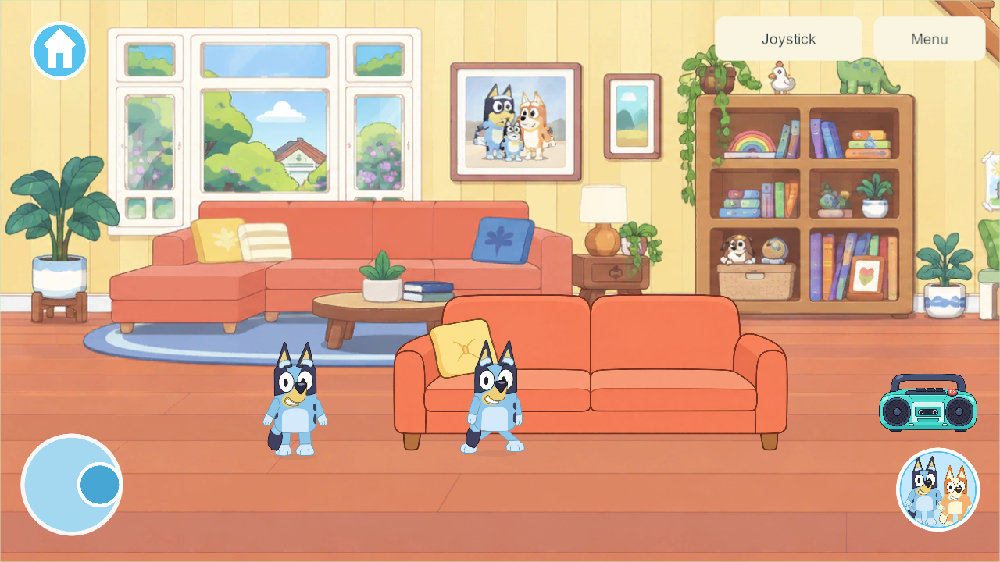

# Walking and home chooser revision — build 118

September 26, 2026 · **WALK-01 / CHAR-01**, G6 character presentation. **Build 116 was rejected by the user:** the walk looked worse despite passing engineering checks. Revision 118 corrects cadence, facing, arm phase and crossing legs, alongside the requested single-home menu and unobscured character selection. Native validation and retained Android delivery passed; user visual acceptance remains separate from technical checks.

## What changed after the feedback

The [second research investigation](walk-animation-research-2026-09-26.html#second-investigation-after-the-rejected-walk) identified five weaknesses in 116: excessive cadence, reversed interpretation of the artwork's facing, arm/leg phase mismatch, excessive overlapping motion and a still-image verification gap.

The replacement uses 3.5 steps/second at full walking speed for both characters, down from 5 for Bluey and 6.10 for Bingo. It preserves the existing 210-unit gameplay speed. The source art now faces in the direction of travel. Pelvis height follows authored contact/down/passing/up values, with a quiet forward lean, opposite arm/leg swing and reduced tail motion. Passing feet lift less than in 116. Horizontal walking brings the frontal drawing's hip attachments toward a common walking lane so the legs no longer form the X shape found in the 117 preview. The face and torso remain connected; source SVGs and exported textures are unchanged.

The world chooser now has **five destinations**, including one **Heeler Home** labeled **House + backyard**. Selecting that entry anywhere on the property closes the menu without a trip, teleport or loading screen. Returning from Creek or another world still uses the real travel/loading barrier. Existing `garden` save/network identifiers remain compatible; this is not a saved-world migration.

Opening character selection fits the real world above the horizontal shelf and left of the place rail, keeping bottom-edge characters visible. Switching to Bingo updates the actual character in that unobscured scene. Closing restores the previous camera. Player coordinates, objects and other players remain unchanged.

## Scope and limits

The small UI limb mesh remains a presentation technique over existing editable layered art. Four active limbs use 63 vertices each; this is not a measured physical-device performance result. Independent side/back drawings and authored turn poses remain future work. Controls, root speed, gameplay authority, save schema and content protocol are unchanged. G6 and the full house remain incomplete.

## Verification of revision 118

| Check | Result and limit |
| --- | --- |
| Actual character rig | All 12 combinations pass: Bluey/Bingo, left/right, 30/60/120 FPS sampling. Equal distance gives equal phase, maximum steady stance drift is 0.00098 canvas world units, and lifted feet clear the floor. Cadence and artwork-facing checks now supplement contact mathematics. |
| Complete-cycle preview | 180 native frames sampled at 60 FPS, showing both characters starting, walking right, reversing and stopping. The 117 preview exposed crossed-leg silhouettes; 118 corrects the hip attachments. This is a deterministic in-place preview, not measured device frame rate. |
| Two actual isolated clients | Bluey and Bingo walk, reverse and stop in the home at unchanged gameplay speed. Slower carrying keeps the real bucket assigned to one holder. Local and remote traces are retained. |
| Phone and tablet chooser | Both aspect ratios show bottom-edge Bluey, then Bingo after selection, completely inside the world viewport. One Home bubble resumes either end of the property without moving players or items. Creek-to-home travel retains acknowledgement and scenery readiness. Real joystick movement crosses the house/backyard boundary without a trip or a new visit. |
| Home regression | All five groups pass on 118: sofa occupancy/switching, radio/dance/mute, trampoline/exit, shed storage/travel/retrieval and offline cold reopen. Earlier HOME-01's 92 core checks remain historical; they were not rerun for this presentation change. |
| Builds | Fresh Windows client/server and signed Android release 118 succeed. Build provenance and installed-artifact checks are recorded in the delivery evidence. |

The mathematical and UI checks do not declare the revised walk visually accepted. The user rejected 116 despite its passing tests; approval of 118's performance remains open.

### Full-cycle preview

<video controls loop muted playsinline style="width:100%;max-width:1000px" src="evidence/walk-animation-2026-09-26/walking-118.mp4"></video>

[Open the native preview](evidence/walk-animation-2026-09-26/walking-118.mp4). Playback duration is three seconds, including start, reversal and stop. Original art is enlarged for inspection; this is separate from the real-home captures below.

### Character selection on a phone

### Real-home walking pose

## Reproducible evidence

- [Walking result](evidence/walk-animation-2026-09-26/walk-result.json), [12 rig trials](evidence/walk-animation-2026-09-26/rig-checks.json), [chooser and property checks](evidence/walk-animation-2026-09-26/navigation-result.json), [home regression](evidence/walk-animation-2026-09-26/home-result.json), [delivery verification](evidence/walk-animation-2026-09-26/delivery.json).
- `uv run --offline --with cryptography python Tools/Test-WalkAnimation.py 118`; the old comparison uses `114 --baseline`.
- `uv run --offline --with cryptography python Tools/Test-HomeNavigation.py 118`.
- `uv run --offline --with cryptography python Tools/Test-HomeWorld.py 118`.
- These tests use isolated players and temporary servers, never the live family world. The historical `home`/`garden` arrival aliases are used only for explicit property fixture setup in old interaction tests; the new chooser test separately exercises the real five-destination menu.
- Local raw evidence: `LocalData/SharedGarden/3588142847cf4105bde3c498df755d6f/walk/`, `7d4450360be2474ba10f16a9160c76ee/home-navigation/`, `7bdcee2e5df744278c1bb8a3e98dc4b3/home/`.

## Android delivery and next work

Samsung updated **116 → 118** in place, using the existing package/signing identity and `adb install -r`. The installer pulled the installed APK back and matched it to the freshly signed artifact, then launched the exact package. A phone screenshot shows the home and the revised walking character. Both prior world IDs, every toy field, home state, player count and player identity remain intact; only the active player's `x`/`y` changed while the user was walking. No uninstall or clear-data operation occurred.

All 681 Unity/source-art entries in the Android build manifest matched before final whitespace normalization. Windows matches the same inputs except the subsequent Android version-code metadata. Private installation evidence: `LocalData/Verification/android-phone-f5f149dd25264a86a3870291e0e02271/installation.json`; backups and phone captures: `LocalData/Verification/android-walk-118/`. These stay outside Git.

Installed APK SHA-256: `9d2f4762271ef5500554500d52b8bfb8f15891a8aad576398e279be37983a80c`. The looping preview and native screenshots are technical evidence; user acceptance of the revised performance remains open.

The live family server/helper remains **110/content 4**; the phone's home content is **5/schema 4** and continues in solo play until a separately qualified shared rollout. iPads/iPhone remain **101** and their update stays deferred. Native 16 KB qualification and physical A10 memory/frame-time checks remain open; the Android device uses 4 KB pages.

Continue refining the walk from user feedback, then resume the [home kitchen/storage/food sequence](home-interactions-2026-09-25.html#house-layout-and-next-feature-passes), followed by durable bedroom integration. Full roster/directional artwork and remaining phase gates stay open. [Current plan](../family-playset-build-guide-2026-09-23.html#18-current-work-record-and-research-basis).
