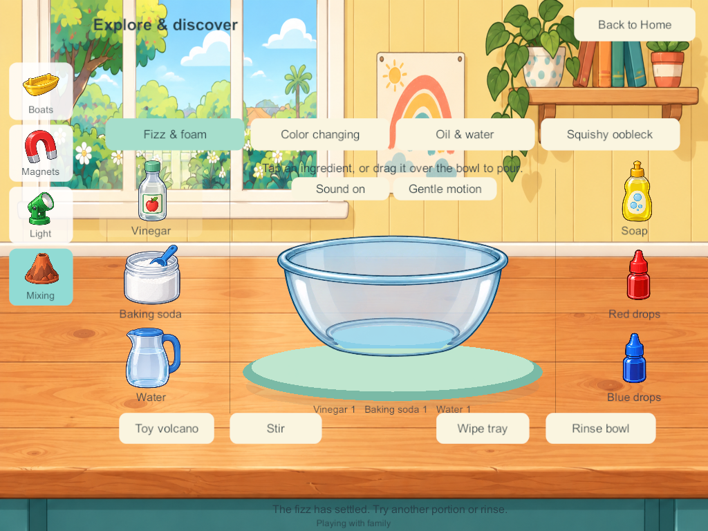
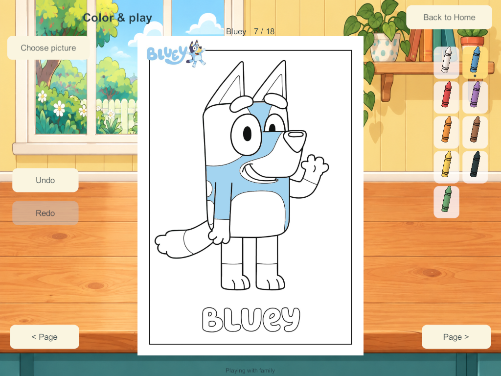

# Science workshop and Bluey coloring correction — September 27

The user rejected Android 179's flat, schematic science and six simple coloring pages. This bounded task addresses SCI-01/02/04/09 and COL-02/03/04/05: illustrated equipment, clearer composition, preserved reactions, and twelve additional Bluey pages. Visual acceptance remains the user's decision.

## Research used in the implementation

- [Toca Boca Jr publisher page](https://www.tocaboca.com/toca-boca-jr) and its actual [Lab: Elements promotional gameplay image](https://www.datocms-assets.com/113033/1710230691-tocabocajr_website_4.png?auto=format&fit=crop&w=1440) were visually inspected in the browser. Large tangible apparatus and a central reaction area informed the layered glass vessel and surrounding illustrated supplies. The screenshot is presentation evidence, not a measurement of child preference or an endorsement of its fictional chemistry.
- [Budge's Bluey: Let's Play!](https://budgestudios.com/en/apps/detail/bluey-lets-play/) and the existing accepted Home references inform the warm illustrated house, picture navigation and separate interactive layers.
- [Official Bluey coloring catalog](https://www.bluey.tv/colouring/), [Bingo sheets](https://www.bluey.tv/make/bingo-colouring-sheets/) and [sporty sheets](https://www.bluey.tv/make/sporty-colouring-sheets/) provide recognizable line art rather than generic character substitutes. Original publisher PDFs, source URLs, selected page numbers and hashes are preserved in [the source manifest](../../SourceArt/Discovery/Coloring/manifest.json).
- Scientific rules remain those documented in [the applied mixing research](home-science-play-design-2026-09-27.html): finite vinegar/soda contact, soap retaining foam, indicator quantities, oil separation and oobleck. This correction does not change their chemistry.

The design decisions are ours: a wooden workbench, compact picture navigation, large separate props, readable glass layers and full-height coloring pages with crayons beside them. No interactive equipment is painted into the background.

## Implemented

- Illustrated Home workbench replaces the plain cream activity screen.
- Boats, cargo, magnet/materials and lamps use individual illustrated sprites. Boat water fits the vessel; RGB lights use smooth overlapping red/green/blue spots with correct additive intersections. Direct taps on the boat, material samples and lamps supplement labeled controls.
- Mixing retains all four variants, direct portion/pour gestures, bounded effects and calm/audio preferences. The working glass bowl has separate back and front layers around the live liquid.
- Eighteen selectable coloring pages: the original six plus Bluey; Bingo's glasses; jumping Bingo; Bingo's scooter; hooray Bingo; rocket Bingo; Bluey's bike; Chilli hockey; the Heeler family; Bluey's surprise; Bluey's potion; and football friends.
- A picture chooser, fitted portrait/landscape pages, crayon tools and page-local undo/redo. The source PDFs are rasterized without redrawing or retouching; fixed closed-region masks supply digital tap filling. Tiny unfillable marks remain printed details.
- Only the active full-resolution coloring sheet/mask is retained; the chooser uses small thumbnails. Colors and histories, not image pixels, travel over the network.

## Persistence and authority

Schema 18/content 19 appends twelve blank pages to each profile's six existing pages. IDs, colors, undo/redo and the sixteen mixing trays are preserved. Schema 16/17 validators retain their six-page contract. Installed older clients require a matching server upgrade before shared admission. No phone ever becomes a host, and no private progress is merged into the shared world.

The four players may select the same page and color independently. Closing, travel and resets remain local to that profile/activity. All original Home, enrollment and private-save contracts remain in force.

## Evidence and limits

Build 180 was rejected after a shader compilation error and was not installed. Candidate 181 passed the 18-page four-client test, including real hit masks, undo/redo, independent departure, save/restart and rejoin. Visual review found water overflowing the bowl bounds and blocky RGB rendering; those were corrected before candidate 182. Candidate 183 passes the full 18-page four-client suite from a real 178 save, preserving previous coloring and indicator mixture. Candidate 185 makes the final vessel-boundary adjustment; coloring, authority and migration source is unchanged.

The 212 core checks pass, including additive page migration, all new pages for four owners, worst-case kitchen/coloring/mixing message size and chunked recovery of the compact runtime representation. The combined view is 81,495 bytes, below its existing 131,072-byte transport ceiling. Pretty-printed test JSON is not the runtime wire format.

The first production-style encrypted recovery run on 185 failed with packet-queue-full errors, so 186 was not installed. The installed NGO 2.13.2 source sets a 64-packet reliable window: four clients exhaust the previous 256-packet queue before motion/recovery traffic. [Unity Transport 2.7.4 guidance](https://docs.unity3d.com/Packages/com.unity.transport@2.7/manual/faq.html) and the installed transport implementation informed the bounded correction: 512 packet slots, and no redundant full snapshot to the actor who already receives it with the acknowledgement. No timeout, authority or save guarantee is relaxed. Candidate 187 contains this correction; the strengthened encrypted-recovery test also rejects any queue-overflow log. All seven [187 encrypted recovery groups](evidence/workshop185-2026-09-27/recovery187.json) now pass, including original enrollment, saved artwork/mixtures and zero packet-queue overflow. The nine [mixing groups](evidence/workshop185-2026-09-27/mixing-results.json) and two [installed-style private-solo groups](evidence/workshop185-2026-09-27/solo187.json) pass. The first solo harness run met a transient Windows save-file sharing lock; a bounded read retry fixed the harness, and the complete rerun passed. This is not sustained mixed-device, physical audio, child-usability or A10 performance acceptance. Blank drawing, personal folders/display/carrying/Together, the remaining five science stations and the wider Home scope remain open.

## Android 188 delivery

Updated Samsung from 179 to signed release 188 with `adb install -r`. The installed APK hash and signing certificate match the intended new release. All 370 runtime code/art/data/shader files match qualified Windows 187 and current source. All 20 primary saved worlds and 20 backups remain byte-identical, with valid envelope checksums; every previously captured SoloPrototype/FamilyLAN file is unchanged. [Sanitized installation and retention evidence](evidence/workshop185-2026-09-27/android188-update.json) · [Source match](evidence/workshop185-2026-09-27/runtime-source-verification.json).

The phone was locked/dozing after installation. The launch command succeeded, but this is not visible acceptance. The user has been asked to unlock/open Little Weeps; no lock bypass or data reset was attempted. No live family server or other device was changed. Server/iPads remain last recorded at 171 and require a coordinated matching-content upgrade for shared play.

## Captured native appearance

These are native Windows captures at tablet dimensions, not photographs of phone/iPad acceptance.

## Source artwork

The new workbench, props and glass layers were made with built-in imagegen. [Exact prompts](../../SourceArt/Discovery/workshop-prompts.json) and [asset hashes](../../SourceArt/Discovery/manifest.json) retain provenance. Accepted Bluey/Bingo character artwork and movement were not replaced. Publisher coloring PDFs remain unchanged.
