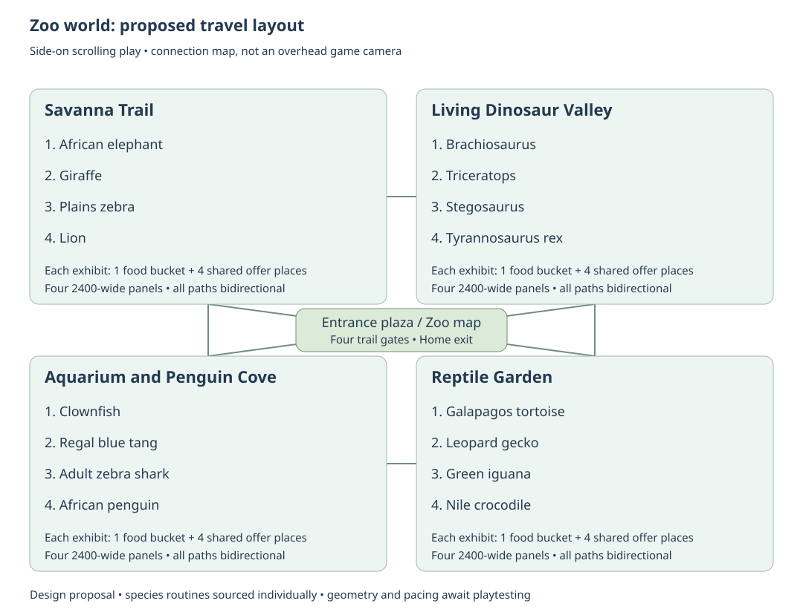
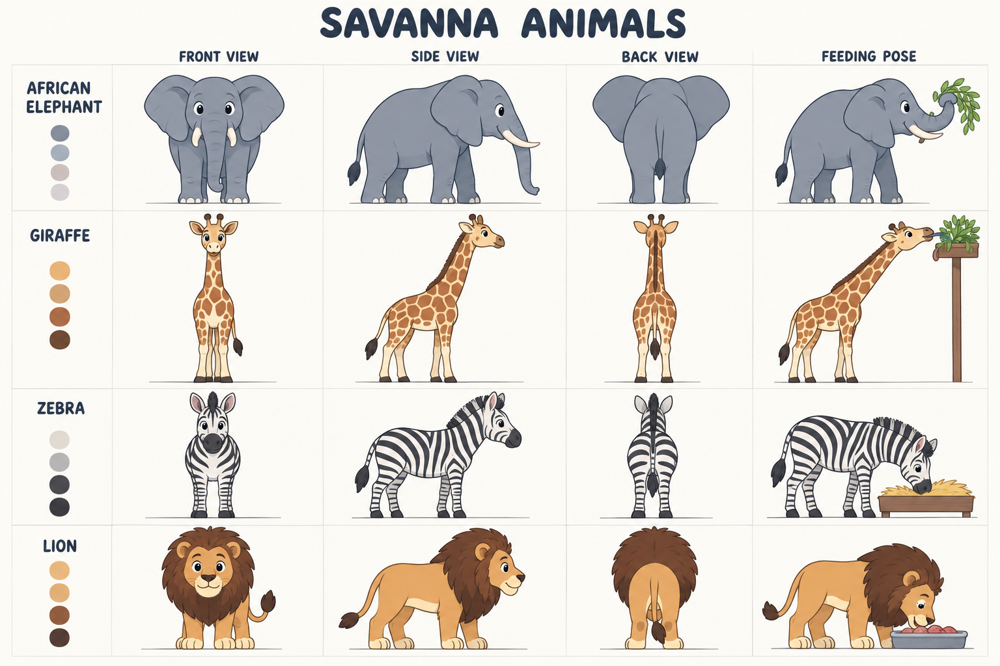
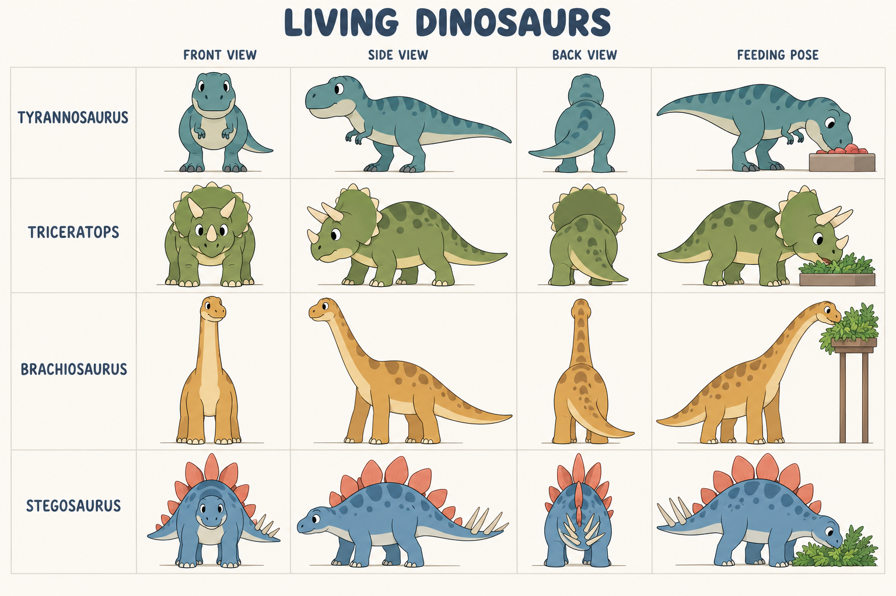
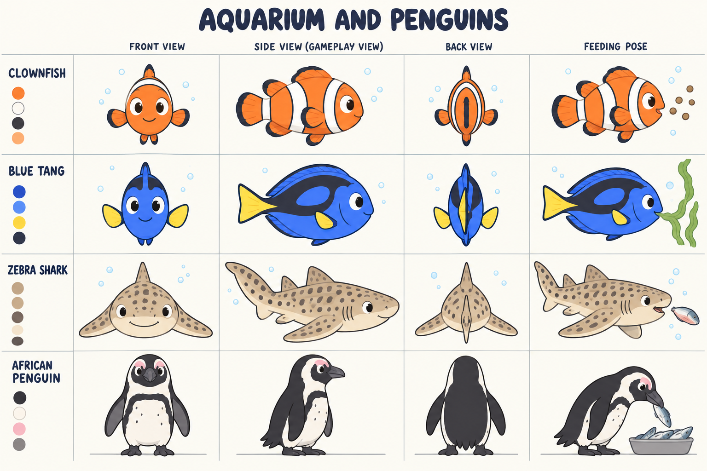
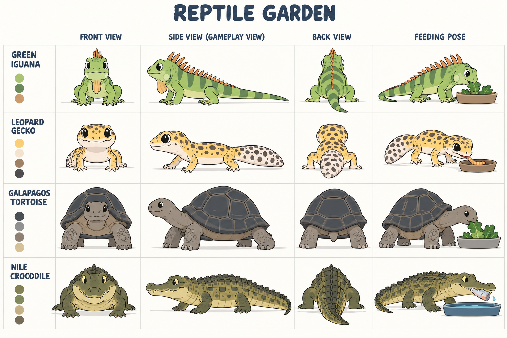

# Zoo world research and animal model sheets

September 30, 2026. Design and art research for Little Weeps, following the user's request for a zoo the children can travel through, living dinosaurs, animals doing their own activities, animal sounds, and a food bucket beside every exhibit. The user confirmed that the art should fit the Bluey show style.

**Recommended direction:** a connected illustrated zoo with four areas: Savanna Trail, Living Dinosaur Valley, Aquarium and Penguin Cove, and Reptile Garden. Every creature has an everyday routine and a gentle feeding response. Up to four family players can visit and feed the same animals together, with independent travel and cameras. This document proposes a 16-species starter roster; it does not limit later additions to those species.

**Status, expanded after the user's request for deep research:** four draft model sheets, an exhibit-by-exhibit layout, a reviewed travel map, a source-backed design study and a project-specific integration plan are complete. Zoo scenes, rigs, animation clips, zoo audio integration, server rules and playable feeding are not implemented. These generated drawings are visual development references, not approved final sprites or frame-perfect animation turnarounds. Preserve the current Home work and main integration hold. Zoo is a requested additional destination; the existing five destinations remain intact until the chooser is deliberately expanded during implementation.

[Model sheet source folder](../../SourceArt/Zoo/ModelSheets/README.md) · [Current project decisions](../current-decisions.md) · [Existing feature goals](../bluey-game-research-2026-09-23.html)

[TOC]

## Evidence and limits of this research

The deeper pass checked the actual **Little Weeps** Unity project, not the unrelated Meeps project. Code was inspected at branch `codex/home-science-coloring`, HEAD `c1dd74264d4298cc866744867e444c5becd4eac8`, together with the concurrent working copies on September 30. Unity is `6000.3.24f1`; the manifest includes uGUI 2.0.0, Netcode for GameObjects 2.13.2 and Transport 2.7.4. Findings below describe the code read at that point; line numbers may move with other chats' work.

This report distinguishes **verified behavior** in local code or a primary source, **proposed design** derived from it, and **unmeasured values** requiring final artwork or playtesting. A source does not establish a game mechanic merely because it mentions feeding. No public source establishes the best approach duration for these children, the final creature population, or this project's device performance. Those values remain open; they are not filled with guesses.

| Material actually reviewed | Finding that affects this game | What it does not establish |
| --- | --- | --- |
| [Sago Mini Zoo designer Davin Risk's letter](https://sagomini.com/article/zoo-letter-to-parents/) | The team visited Toronto Zoo, designed distinct habitat types and recognizable animal shapes/markings, and treated objects as a physical playset for open-ended exploration and care. | Its animal AI, pathfinding, multiplayer rules and our bucket mechanic are not documented there. |
| Three published screenshots on the [official Sago Zoo page](https://sagomini.com/apps/zoo/) | Visually reviewed Arctic glass-front water habitat, jungle perches at different heights and a savanna scene with foreground water. These demonstrate layered habitat composition and land/water separation. | A still image cannot prove autonomous routines, movement speed, hit targets or feeding ownership. No screenshot is imported as game artwork. |
| [San Diego Zoo's current official map, August 10, 2026](https://zoo.sandiegozoo.org/sites/default/files/2026-08/08-10-26_ZooMap_web.pdf), linked from [Plan your visit](https://zoo.sandiegozoo.org/plan-your-visit) | Downloaded the PDF, rendered its page with Poppler and visually reviewed it. Named habitat areas, branching/connecting paths, entrance and recognizable map landmarks support an entrance-plus-trails structure. | The illustrated real zoo is neither a preschool usability study nor a template for our dimensions. Its hills, service routes and commercial facilities do not become game requirements. |
| [Unity uGUI Canvas manual, installed package family](https://docs.unity3d.com/Packages/com.unity.ugui@2.0/manual/UICanvas.html) and [Unity UI optimization guidance](https://unity.com/how-to/unity-ui-optimization-tips) | UI hierarchy controls drawing order; changing UI can dirty Canvas geometry/batching. Existing game code confirms UI-based art and sibling sorting. | Adding SpriteRenderer sorting or an Animator alone does not solve this UI game's animal depth or performance. |
| [Bill Merrill, Game AI Pro chapter 10](https://www.gameaipro.com/GameAIPro/GameAIPro_Chapter10_Building_Utility_Decisions_into_Your_Existing_Behavior_Tree.pdf), sections 10.6–10.8 | Valid behaviors can be ranked or selected with weighted utility; evaluation can be separated from execution and cached between evaluations. This supports selecting purposeful routines without changing them every frame. | It gives no measured species activity budgets or child-friendly timing values. A full behavior-tree framework is not required by the paper or by this game. |
| [Apple's game touch-control session](https://developer.apple.com/videos/play/wwdc2024/10085/), [Apple design tips](https://developer.apple.com/design/tips/) and [Android accessibility guidance](https://developer.android.com/guide/topics/ui/accessibility/apps) | Direct touch actions need readable placement and adequate hit areas; Apple gives a 44-point baseline, Android 48 dp. Controls must avoid obscuring the play area. | These units are platform UI measurements, not Unity world coordinates. They do not guarantee that this family's children understand a bucket. |
| [Playtest with Kids: pain points](https://playtestwithkids.org/method/pain-points/) and [Sago Mini's documented early prototype study](https://playtestwithkids.org/case-study/jump-and-spell-in-sago-mini-school/) | Observe actions and nonverbal confusion, not just answers to questions. Sago tested a mechanic with placeholder art before polishing it. | Their study is about another game, not evidence that our zoo's proposed controls or pacing work. |

The animal/museum sources are linked beside each species below. Additional species-specific iguana and Nile crocodile evidence was found in this pass; the earlier broad reptile references are no longer the only support. Dinosaur diet/anatomy have fossil evidence, but exact voices, colors, gaits and daily schedules are not known from these directory pages.

## Games and design lessons

These findings come from public developer descriptions and support pages. The games were not installed or directly played for this research; their internal AI and performance are unknown.

| Reference | Published behavior | Proposed use in Little Weeps |
| --- | --- | --- |
| [Sago Mini Zoo](https://sagomini.com/apps/zoo/) and its [species guide](https://sagomini.com/workspace/uploads/files/sagomini-zoo-animalspecies.pdf) | An animal-focused children's play space, with a varied named animal cast in the official guide. | Make the zoo easy to explore, give individual animals recognizable personalities, and mix land and water exhibits. Our dinosaur and bucket mechanics are our own proposal. |
| [Bluey Let's Play support](https://budgestudios.freshdesk.com/en/support/solutions/articles/12000094826-how-to-play-) | Players discover scene possibilities by tapping, dragging and stacking items. | Keep the feeding gesture tangible: take food, carry it, put it in a feeding spot, watch the animal respond. Avoid a management dashboard. |
| [Planet Zoo animal behavior update](https://www.planetzoogame.com/en-us/update-notes/pc/1-10-0) | Species can investigate habitat changes, use climbing frames, and respond to other animals' calls. | Give each species a small set of meaningful routines and reactions. Use occasional neighbor responses rather than making every animal start the same loop together. |

The synthesis is our design judgment: borrow children's games' direct interaction and zoo simulations' observable behavior, then simplify both to fit this existing 2D family game. No ticket prices, staff scheduling or compulsory objectives are needed for the requested zoo visit.

## Traveling through the zoo

Proposed travel: enter through a zoo gate from the existing destination chooser. A picture map shows four clearly different areas, with paths and arrows connecting them. Walk between neighboring exhibits or use the map for longer travel. A child can tap a big animal portrait for an explicit trip near its viewing and feeding area, or explore the paths. Both options show the same shared zoo.

Savanna Trail has roomy planted enclosures and shady resting spots. Dinosaur Valley has live, breathing animals among ferns and broad trees. The aquarium includes tanks with different swimming depths and a separate land/water penguin habitat. Reptile Garden has warm rocks, branches, shaded hides and a pond. Rest places and moving places both matter: an animal resting with breathing or blinking still feels alive.

Children stay on visitor paths. Each exhibit has its own food bucket and a clear feeding station connected to the animal side. A raised leaf holder works for giraffes and Brachiosaurus; a chute reaches the aquarium; low trays suit grazers and reptiles. The bucket is visible beside the exhibit, not hidden in a menu. Animal silhouettes on the bucket and food identify what belongs there without requiring reading.

## Concrete layout for all sixteen species

[Editable exhibit and connection data](../../SourceArt/Zoo/Layout/zoo-layout.json) · [Layout notes](../../SourceArt/Zoo/Layout/README.md)

**Proposed topology:** choose Zoo from the existing world menu and arrive in an entrance plaza with four illustrated trail gates and a zoo map. Each trail contains four consecutive exhibits. Trail ends connect Savanna → Dinosaurs → Reptiles → Aquarium → Savanna; every connection works in both directions. Each trail also connects to the entrance. This gives both short visits and a full loop. Players can return through a trail entrance or explicitly use the zoo map to return to the plaza; another player's trip never moves the group.

This is a **connection map**, not a change to an overhead camera. The playable scenes retain the game's current side-on scroll, ground walking and independent cameras. Gate travel is an explicit proximity-checked action, not a hidden teleport when a child reaches the screen edge. Two gates at a junction need distinct landmarks and hit areas. Opening the map does not pause shared animals or start a private session.

**Proposed panel allocation:** one existing-size logical panel per species, plus one entrance panel: 17 panels in total. The verified convention is 2400 × 800 logical units; four panels make each trail x=0 through 9600. Each exhibit starts at 0, 2400, 4800 or 7200, with its local coordinates added to that start. These are design dimensions chosen to reuse the renderer's panel convention, not measured zoological enclosure dimensions or implemented bounds. Exact feeder, path and creature coordinates remain unset until full silhouettes and authored art can be checked together.

| Trail and proposed order | Habitat must provide | Feeding layout and movement route |
| --- | --- | --- |
| Savanna 1: African elephant | Open walking space, shade/rest, browse and water interaction anchor. Trunk reach needs clearance. | Bucket beside viewing edge; four child places facing animal-side trays. Ground route ends at a trunk pickup point; the animal stays behind the barrier. |
| Savanna 2: giraffe | High browse tree, full neck visibility and turning space. | Raised leaf rack beyond the edge; animal approaches on ground, then neck/tongue reach. The child action activates a reachable rack, not direct unsafe hand contact. |
| Savanna 3: plains zebra | Grass patches, shade and room for companion spacing. | Low hay trough and four offer places. Separate grass/rest/feeder anchors allow grazing and movement without always circling. |
| Savanna 4: lion | Resting rock, shaded floor and a clear route from rest to feeder. | Prepared meat tray beyond barrier. Wake/rise before approach; no visitor chase or hunting requirement. |
| Dinosaur 1: Brachiosaurus | Canopy browse, full neck and tail clearance. | Raised foliage rack; ground approach and an independent neck reach. Large silhouette must fit the visible scene rather than be cropped into a panel. |
| Dinosaur 2: Triceratops | Low browse, rest and a wide turn. | Low foliage tray. Keep horns/frill clear of the visitor-side layer and show beak contact. |
| Dinosaur 3: Stegosaurus | Low foliage and a route with room for the full tail. | Low plant tray. Body turns must not swing clipped tail spikes into the visitor path. |
| Dinosaur 4: T. rex | Wide route, rest and unobstructed biped/tail silhouette. | Prepared meat tray beyond barrier. Two-foot locomotion and head/jaw reach; daily routines are reconstructions. |
| Aquarium 1: clownfish | Anemone and a short underwater excursion/return route. | Bucket operates a chute; pellets arrive at a defined underwater outlet, within tank bounds. |
| Aquarium 2: regal blue tang | Reef, algae grazing anchor and turning space. | Seaweed holder underwater. Tail-driven approach; no land walking or surface-food target it cannot reach. |
| Aquarium 3: adult zebra shark | Sandy bottom rest, broad swim route and rock opening. | Seafood tray delivered underwater. Resting is valid behavior; do not require perpetual circling. |
| Aquarium 4: African penguin | Dry preening/rest rock, pool, connected entry and exit anchors. | Pool-edge fish tray reachable by the authored land/water route. Swimming uses flippers; walking uses feet. |
| Reptile 1: Galapagos tortoise | Grass, shade and a nearby rest anchor. | Low greens dish. Shorten the authored route if waiting feels too long; preserve deliberate steps. |
| Reptile 2: leopard gecko | Shaded hide, rocks and close exploration/scent anchors. | Low insect bowl. Slow notice/approach followed by a brief species-specific capture/swallow. No generic daytime sunbathing loop. |
| Reptile 3: green iguana | Strong branches/perch for basking, shade and a connected crawl/climb route. | Greens bowl reachable from perch. Route must include descent/climb links rather than sliding through a branch. |
| Reptile 4: Nile crocodile | Dry basking bank, pond and connected water entry/exit. | Fish tray at water feeding edge. Bank → entry → swim → feeder is valid; a straight line across a fence is not. |

The order is a design choice: large/recognizable entry exhibits, then different movement and feeding styles within each trail. Dinosaur herbivores appear before T. rex. The map sources support identifiable habitat zones and connected paths, but do not prove this ordering is optimal. Nothing in the design excludes adding more species later.

**Exhibit composition:** clean rear scenery → rear plants/rocks → animal bodies and coordinated environment parts → habitat barrier/glass and feeding delivery parts → visitor path, bucket and characters → only the required foreground covers. Keep a continuous walkable visitor band and a clear view of the food outlet. Animal resting places may be higher/back from that band. Aquarium glass is a foreground habitat layer; it must not tint or block the visitor characters and bucket. Climbing perches and raised racks need authored occlusion pieces.

There are **16 buckets and 64 shared child offer places** in this proposal. Four places mean four players can participate in one exhibit, not four separate animals or private simulations. One creature accepts one portion at a time with a fair shared queue; a species group can serve multiple offers if final art and bounds support it. The final number of individual creatures per species is intentionally not invented in this research.

## How this fits the actual game code

All source paths below are in `Unity/FamilyPlayset/Assets/FamilyPlayset/Code/`. These are inspected integration points, not files already changed for the zoo.

| Inspected source and symbol | Verified current behavior | Required zoo integration |
| --- | --- | --- |
| [Core/WorldLayout.cs](../../Unity/FamilyPlayset/Assets/FamilyPlayset/Code/Core/WorldLayout.cs), `Area`, `Destination`, `Place`, `MaxX`, `Position` | Zoo is absent. Existing non-internal worlds generally end at 4800; internal Home rooms at 2400. Destinations exclude internal Home rooms. | Add a Zoo layout helper and five valid zone IDs: `zoo`, `zoo-savanna`, `zoo-dinosaurs`, `zoo-aquarium`, `zoo-reptiles`. Only `zoo` is a global chooser destination; its internal trails report Zoo as their place and use their own 9600 bounds. Gate arrival must use the selected endpoint. |
| [Client/SoloNavigation.cs](../../Unity/FamilyPlayset/Assets/FamilyPlayset/Code/Client/SoloNavigation.cs), `WorldIds`, label array, `BuildWorldBubble`; [SoloTravelScreen.cs](../../Unity/FamilyPlayset/Assets/FamilyPlayset/Code/Client/SoloTravelScreen.cs) | Five destination pictures are hardcoded. Travel validates a destination, resolves its icon/label, waits for authority and scenery readiness. | Add a sixth Zoo picture/label and preserve all five entries. Internal gate routing needs its own validated command; global `Destination` must not expose each exhibit as a separate world. |
| [Client/SoloScenery.cs](../../Unity/FamilyPlayset/Assets/FamilyPlayset/Code/Client/SoloScenery.cs), `SceneTiles`, `VisibleTiles`, camera clamp and resource requests | Background tiles are explicit records, loaded through `Resources/Scenery`. The renderer limits resident/requested panoramas to three. Camera is local. | Register the hub and 16 exhibit tile IDs; use zoo zone bounds and the existing loading window. Release departing trail scenery. Do not load all 17 backgrounds together. Animal/prop/audio caches need their own measured limits. |
| [Client/CharacterSheetView.cs](../../Unity/FamilyPlayset/Assets/FamilyPlayset/Code/Client/CharacterSheetView.cs), `Configure`, `Present`, frame validation | Character art uses UI `RawImage` UV crops, with a 16-pose avatar sheet and 8 walking frames. Those frame requirements belong to avatars. | Make an animal visual adapter with species-specific clips and sockets. Reuse UI texture/frame techniques, not Bluey pose enums or avatar frame counts as biological requirements. No installed 2D Animation package was found in the manifest. |
| [Client/SoloScreen.cs](../../Unity/FamilyPlayset/Assets/FamilyPlayset/Code/Client/SoloScreen.cs), `ToBoard`, `SortDepth` (around lines 583 and 615) | Ground positions map through `(y * .45 - 250)`; depth is sorted by ground anchor, part and stable key, then UI sibling index. | Add animal/feeder/barrier depth contributions. Keep body articulation separate from ground depth. Tank/climb display coordinates need an adapter; a swimming height must not be treated as a visitor floor position. SpriteRenderer `SortingGroup` cannot order these UI RawImages. |
| [Core/SharedMovement.cs](../../Unity/FamilyPlayset/Assets/FamilyPlayset/Code/Core/SharedMovement.cs), `AdvanceLocal`, `MovementAuthority.Tick`, `Walking.Step`; [SoloWorld.cs](../../Unity/FamilyPlayset/Assets/FamilyPlayset/Code/Core/SoloWorld.cs), `SetWalkingPosition`, `Apply(Move)` | Generic walking clamps y to 35–455 and x to area bounds. Bedroom-specific routing is applied separately. A painted fence has no collision effect. | Implement the same pure Zoo visitor-path projection/routing for private solo, shared walking and transaction movement. Server validation also checks path/gate reachability. Client-only collision would leave shared players able to cross habitats. |
| [Core/SoloWorld.cs](../../Unity/FamilyPlayset/Assets/FamilyPlayset/Code/Core/SoloWorld.cs), `ToyKind`, `HasUsefulInteraction`, `Validate` | `Bucket` stores water and serves taps/plants; toy count is schema-constrained. There are no zoo actions or animal states. | Give zoo buckets a dedicated station/portion contract. Recommended: store bounded zoo portions/reservations inside Zoo state and expose them through a client carry adapter. If implemented as new `SoloToy` kinds instead, stock counts, enum validators, travel and migration all need deliberate extension. |
| [Core/SoloWorld.cs](../../Unity/FamilyPlayset/Assets/FamilyPlayset/Code/Core/SoloWorld.cs), `SoloSnapshot`, `Clone`, `Validate`, upgrades | Snapshot state is manually cloned and validated; omitting a new field from `Clone` loses it on snapshot/reopen. | Add detached deep copies, validation and an idempotent Zoo migration to both private saves and server loads. Keep old object IDs, positions and player data intact. Validate animal route bounds and reservation/portion ownership, not just field presence. |
| [Core/SoloWorld.cs](../../Unity/FamilyPlayset/Assets/FamilyPlayset/Code/Core/SoloWorld.cs), `TravelPlayer` (around line 312) | Personal toys/kitchen food remain at departure; general tools reset to legacy rack coordinates. Travel increments the player's visit. | **Correction to the initial report:** current global travel does not preserve a carried item in the hand. Proposed zoo-specific behavior settles that player's portion at its source station and releases only that player's offer. Do not run food buckets through the garden water-bucket reset. |
| [Core/FamilySession.cs](../../Unity/FamilyPlayset/Assets/FamilyPlayset/Code/Core/FamilySession.cs), `AdvanceIdle`; [NetworkProbe/NetworkProbe.cs](../../Unity/FamilyPlayset/Assets/FamilyPlayset/Code/NetworkProbe/NetworkProbe.cs), `TickMovement` | World idle advancement is gated on connected players. Visible maintenance changes immediately save and publish. Player movement has a separate 30 Hz simulation / 20 Hz packet lane. | Use server-owned creature segments/phases plus client interpolation, or a dedicated bounded motion lane. Do not label every footstep/frame a visible maintenance transaction, which would cause continual checkpoint/full-view writes. An empty server currently does not keep simulating; settle/resume instead of claiming 24/7 animals. |
| [Client/SoloWorldMusic.cs](../../Unity/FamilyPlayset/Assets/FamilyPlayset/Code/Client/SoloWorldMusic.cs), `TickWorldMusic`, `WorldMusicPlayer` | Unknown areas fall back to Home music. Two local 2D AudioSources crossfade; narration/books already affect local ducking. | Add explicit Zoo/trail music mapping and a separate bounded effect player. Combine animal-call ducking with existing narration/book logic instead of overriding it. Local camera/area controls audible distance; shared events identify sounds, not one global volume for all players. |

**Architecture decision:** reuse the scrolling UI world with internal trail zones. A single 38,400-unit corridor for 16 exhibits would require more extensive bounds/long-trip handling and gives no entrance choice. Separate global worlds for every animal would clutter the chooser and break the requested sense of one zoo. A new 3D/NavMesh animal world would replace the established art/view/control model. The internal-zone choice follows existing room/travel and streaming patterns while requiring new Zoo routing rules; it is a recommendation, not a benchmarked comparison.

Gate commands should identify the source zone, destination endpoint, actor and current visit. The authority checks proximity and permitted connections before moving just that player. New schema/content changes must use the project's compatibility policy and coordinated PC/VPS update; choose version numbers at implementation time because other chats are changing them. This research performs no server update.

## Savanna model sheet and behavior

The natural behavior column summarizes the linked zoo material. The animation and food presentation columns are proposed game choices, not a complete real animal diet.

| Creature | Natural behavior reference | Proposed everyday animation | Proposed feeding response and bucket |
| --- | --- | --- | --- |
| African elephant | Flexible trunk, moving ears, social behavior and plant feeding. [San Diego Zoo](https://animals.sandiegozoo.org/animals/elephant) | Heavy alternating steps, ear flap, trunk exploration, shade rest, a brief water spray. | Notice leaves, turn, walk slowly, reach with trunk, lift one portion to mouth and chew. Bucket contains leafy branches and plant portions. |
| Giraffe | Browses leaves using its long tongue. [San Diego Zoo](https://zoo.sandiegozoo.org/animals/giraffe) | Long measured steps, look around, browse a tree, rest. | Approach a raised leaf holder, lower/stretch neck, use tongue, chew. Bucket contains leafy twigs. |
| Plains zebra | Grazing, herd relationships, grooming and distinct stripe patterns. [San Diego Zoo](https://animals.sandiegozoo.org/animals/zebra) | Wander near a companion, lower head to graze, ear twitch, tail flick, rest. | Walk to low trough, bend neck and nibble hay. Bucket contains grass hay. |
| Lion | Social big cat and meat eater. [San Diego Zoo](https://animals.sandiegozoo.org/animals/lion) | Nap, breathe, stretch, groom a paw, walk to shade, occasional call. | Wake/notice, rise, approach slowly, lower head to prepared meat portions. No hunting scene is needed for feeding. |

## Living dinosaur model sheet and behavior

These are planned as **live animals in the game**, rather than toy dinosaurs or fossils. Their diet and broad anatomy use museum references. Their exact colors, daily routines, social behavior and calls are creative reconstructions. Mixing these animals in one park is a fantasy zoo, not a claim that they all lived together.

| Creature | Museum reference | Proposed everyday animation | Proposed feeding response and bucket |
| --- | --- | --- | --- |
| Tyrannosaurus rex | Carnivore moving on two legs. [Natural History Museum](https://www.nhm.ac.uk/discover/dino-directory/tyrannosaurus.html) | Balanced two-leg walk, horizontal torso and raised tail, head turn, sniff, resting breaths. | Turn toward food, take slow heavy steps, lower jaw to prepared meat portions. Keep two short arms with two fingers each; do not use a kangaroo stance or drag the tail. |
| Triceratops | Four-legged herbivore with three horns and a frill. [Natural History Museum](https://www.nhm.ac.uk/discover/dino-directory/triceratops.html) | Graze low plants, walk, rub gently against a trunk, rest. | Approach a low foliage tray and crop leaves with beak. Bucket contains foliage; no charging response. |
| Brachiosaurus | Four-legged long-necked plant eater. [Natural History Museum](https://www.nhm.ac.uk/discover/dino-directory/brachiosaurus.html) | Measured walk, high browsing, slow neck sweep, rest. | Walk to raised browse rack, reach neck toward leaves, take a portion. Preserve longer forelimbs in the final rig. |
| Stegosaurus | Four-legged plant eater with plates and tail spikes. [Natural History Museum](https://www.nhm.ac.uk/discover/dino-directory/stegosaurus.html) | Slow walk, low browsing, breathing, mild tail balance. | Walk to low plant tray, lower small head, crop foliage. Keep tail spikes away from the feeding edge; colors and plate motion are authored choices. |

## Aquarium model sheet and behavior

| Creature | Natural behavior reference | Proposed everyday animation | Proposed feeding response and bucket |
| --- | --- | --- | --- |
| Clownfish | Close relationship with host anemones. [Monterey Bay Aquarium](https://www.montereybayaquarium.org/animals-the-ocean/animals-a-to-z/clownfish) | Fin paddling, short swim excursions near an anemone, turn and hover. | Swim toward a small pellet cloud from a chute; take pellets one at a time. Bucket contains pictured aquarium feed. |
| Regal blue tang | Reef fish and algae feeding. [Oregon Coast Aquarium](https://aquarium.org/animals/blue-tang/) | Tail-driven swimming, gentle turns, inspect reef and graze. | Approach a seaweed holder, nibble, return to reef. This is Paracanthurus hepatus with black body markings and a yellow tail; do not confuse it with the Atlantic blue tang. |
| Adult zebra shark | Can rest on the bottom; adults have spots, juveniles stripes; eats invertebrates and small fish. [Monterey Bay Aquarium](https://www.montereybayaquarium.org/animals-the-ocean/animals-a-to-z/zebra-shark) | Rest on sand with breathing, slow tail strokes, inspect a rock opening. | Swim gently to a feeding location and take a prepared seafood portion. Its game food can show fish/shrimp; no rushing or lunging at visitors. |
| African penguin | Underwater swimming, beach activity and fish feeding. [San Diego Zoo Wildlife Alliance](https://sandiegozoowildlifealliance.org/story-hub/zoonooz/whos-who) | Waddle, preen, slide into pool, swim using flippers, climb out. | Waddle or swim to a reachable tray, take and swallow a fish. Keep the pink eye patch and breast band. |

Fish move through tank space with fin/tail motion, not land footsteps. The feeding cloud stays underwater and within reachable tank bounds. Keep mouth, fin and body deformation subtle rather than making every fish talk.

## Reptile model sheet and behavior

| Creature | Natural behavior reference | Proposed everyday animation | Proposed feeding response and bucket |
| --- | --- | --- | --- |
| Green iguana | Plant-eating lizard; use species-specific rather than generic reptile food. [San Diego Zoo iguana reference](https://animals.sandiegozoo.org/animals/iguana) | Warm-rock rest, breathing, slow crawl, branch climb, head turn. | Crawl to a shallow greens bowl and bite a leaf. Bucket contains leaves and vegetables. |
| Leopard gecko | Insect feeding and exploration were studied directly. [Published behavior study](https://pmc.ncbi.nlm.nih.gov/articles/PMC10705344/) | Peek from a shaded hide, slow steps, tongue lick, inspect nearby rocks. | Look toward bowl, approach, take one stylized insect and swallow. Bucket contains insect portions. Tiny quick feeding movements can follow a slow approach. |
| Galapagos tortoise | Plant feeding and neck reach. [San Diego Zoo Wildlife Explorers](https://sdzwildlifeexplorers.org/animals/galapagos-tortoise) | Slow deliberate steps, grazing, shell breathing movement, shade rest. | Extend neck, take several slow steps, crop greens in a low dish. Put its starting rest anchor near the feeder to keep a slow pace enjoyable. |
| Nile crocodile | Water/land movement, tail-driven swimming, basking and swallowing food. [San Diego Zoo crocodilians](https://animals.sandiegozoo.org/animals/crocodilian) | Float, blink, swim, crawl onto a warm bank and rest. | Swim/crawl toward a waterside tray and swallow a prepared fish portion. No mammalian chewing loop, attack or visitor chase. The reference describes crocodilians broadly, so species-specific refinements remain for production. |

**Deeper species checks:** [San Diego Zoo's green-iguana exhibit description](https://zoo.sandiegozoo.org/animals/reptile-mesa) directly describes sturdy shrubs used for basking and vegetation the iguanas would otherwise eat. This supports an actual perch/plant exhibit rather than a generic reptile floor. [Crocodiles of the World's account of its Nile group](https://www.crocodilesoftheworld.co.uk/latest-news/kajsa-rescued-swedish-greenhouse-nile-croc-thriving-at-zoo/) describes basking on land, then swimming and feeding in water. A connected bank/pool route is therefore species-specific. Our gentle tray approach remains a deliberate game adaptation.

The [leopard-gecko study](https://pmc.ncbi.nlm.nih.gov/articles/PMC10705344/) followed 18 animals across baseline, small-insect feeding intervention and later observation. It found sustained increases in activity and a smaller change in behavioral diversity. This supports giving geckos exploration, inspection and food-seeking opportunities, not simply replaying a crawl forever. It does not establish every gecko's behavior or a game's feeding duration. Resting and shaded routines should differ from the iguana's; not every lizard is a daytime sunbather.

## Feeding from the bucket

1. The child taps the bucket beside an exhibit. It opens with large pictured portions appropriate to that exhibit. A tap takes a portion into their hand; dragging is also available. Replenishment is automatic so a sibling cannot empty the exhibit for everyone.
2. Taking food makes nearby eligible animals turn or look toward the feeding area. Food held far away does not pull an animal out of its enclosure. The child can carry it to one of four pictured feeding places along the viewing edge, or tap that place to walk there.
3. When the child reaches a feeding place while holding food, an animal reserves a reachable animal-side eating spot and approaches at its gentle species pace. Dropping food in a tray/chute can also invite an animal without a player continuing to hold it. Do not teleport it into place.
4. Food is only consumed after a valid offer or placement within reach. Align mouth, trunk or beak to the portion; animate contact; remove exactly that portion; play a bite/swallow sound. Fish use the chute and a finite pellet cloud. The child sees the food disappear for a clear reason.
5. The animal pauses briefly, gives a mild satisfied reaction, and resumes its routine. A recent eater can wait while another creature approaches. The zoo does not punish children for leaving or require them to prevent starvation.

**Pacing remains unmeasured.** The child must see a notice/turn response when taking food, then continuous slow approach and visible mouth/trunk contact. Select route lengths and durations after final art and observing the children. No source reviewed establishes numeric timing for this family. Tortoises can start from a nearby rest anchor rather than be made to sprint. Measure whether the child notices the response, stays engaged and understands what to do next before setting the values.

Four players use the same exhibit and animals. Four offer places and a fair queue prevent one player locking the activity. A single animal eats one portion at a time; siblings can see whose portion it is considering. Additional animals serve other places where space permits. Reservations release when a player walks away, changes area, disconnects or cancels. A changed/canceled target cannot make a stale command consume somebody else's food. Joining late sees the current routine and feeding state; another player's travel does not reset the exhibit.

## Animation contract

Every creature needs breathing/idle, locomotion, turn, notice food, approach start/stop, eat or swallow, satisfied reaction, and return to routine. Add at least two species-specific activities from the tables. Penguin and crocodile additionally need land/water entry and exit; fish need swimming, turning and hovering/resting as appropriate. A quiet animal may rest often, but must never appear as a frozen decorative object.

Preserve one stable silhouette, palette and individual marking map through every view. The generated sheets contain some shading and pose/marking differences; simplify shading, resolve spot/stripe continuity, and check limb/finger counts against references when tracing the editable final artwork. Turnarounds are drawn at cell scale for readability, not an accurate cross-species height chart. Correct Brachiosaurus forelimb proportions, stegosaur plate rows, reptile toes and fish fin placement during final cleanup.

Produce layered editable 2D sources with body, head, jaw/beak, eyes, near/far limbs, tail and distinctive parts separated. Use trunk sections and ears for elephant; neck/head segments for giraffe and sauropod; fins for fish; flippers for penguin; shell separate from tortoise head/limbs. Store mouth/food sockets, foot or swimming pivots, resting/feeding anchors and bounds beside the artwork. A finished reference sheet alone is not an animation asset.

The server selects shared animal state, target, reserved feeding place, consumed portion and timing. Clients interpolate movement and play the same identified reactions locally. Choose different initial routine phases and bounded variation so a herd does not march in synchrony. Keep existing PC/VPS authority, private offline solo and server-owned world on reconnect. Far-away exhibits can use cheaper simulation; loading one shows the current state rather than replaying every missed animation or call. Performance must be measured on the existing older iPads; no frame-rate claim has been made.

## Building natural routines and reliable feeding

**Proposed animal state:** stable individual ID, species ID, exhibit ID, current routine, route segment, phase age, facing, deterministic variation seed, next decision boundary and optional reserved offer ID. Content definitions hold authored habitat graphs, resting/browsing/feeding anchors and matching animation/sound identifiers. State must be independent of whether a client has loaded that animal's art. A client cannot decide that a portion was eaten merely because its animation reached a frame.

Use a small readable state machine for execution, with species-specific weighted choice between eligible routine anchors. The [Game AI Pro utility-selector chapter](https://www.gameaipro.com/GameAIPro/GameAIPro_Chapter10_Building_Utility_Decisions_into_Your_Existing_Behavior_Tree.pdf) supplies the general decision approach; the following zoo states and priorities are this project's proposal. Evaluate when a routine completes or a relevant event occurs, retain a commitment while walking/eating, and use minimum commitment/hysteresis to prevent constant switching. No hunger decay or hidden score should require children to maintain the zoo. Feeding temporarily interrupts a routine; care remains open play.

| State/event | Shared rule | What the child sees |
| --- | --- | --- |
| Routine / rest | Choose a valid species anchor and a traversable route. Idle can include breathing, eye/ear movement or preening. | Animal performs a recognizable activity rather than moving randomly or remaining a frozen drawing. |
| Take food | Create one bounded portion tied to player and source exhibit. Nearby eligible animals notice, but do not leave their habitat or abandon another accepted meal. | Food enters hand; animal looks/turns toward that exhibit's feeding edge. Bucket visibly replenishes. |
| Offer food | Validate player/visit, exhibit, food kind, ownership, distance and free child slot; assign offer sequence. | Correct place lights up and a shared response identifies whose portion is next. |
| Reserve and approach | Fairly reserve one compatible animal-side eating anchor and exactly one portion. Keep offer order stable; do not reorder on every retry or frame. | Animal walks/swims/climbs along its route toward the food. Others continue routines or wait. |
| Contact / consume | Server advances to a valid contact phase and commits one consumption transaction with existing receipt/replay safeguards. | Mouth, trunk or beak reaches the food; the portion disappears with an appropriate feeding sound. |
| Finish / resume | Release reservation, select next valid routine or next queued offer without stranding other players. | Chew/swallow ends; animal turns away or considers the next child. |
| Cancel / move away / travel / disconnect | Release only that actor's reservation; return unconsumed station food according to its ownership rule. Revalidate at contact. | Animal slows/stops/returns naturally; siblings' accepted offers continue. |
| Route unavailable / blocked feeder | Reject or unwind the offer and return its unconsumed portion. No permanent reservation, teleport or consumption at distance. | Child retains food and can retry at an available place. |
| Join/reconnect | Read the authority's current phase, offer and segment. Play current activity from its phase; suppress old one-shot calls/bites. | Newcomer sees the same zoo; nobody's activity restarts because they joined. |

Reservation invariants: one portion has one owner/location; one animal has at most one accepted meal; one offer slot has at most one participant; consumption increments once even if the command is repeated; an invalid visit never consumes an item. A queued player changing trails affects only their offer. A placed tray portion can remain a shared offering after the player steps away if explicitly represented as tray-owned; it must not simultaneously remain player-owned. Decide and encode that distinction, rather than treating all departure as the same cancellation.

**Creature movement graphs differ from visitor paths.** Ground creatures route between floor anchors with body-bound clearance. Aquarium graphs include swimming depth and a tank polygon. The adult zebra shark has a sandy bottom rest anchor. Penguin/crocodile graphs have typed land/water links with matched transition animations. Iguana graphs include climb links and perch contact. Long tails/necks need swept bounds during turns, not just center-point containment. Aquarium pellets expire or are consumed within the tank; they must not chase a moving player through the scene.

The simplest initial network model is a server-issued route segment with start/end, phase start, duration and monotonic state sequence; clients interpolate presentation. Feeding, phase boundaries and meaningful routine changes are reliable shared state events. If curved paths or disturbances need extra snapshots, add a bounded animal motion message alongside the existing motion lane. Do not send articulated joints, blink timers or every animation frame. All clients derive art from species/clip/time, while the authority owns contact, food and cancellation.

Keep continuous creature motion out of global inventory revision churn. Persist current recoverable phase/segment through the server's checkpoint scheme and immediately persist discrete consumption. A restart must not duplicate a partially eaten portion. The existing `AdvanceIdle` connection gate means the no-player case needs a defined settled checkpoint/resume behavior. There is no researched need to simulate each missed step or play every missed sound after the PC wakes.

## Turning model sheets into game assets

The four existing generated sheets are **visual references**. They cannot be dropped into Unity as animation-ready models. Their front/side/back views do not supply a continuous walk cycle or all occlusion parts. The requested Bluey direction is flat, clean, recognizable 2D art; draft shading and inconsistent markings need cleanup, and the user has not approved the final animal designs.

1. Clean an editable species master: stable proportions, silhouette, marking map and palette against the linked zoo/museum material. Keep near/far limbs and jaw/eyes/tail plus species-specific parts separate. Create a relative size study beside existing Bluey/Bingo artwork; the current equal-sized sheet cells are not a scale chart.
2. Make reusable pose/clip definitions for rest/idle, left/right movement, turn, notice, approach stop, contact/eat or swallow and resume. Preserve asymmetric markings when changing facing. Species-specific activities come from the tables, with dinosaurs' reconstructions explicitly identified. Select actual frame counts from the required motion and test footprint, not the avatars' fixed eight-frame convention.
3. Author feet, mouth/trunk/beak, body-ground, swim pivot and contact sockets with per-frame coordinates. Put food at the socket during contact; use floor contact and distance-driven locomotion to prevent sliding. Crocodiles/fish swallow instead of using mammalian chewing; penguin/crocodile transition clips match route-link endpoints.
4. Export trimmed UI atlas frames plus pivot/crop/clip metadata. The existing `RawImage.uvRect` method can show frames from a shared texture. A separate animal adapter supports whole-frame clips and, where useful, a few coordinated UI layers for trunk/neck/jaw. No new SpriteSkin package is a prerequisite. If bone deformation is later chosen, evaluate its fit with UI rendering and editable source before adopting a different pipeline.
5. Separate clean scenic bases from interactive buckets, food, feeders, glass/fences and occlusion covers. Keep authoritative hotspot/route definitions adjacent to the art, but do not bake usable duplicates into a background. Produce a first elephant/giraffe scene at actual camera scale and check full silhouettes, readable feeding contact and four nearby children before expanding.

Clip metadata should include ID, frames, duration basis, looping flag, motion/contact markers, root pivot, sockets and visual bounds. Displayed eating markers synchronize the illustration to the shared phase; they do not independently delete authoritative food. Preserve source artwork, export recipe and asset provenance alongside runtime copies.

## Loading, memory and audio integration

The existing [scenery contract](../../SourceArt/Scenery/README.md) uses 2172 × 724 source panoramas, ASTC 6×6 mobile imports, no mipmaps/readable CPU copy and a three-panorama residency window. [Unity 6000.3's ASTC format definition](https://docs.unity3d.com/6000.3/Documentation/ScriptReference/TextureFormat.ASTC_6x6.html) specifies 128 bits per 6×6 block. This permits a **format-storage estimate**, not a game memory/FPS claim:

| Texture example, if imported with the existing format | Calculation | Estimated compressed base-level payload |
| --- | --- | --- |
| One 2172 × 724 panorama | ceil(2172/6) × ceil(724/6) × 16 bytes | 700,832 bytes, approximately 0.668 MiB |
| Three such panoramas | 3 × 700,832 | 2,102,496 bytes, approximately 2.005 MiB |
| Example 2048 × 2048 animal atlas | ceil(2048/6)² × 16 bytes | 1,871,424 bytes, approximately 1.785 MiB |

These numbers exclude platform padding, Unity objects, transient decoded images, GPU copies, unsupported-format fallback, audio, material/Canvas overhead and all other game content. The example atlas size is illustrative, not an assigned production budget. Final atlas count and frame packing are unknown until clips exist. Load visible/nearby species, release departed trail assets, and avoid combining all 16 species into one permanently resident atlas.

Unity's [UI performance guidance](https://unity.com/how-to/unity-ui-optimization-tips) explains that Canvas changes can rebuild geometry/batches and suggests separating content by update behavior. Apply that to a measured animated-animal layer, clean backgrounds and controls; excessive individual Canvases can trade rebuild savings for batches. Use the existing depth contract and profile the first animated exhibit before picking granularity. Disable decorative animal/feeder raycast targets and reserve hits for the bucket, offer places and intentional tap-to-hear actions, so habitat layers do not intercept walking/panning.

Animal effect playback should use local 2D sources, consistent with the current Canvas and music pipeline. [Unity's spatialBlend API](https://docs.unity3d.com/6000.3/Documentation/ScriptReference/AudioSource-spatialBlend.html) defines zero as 2D. Derive pan/attenuation from logical animal position relative to **that player's** camera and area, not arbitrary RectTransform world distances. Limit simultaneous calls, keep eating/movement responsive, cancel clips on departure and discard stale event IDs after reconnect. Combine call ducking with existing book/narration settings. Source pool sizes, gains and call spacing remain listening/profile decisions.

**PC fallback already has a concrete precedent:** another task has now produced the four requested dinosaur species' original calls for the book. [The book implementation record](native-reader-controls-2026-09-28.md#september-30-restart-the-whole-book-and-hear-dinosaur-calls) and [saved jobs](../../SourceAudio/Books/dinosaur-call-jobs-2026-09-30.json) record T. rex, Triceratops, Stegosaurus and Brachiosaurus, their prompts, seeds and mastering. The files exist under `SourceAudio/Books/hello-dinosaurs/`. They are imaginative generated calls, with MMAudio/model provenance; zoo reuse would retain those records and require a listening/comfort check. They are not newly generated or integrated into Zoo by this research. Other species' missing calls/Foley can use the same existing PC workflow or original microphone recording after selection.

## Free sounds and PC recording plan

These are **license-checked candidates**, not downloaded, auditioned or integrated audio. Freesound currently shows login-to-download. Its [license FAQ](https://freesound.org/help/faq/) explains its license categories; keep the original page, author, license, file checksum and edit recipe for every selected sound. Prefer CC0 and retain credits even where attribution is optional. Listening access alone is not a game asset license.

| Candidate reviewed | Listed license and type | Intended use and limitation |
| --- | --- | --- |
| [Voice elephant by vataaa](https://freesound.org/people/vataaa/sounds/148873/) | CC0; MP3, approximately 7.4 seconds | Elephant call candidate. Species/recording provenance and tone need listening review; trim and soften only after selection. |
| [lion growls by stratcat322](https://freesound.org/people/stratcat322/sounds/270383/) | CC0; WAV, approximately 5 seconds; edited from a linked source | Lion response candidate. It is already processed; inspect the original and reject it if frightening or unsuitable. |
| [Penguin Squeak by Breviceps](https://freesound.org/people/Breviceps/sounds/705839/) | CC0; WAV, 0.6 seconds; cartoon tag | Short stylized penguin response candidate, not verified African penguin field audio. |
| [CrocodilianTypeGrowl by Ovkovko](https://freesound.org/people/Ovkovko/sounds/825609/) | CC0; designed with an instrument rubbing technique | Designed reptile/dinosaur effect candidate; do not label it a real crocodile recording. |
| [Natural History Museum Jurassic sounds](https://www.nhm.ac.uk/schools/teaching-resources/key-stage-1/dinosaurs-and-fossils/jurassic-sounds.html) | Reconstruction examples; a game redistribution license was not established | Listen as a design reference only. Do not include these recordings in the app on this evidence. |

Reject the search result named Zebra-II-64-26 as an animal lead: the name alone does not establish a zebra recording. The [zoo zebra page](https://animals.sandiegozoo.org/animals/zebra) describes brays, barks and softer sounds and includes a listening reference, but app reuse permission was not established. No verified free call is claimed for giraffe, zebra, iguana, gecko or tortoise in this research.

| Creature group | Sound events required | Free source or original PC plan |
| --- | --- | --- |
| Elephant | Occasional call, heavy steps, leaf pickup/chew, water spray | Elephant candidate plus recorded leaves, foot taps and water. |
| Giraffe | Quiet chewing, hoof steps, branch movement; optional stylized breath | Record twig/leaf movement and soft breaths. A designed response is not proof of a natural giraffe call. |
| Zebra | Hooves, hay crunch, occasional bray/snort | Record footsteps/hay; make a gentle designed vocal effect if a usable recording is not found. |
| Lion | Occasional low call, paws, grooming/stretch, feeding | Audition the CC0 growl; record movement/eating Foley. |
| Four dinosaurs | Different low calls/breaths, steps, foliage or prepared-food eating | Original PC effects: low voiced breaths for T. rex, rounded short hum for Triceratops, longer breath for Brachiosaurus, soft chuff for Stegosaurus. All four calls are speculative game sounds. |
| Clownfish, blue tang, zebra shark | Water, fin/water movement, pellets/seaweed/seafood feeding | Original water and feeding effects. Give all three audible responses without claiming invented roars are their natural calls. |
| Penguin | Short call, waddle, splash, fish swallow | Cartoon squeak candidate; original splash/steps. Natural species call remains a separate sourcing task. |
| Iguana, gecko, tortoise | Light steps, leaf/insect eating, breathing and movement | Original PC Foley; mostly quiet animals. Optional cartoon reaction must be labeled designed. |
| Crocodile | Water entry, tail swish, movement, gulp; occasional designed low sound | Original water/Foley; instrument growl candidate only if gentle and clearly classified as designed. |

Use the user's PC for original recording and editing where a usable free asset is missing. [Audacity's official recording guide](https://manual.audacityteam.org/man/record.html) documents microphone recording. A future recording session can capture three to five variations of leaves, soft footsteps, water, bowl taps and voiced breaths; remove unwanted room noise, trim silence, use short fades and match perceived loudness. Keep editable originals in SourceAudio/Zoo and export compact game copies later. No microphone capture, software installation or voice generation was performed for this research.

Proposed playback rules: occasional calls rather than continuous roaring; nearby exhibits louder than distant ones; local music ducking during a call; a tap-to-hear response; and independent mute settings. Avoid repeated identical clips and a room full of overlapping calls when four children feed at once. Every species has sound feedback, but sounds can come from eating, water and movement as well as vocalization.

## First implementation and acceptance

The first bounded implementation should connect the Zoo entrance to **two adjacent Savanna exhibits**, elephant and giraffe, with separate buckets and four shared offer places in each. This tests trunk contact, raised browsing, streaming between panels and the full visit → take food → slowly approach → eat → resume sequence. It does not substitute for the remaining fourteen species. Expand through zebra/lion, the four living dinosaurs, aquarium/penguin transitions and reptiles using the common contract plus the species-specific routes.

- Confirm the sixth world picture and internal gates; all five existing destinations remain accessible. Check private/shared walking cannot cross habitat boundaries. A sibling's travel leaves other players' animals/offers running.
- Run a focused older-save migration/clone/reopen check: existing possessions stay intact, Zoo state is added once, and zoo travel applies its explicitly authored portion-return rule. Current global travel leaves carried items at departure; preserve that baseline for unrelated areas.
- Watch every species long enough to see locomotion, rest, at least two distinct activities and a feeding reaction. Confirm foot/fin contact, full tails, correct food and mouth/trunk alignment.
- Use one representative four-client scenario: all offer to the same creature, one cancels/travels, another completes, and a late join/reconnect sees the resulting state. Check fair ordering, exactly-once consumption and remaining players' continuity. Test restart only for the new consumption/save contract; do not repeat unrelated whole-game suites.
- Check fish food reachability, land/water transitions, feeders behind barriers and the tortoise's slow approach. If routing fails, return the offered portion and release the spot without teleporting an animal.
- Check muted and audible reactions, clip overlap and listening comfort on physical devices. Preserve the difference between recordings and designed sounds in the asset catalog.
- Profile the integrated scene on an existing older iPad: resident scenery/animal assets, UI rebuild/batches, memory and movement frame time. No device result is claimed yet. Observe the children discovering a bucket, noticing the animal and offering food; record missed targets, parent help, abandoned waits and pan/walk mistakes before assigning timings or target sizes.

**Research handoff:** four model-sheet drafts, their prompt manifest, a 16-exhibit layout and editable connection data, reviewed primary sources, actual-code integration points, shared routine/feeding rules and an art/audio production plan. Design-data checks and document/link checks do not establish playable behavior. Remaining production work is final visual approval/cleanup, actual routes and hit targets, clips/sockets, audio selection, migration/server rules, playable integration and the focused checks above. The requested zoo is recorded without replacing the active Home sequence or claiming a device/server update.

**Checks for this research pass:** the layout renderer verifies 16 unique species, four contiguous panels per trail, 16 buckets, 64 shared offer places and a connected bidirectional portal graph. The SVG was visually inspected; the interactive exhibit study was checked for selection changes and readable layout at 320-pixel browser width, with no horizontal overflow. The generated report loads its map and four model sheets. [The document audit](evidence/zoo-research-2026-09-30/docs-validation.json) checked 127 rendered pages and more than 3700 local links with no zoo-related error; its overall result remains failed because the concurrent `docs/server-update-policy.md` record is unclassified. That unrelated file was left untouched. [Research evidence](evidence/zoo-research-2026-09-30/deep-research-validation.json) records source/code provenance and the limits of these checks. No Unity build or gameplay/device test was performed for documentation-only research.
