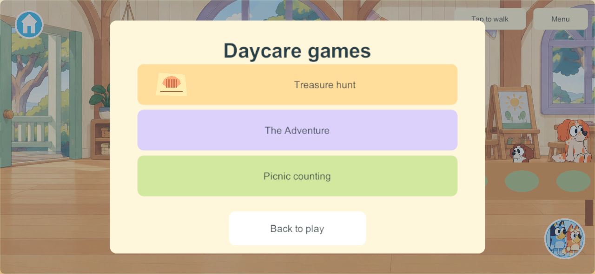
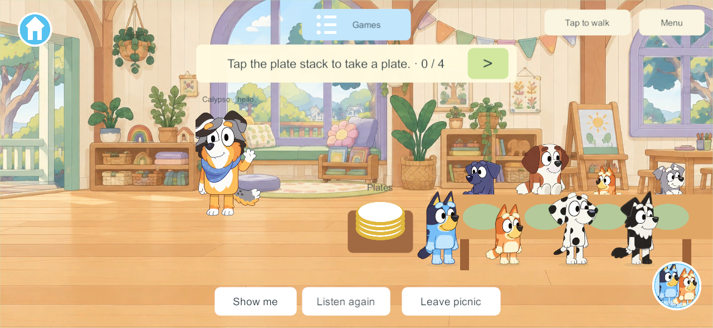
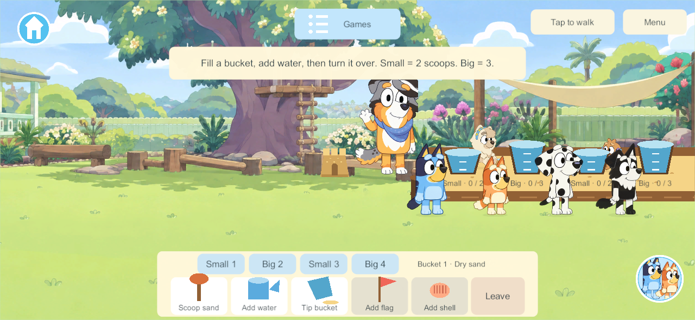
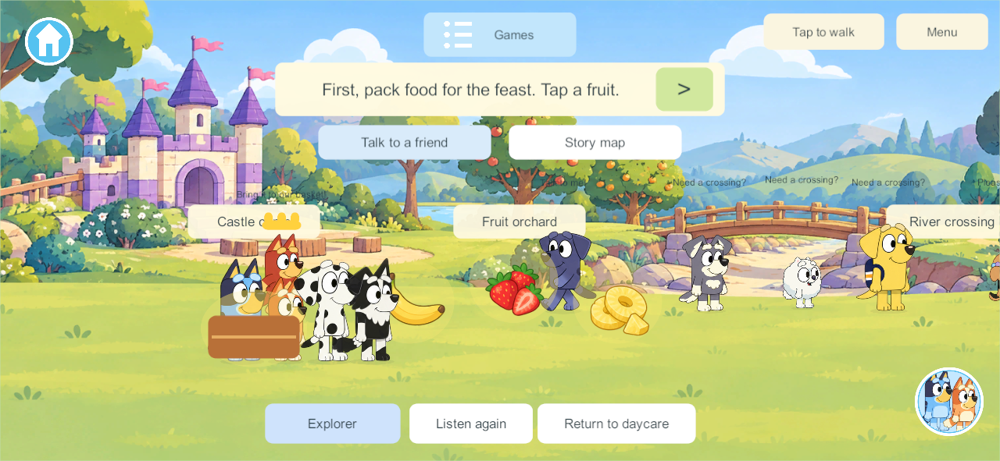
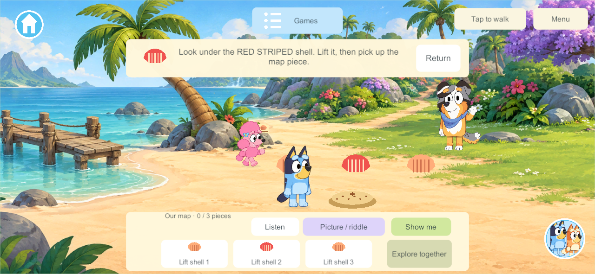

# Daycare world audit

Created October 2, 2026. Historical release 401 findings recorded below; current seven-game review pending.

This is the dedicated audit file for Daycare. Follow the [world review phase](../world-play-audit-phase-2026-10-02.md) and use the [activity review template](activity-review-template.md) for each activity. Initial inventory is based on main source `096ea65` and existing project records, not a new gameplay review. Latest recorded completed client build at setup is 414; installed devices and captured builds must be recorded separately when the audit runs. Preserve unfinished work in other checkouts.

## World scope

World menu ID: `daycare`. The classroom and garden connect to internal Adventure, Treasure, clinic, Hide and seek and Tag areas. These are Daycare activities, not additional main worlds.

## Starting activity inventory

| Activity | Entry or interaction type | Audit status |
| --- | --- | --- |
| Animal care clinic | Games menu | Not reviewed |
| Treasure hunt | Games menu | Historical review only; refresh required |
| The Adventure | Games menu | Historical review only; refresh required |
| Picnic counting | Games menu | Historical review only; refresh required |
| Sandcastle club | Games menu | Historical review only; refresh required |
| Hide & seek with Calypso | Games menu | Not reviewed |
| Tag with friends | Games menu | Not reviewed |

This is a starting list, not certification of complete feature coverage. At review time reconcile the current Games menu, direct scene interactions, internal areas and planned wishlist entries. Do not describe planned content as playable.

## Stories and completion steps

The four dated release-401 explanations appear below. New activities and current changes still require the activity template.

## Buttons and layout

Pending current review. Map general navigation, activity controls, scene taps, gestures, help and exits. Record their actual placement and behavior with screenshots. Refresh the old four-game review against the current seven-game menu. Review the clinic, Calypso Hide and seek and Tag independently, including their join invitations, camera, NPC movement and exits. Keep the release-401 evidence separate from new captures.

## NPC purpose and behavior

Pending current review. Record who is present, what each NPC or animal does, how the player recognizes its purpose, whether it reacts to progress, and where crowding or blocked objects occur. Include the relevant saved cast and attendance behavior.

## Screenshot evidence

Release-401 images below are preserved historical evidence. They do not establish current-build layout or the three new activities.

- [ ] Record reviewed source commit, build, capture date, viewport and player count.
- [ ] Entry menu and world overview.
- [ ] Active interaction for each activity.
- [ ] Important choice, mistake or helpful feedback where present.
- [ ] Completion, replay or open-play outcome.
- [ ] One useful tablet or four-player composition view with independent departure where relevant.

## Research basis

These existing records provide starting evidence and primary-source links. Their old release status and next-step instructions are historical. Read [current decisions](../current-decisions.md) before acting.

- [daycare-treasure-hunt-2026-10-01.md](../implementation/daycare-treasure-hunt-2026-10-01.md)
- [daycare-sandpit-2026-10-01.md](../implementation/daycare-sandpit-2026-10-01.md)
- [daycare-story-encounters-2026-09-30.md](../implementation/daycare-story-encounters-2026-09-30.md)
- [daycare-animal-clinic-2026-10-01.md](../implementation/daycare-animal-clinic-2026-10-01.md)
- [daycare-hide-and-tag-2026-10-01.md](../implementation/daycare-hide-and-tag-2026-10-01.md)

Source entry points:

- [SoloMiniGames.cs](../../Unity/FamilyPlayset/Assets/FamilyPlayset/Code/Client/SoloMiniGames.cs)
- [SoloDaycare.cs](../../Unity/FamilyPlayset/Assets/FamilyPlayset/Code/Client/SoloDaycare.cs)
- [SoloSandpit.cs](../../Unity/FamilyPlayset/Assets/FamilyPlayset/Code/Client/SoloSandpit.cs)
- [SoloKingdom.cs](../../Unity/FamilyPlayset/Assets/FamilyPlayset/Code/Client/SoloKingdom.cs)
- [SoloKingdomStory.cs](../../Unity/FamilyPlayset/Assets/FamilyPlayset/Code/Client/SoloKingdomStory.cs)
- [SoloTreasure.cs](../../Unity/FamilyPlayset/Assets/FamilyPlayset/Code/Client/SoloTreasure.cs)
- [SoloVet.cs](../../Unity/FamilyPlayset/Assets/FamilyPlayset/Code/Client/SoloVet.cs)
- [SoloDaycarePlay.cs](../../Unity/FamilyPlayset/Assets/FamilyPlayset/Code/Client/SoloDaycarePlay.cs)

## Current findings

See the historical findings below. Current source and new game findings remain pending.

## Improvement priorities

Pending current review. Rank observed usability problems before optional gameplay additions. Record effort and whether a change affects artwork, client controls, shared rules or saved data. Keep one bounded improvement active after the audit.

## Completion and handoff

- [ ] Every current activity has a plain-language story and real steps.
- [ ] Required progress and optional play are distinguished.
- [ ] Actual buttons and gestures are explained with pictures.
- [ ] NPC or animal roles, framing and four-player spacing are reviewed.
- [ ] Findings cite evidence and proposals are clearly labeled.
- [ ] Source/build and evidence limits are current.
- [ ] Summary and relative screenshot links are ready for the parent or ChatGPT Classic.

Next action: refresh the current Daycare menu and the clinic, Hide and seek, Tag and changed sandpit before carrying old conclusions forward.

## Historical Daycare review from release 401

Reviewed October 1, 2026 in an isolated native PC world at 1280 by 591 phone aspect. Picnic, Sandcastle and Adventure views include four players; the Treasure active view shows one. These are game captures, not physical phone or iPad photographs. Current source has added three games and later changes. Recheck each finding before using it as a current defect. The original ZIP remains a dated handoff, not the current activity inventory.

### Menu and common controls

Home was top left; Games top centre; movement mode and Menu top right; character selection bottom right. The initial menu showed three games and hid Sandcastle club below a scrollable list without an obvious cue. Proposed improvement: an illustrated menu that makes every activity discoverable; current seven-game layout needs a new assessment.

[Scrolled menu showing Sandcastle club](evidence/daycare/release-401/01b-games-menu-scrolled.png).

### Picnic counting

Story: Calypso's four guests need plates. Start the activity, take a plate from the stack, place it on an empty green table place, then repeat or share the work. Completion requires all four plates. Set it again begins another round. Serving and eating were proposed additions, not existing completion steps.

Buttons: instruction banner and > near the top; Show me, Listen again and Leave picnic at the bottom. The arrow and Show me guide walking and perform the next pickup or placement. Four saved guests sit behind the table.

Observed: players overlapped in front of the guests and covered table places. Calypso's ambient hello/reading labels did not clearly connect her to picnic progress. Proposed: spaced positions around the table, direct plate placement, guests pointing and thanking, and a clearer completion celebration.

[Four plates and completion](evidence/daycare/release-401/03-picnic-complete.png).

### Sandcastle club

Story: Calypso demonstrates sand building with two classmates. Choose Small 1, Big 2, Small 3 or Big 4; scoop two times for a small bucket or three for a big bucket; add water; tip it to build a tower. A full dry bucket crumbles. Finish all four towers to make the shared castle. Flags and shells are optional. New lesson replays; Leave exits independently.

Buttons: top instruction strip; a large bottom tray with four mould selectors, Scoop sand, Add water, Tip bucket, Add flag, Add shell, Leave and eventually New lesson.

Observed: the pit was pushed against the right edge with empty lawn to the left; players and classmates obscured labels and each other. The flat shapes differed from the painted garden. Proposed: centred framing, room around the pit, scene tools, falling sand/water/bucket feedback and classmates helping with decorations. Uncommitted sandpit changes existed when this new audit was created, so these findings require refresh against the next completed build.

[Lesson start](evidence/daycare/release-401/04-sandcastle-start.png) and [completed castle](evidence/daycare/release-401/06-sandcastle-complete.png).

### The Adventure

Story: the Kindly Queen asks for help with three frozen friends beyond a river. Press Let's go; gather three fruits into the basket or choose Help me pack; choose bridge or stepping stones and complete the three crossing actions; play ball with the Greedy Queen for a brief wand opportunity or invite her to the feast; collect the wand; rescue all three friends with Sparkle spell or Silly spell. Completion is the shared feast ending that remembers the chosen route. Play again resets the story and cast.

Buttons: top instructions and >; Talk to a friend and Story map below; role selection, Listen again and Return to daycare at the bottom. Conversations have large central panels with choices, Listen and Back to exploring. The arrow can perform the next task. Nine saved NPCs fill the queen, orchard, river and rescue roles; player roles are pretend labels rather than unique abilities.

Observed: the basket start crowded four players; signs and labels competed with guidance; conversations covered most of the screen. Proposed: short visible chapter introductions, dialogue beside the speaker, illustrated choices, better player spacing and a more responsive feast.

[Opening story](evidence/daycare/release-401/07-adventure-opening.png) and [orchard conversation](evidence/daycare/release-401/09-adventure-conversation.png).

### Treasure hunt

Story: wind scattered the map to Calypso's hidden island surprise. Press Start exploring; lift the red striped shell and take its fragment; lift the pot with three purple flowers and take its fragment; repeat the three windchime pictures for the final fragment; dig at the map landmark; match the three locks to the numbered map fragment symbols; Open chest. Completion reveals the compass, stars and toy boat. Return is independent; New hunt starts a new cast and random puzzle layout. Wrong covers, notes and digs give gentle feedback without erasing earlier discoveries.

Buttons: clue and Return at the top; map progress, Listen, Picture / riddle, Show me and changing puzzle actions in the bottom tray. The map panel has Back to exploring and Follow our clue. Show me guides movement without solving the puzzle. Three saved NPC helpers cover shells, flowers and windchimes, with Calypso beside the clue area.

Observed: bottom controls duplicated visible island objects; disabled Explore together occupied space during the shell stage; the map obscured nearly the entire scene. Proposed: directly lift, strike, dig and turn locks, retain a small fold-out map and show each helper's purpose clearly.

[Opening story](evidence/daycare/release-401/10-treasure-opening.png) and [island map](evidence/daycare/release-401/12-treasure-map.png).

### Historical findings and refresh queue

| ID | Observed release 401 issue | Proposed improvement | Current status |
| --- | --- | --- | --- |
| DAY401-01 | Fourth menu game hidden without clear scroll cue | Illustrated discoverable game cards | Recheck seven-game menu |
| DAY401-02 | Players overlap at picnic and basket | Distinct approach and standing positions | Recheck current scenes |
| DAY401-03 | Sandpit starts at right edge | Centre activity and include all four children | Pending completed sandpit changes |
| DAY401-04 | Large trays and conversation cards obscure play | Direct object actions and shorter pictured dialogue | Proposal awaiting current review |
| DAY401-05 | NPC purpose is hard to read | Props, clear work positions and progress reactions | Proposal awaiting current review |
| DAY401-06 | Completion relies heavily on messages | Clear shared celebrations or proposed playable rewards | Proposal awaiting current review |

The original order was framing/spacing, menu discovery, direct interactions, dialogue, NPC purpose, then rewards. These are recommendations, not implemented or family-approved redesigns. Preserve varied saved casts independent of player avatars, Calypso's identity, shared four-player progress, solo completion, late joining and independent departure.

### Added activities awaiting this style of review

Animal care clinic, Hide & seek with Calypso and Tag with friends have current implementation reports linked above. Their actual stories, required actions, controls and screenshots must be reviewed before this audit is marked current. The clinic report includes the later build-414 patient-selection and backdrop correction; the Tag report includes bounds and runner corrections. Do not transfer old conclusions or old screenshots to these games.
